# Đề Ngôn ngữ lập trình C++ PTIT (Đề Cpp CodePTIT)
## Source: https://github.com/nvbangg/CodePTIT

## Kiểu dữ liệu - Viết vòng lặp - Viết hàm

### CHELLO Hello World
Viết chương trình in ra màn hình dòng chữ:
Hello PTIT.

**input:**
Không có dữ liệu vào

**output:**
```
Hello PTIT.
```

### CPP0101 TÍNH TỔNG 1 ĐẾN N
Cho số nguyên dương N.
Hãy tính S = 1 + 2 + ... + N

**Đầu vào:**
- Dòng đầu ghi số bộ test, không quá 10
- Mỗi dòng ghi một số nguyên dương N, không quá 10<sup>9</sup>

**Đầu ra:**
Với mỗi test, ghi kết quả trên một dòng.

**input:**
```
2
10
20
```

**output:**
```
55
210
```

### CPP0102 CHỮ HOA – CHỮ THƯỜNG
Cho một chữ cái bất kỳ. Hãy kiểm tra xem đó là chữ hoa hay chữ thường. Nếu là chữ thường thì in ra chữ hoa, nếu là chữ hoa thì in ra chữ thường tương ứng.

**Đầu vào:**
Dòng đầu ghi số bộ test. Mỗi bộ test có duy nhất một chữ cái.

**Đầu ra:**
Với mỗi bộ test, ghi ra kết quả trên một dòng.

**input:**
```
2
B
q
```

**output:**
```
b
Q
```

### CPP0103 TÍNH TỔNG PHÂN THỨC - 1
Viết chương trình tính tổng  S = 1 + 1/2 + 1/3 + … + 1/N

**Đầu vào:**
Dữ liệu vào chỉ có 1 dòng ghi số N không quá 6 chữ số.

**Đầu ra:**
Kết quả ghi chính xác với 4 số phần thập phân.
Chú ý: Giới hạn thời gian chạy là 5 giây.

**input:**
```
2
```

**output:**
```
1.5000
```

### CPP0104 TÍNH TỔNG GIAI THỪA
Viết chương trình tính tổng  S = 1 + 1.2 + 1.2.3 + ...+1.2.3...N

**Đầu vào:**
Dữ liệu vào chỉ có 1 dòng ghi số N không quá 20.

**Đầu ra:**
Kết quả ghi trên một dòng.

**input:**
```
3
```

**output:**
```
9
```

### CPP0105 SỐ LỘC PHÁT
Một số được gọi là “lộc phát” nếu chỉ có các chữ số 0,6,8. Nhập vào một số nguyên dương không quá 9 chữ số, hãy kiểm tra xem đó có phải số lộc phát hay không.

**Đầu vào:**
Dòng đầu là số bộ test, mỗi dòng tiếp theo ghi một số cần kiểm tra.

**Đầu ra:**
Nếu đúng in ra YES, nếu sai in ra NO.

**input:**
```
3
181
88888
608868
```

**output:**
```
NO
YES
YES
```

### CPP0106 SỐ THUẬN NGHỊCH
Một số nguyên dương được gọi là số thuận nghịch nếu viết theo chiều ngược lại vẫn có cùng giá trị với số ban đầu. số 121 là số thuận nghịch, số 123 không phải số thuận nghịch.
Viết chương trình kiểm tra số thuận nghịch

**Đầu vào:**
Dòng đầu ghi số bộ test, mỗi bộ test ghi một số nguyên dương không quá 18 chữ số

**Đầu ra:**
Với mỗi bộ test, nếu đúng ghi ra YES, nếu sai ghi ra NO.

**Ví dụ:**
**input:**
```
2
123456789012345
12345678987654321
```

**output:**
```
NO
YES
```

### CPP0107 CHẤM ĐIỂM TRẮC NGHIỆM
Trong những năm gần đây, hình thức thi trắc nghiệm được sử dụng phổ biến trong kỳ thi Trung học phổ thông quốc gia. Ưu điểm của hình thức thi trắc nghiệm là có thể chấm tự động hoàn toàn mà không cần sự can thiệp của con người, điều này đảm bảo tính khách quan và chính xác. Giả sử có 2 mã đề thi 101 và 102 có các đáp án được cho trong bảng dưới đây:

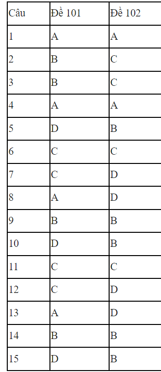

Nhiệm vụ của bạn là chấm điểm cho bài thi của các thí sinh trong một phòng thi. Điểm thi được chấm trên thang điểm 10, làm tròn đến 2 chữ số phần thập phân.

**Đầu vào:**
Dòng đầu tiên đưa vào số bài thi T.
Các dòng tiếp theo mỗi đưa vào mã đề thi và các đáp án làm bài của thí sinh cách nhau bởi một khoảng trống. Giả sử tất cả các đáp án đều được điền đầy đủ.
T thỏa mãn điều kiện 0 < T <= 1000

**Đầu ra:**
Điểm thi được làm tròn đến hai chữ số phần thập phân.

**input:**
```
1
101 A B B A D C C A B D C C A B D
```

**output:**
```
10.00
```

### CPP0108 SỐ TĂNG GIẢM
Một số được gọi là số tăng giảm nếu số đó có các chữ số thỏa mãn hoặc tăng dần, hoặc giảm dần từ trái qua phải. Hãy đếm các số nguyên tố là số tăng giảm với số chữ số cho trước.

**Đầu vào:** Dòng đầu tiên ghi số bộ test. Mỗi bộ test viết trên một dòng số chữ số tương ứng cần kiểm tra (lớn hơn 1 và nhỏ hơn 10)

**Đầu ra:** Ghi ra số lượng các số thỏa mãn điều kiện.

**input:**
```
2
2
4
```

**output:**
```
20
50
```

### CPP0109 CÂN BẰNG CHẴN LẺ
Một số được gọi là “cân bằng chẵn lẻ” nếu số chữ số chẵn và số chữ số lẻ là bằng nhau. Tất nhiên khi đó số chữ số của nó phải là chẵn.
Cho số N là một số chẵn (1< N <7). Hãy liệt kê các số cân bằng chẵn lẻ có N chữ số. Mỗi dòng ghi ra 10 số thỏa mãn.

**Đầu vào:**
Chỉ có duy nhất số N (chẵn)

**Đầu ra:**
Ghi ra các số cân bằng chẵn lẻ có N chữ số theo thứ tự từ nhỏ đến lớn. Mỗi dòng ghi 10 số.

**input:**
```
2
```

**output:**
```
10 12 14 16 18 21 23 25 27 29
30 32 34 36 38 41 43 45 47 49
50 52 54 56 58 61 63 65 67 69
70 72 74 76 78 81 83 85 87 89
90 92 94 96 98
```

### CPP0110 MÃ SỐ QUỐC GIA
Trong mã hàng hóa  người ta thường ghi kèm theo mã số quốc gia sản xuất. Nếu sản xuất tại Việt Nam thì mã tương ứng là 084. Bài toán đặt ra là cho một dãy mã dạng số nguyên không quá 18 chữ số. Hãy loại bỏ đoạn mã 084 ra khỏi mã ban đầu.
Dữ liệu đảm bảo dãy mã luôn có duy nhất một lần cụm 084.

**Đầu vào:**
Dòng đầu ghi số bộ test. Mỗi test là một số nguyên có ít nhất 4 chữ số nhưng không quá 18 chữ số.

**Đầu ra:**
Ghi ra kết quả sau khi loại bỏ 084

**input:**
```
3
123084567
3300478808445
1084
```

**output:**
```
123567
3300478845
1
```

### CPP0111 SỐ LIỀN KỀ
Viết chương trình kiểm tra số nguyên dương N có thỏa mãn tính chất: tất cả các chữ số cạnh nhau chỉ sai khác nhau đúng một đơn vị hay không. số 123212 là số thỏa mãn, số 34578 không thỏa mãn.

**Đầu vào:**
Dòng đầu ghi số số test (không quá 20). Mỗi test là 1 số nguyên dương N có ít nhất 2 chữ số, nhưng không quá 18 chữ số.

**Đầu ra:**
Ghi ra YES hoặc NO

**Ví dụ:**
**input:**
```
3
123212
5654345676
10233211123
```

**output:**
```
YES
YES
NO
```

### CPP0112 KHOẢNG CÁCH
Cho 2 điểm A  và B trong không gian Oxy. Hãy tính khoảng cách giữa hai điểm đó.

**Đầu vào:**
- Dòng đầu ghi số bộ test, không quá 20.
- Mỗi bộ test có 4 số thực lần lượt là tọa độ của 2 điểm A và B, giá trị tuyệt đối không quá 1000.

**Đầu ra:**
Với mỗi bộ test, viết ra khoảng cách giữa 2 điểm với 4 chữ số sau dấu phẩy.

**input:**
```
2
0 0 0 5
0 199 5 6
```

**output:**
```
5.0000
193.0648
```

### CPP0113 SỐ MAY MẮN
John rất thích con số 86 vì theo John đó là con số may mắn. Khi bắt gặp một số nguyên X John muốn kiểm tra xem trong dạng biểu diễn của nó kết thúc là số 86 hay không? Ví dụ số 111539786 kết thúc là  số 86, còn số 123456789 thì không.
Nhiệm vụ của bạn là viết một chương trình đọc số nguyên X và kiểm tra xem trong dạng biểu diễn của nó kết thúc là số 86 hay không?

**Đầu vào:**
Dữ liệu vào gồm nhiều bộ dữ liệu tương ứng với nhiều test. Dòng đầu tiên chứa một  số nguyên dương không lớn hơn 20 là số lượng các bộ dữ liệu. Các dòng tiếp theo chứa các bộ dữ liệu, các số không quá 9 chữ số.

**Đầu ra:**
Với mỗi bộ dữ liệu, ghi ra trên một dòng câu trả lời, ghi số 1 nếu trong dạng biểu diễn của nó kết thúc là số 86, ghi số 0 trong trường hợp ngược lại.

**Ví dụ:**
**input:**
```
3
111539786
123456789
8686
```

**output:**
```
1
0
1
```

### CPP0117 TÍNH TỔNG CHỮ SỐ
Thấy Tí rất thích thú với những con số, cô giáo đã giao cho Tí một bài tập về rút gọn các con số. Phép rút gọn được thực hiện như sau: từ một số ban đầu, số mới được tạo thành bằng cách cộng các chữ số của số ban đầu với nhau. Sau đó Tí phải thực hiện tiếp tục với con số vừa mới thu được.
Quá trình rút gọn kết thúc khi số thu được chỉ có duy nhất 1 chữ số.
Các bạn hãy cùng Tí đi tìm chữ số cuối cùng của phép rút gọn!

**Đầu vào:**
Dòng đầu tiên gồm số lượng test T (T <= 100).
T dòng tiếp theo, mỗi dòng gồm một số nguyên dương (<= 10^9).

**Đầu ra:**
Hãy in ra chữ số cuối cùng sau khi thực hiện phép rút gọn.

**Ví dụ:**
**input:**
```
3
1009
167
102
```

**output:**
```
1
5
3
```

### CPP0118 SỐ SPHENIC
Số nguyên dương N được gọi là số Sphenic nếu N được phân tích duy nhất dưới dạng tích của ba số khác nhau. N=30 là số Sphenic vì 30 = 2×3×5;  N = 60 không phải số Sphenic vì 60 = 2×2×3×5. Cho số tự nhiên N, nhiệm vụ của bạn là kiểm tra xem N có phải số Spheic hay không?

**Đầu vào:**
- Dòng đầu tiên đưa vào số lượng bộ test T.
- Những dòng kế tiếp đưa vào các bộ test. Mỗi bộ test là một số nguyên dương N.
- T, N thỏa mãn ràng buộc : 1≤T≤100; 1≤N≤10000.

**Đầu ra:**
- Đưa ra 1 hoặc 0 tương ứng với N là số Sphenic hoặc không của mỗi test theo từng dòng.

**input:**
```
2
30
60
```

**output:**
```
1
0
```

### CPP0120 CHIA HẾT CHO A VÀ B
Cho bốn số M, N, A, B. Nhiệm vụ của bạn là hãy đếm tất cả các số trong khoảng [M, N] chia hết cho các số A, B.

**Đầu vào:**
- Dòng đầu tiên đưa vào số lượng test T.
- Những dòng kế tiếp đưa vào các bộ test. Mỗi bộ test gồm 4 số M, N, A, B.
- T, M, N, A, B thỏa mãn rang buộc 1≤T≤100; 1≤M, N ≤10<sup>5</sup>;1≤A, B ≤500;

**Đầu ra:**
- Đưa ra kết quả mỗi test theo từng dòng.

**input:**
```
2
5 11 4 6
3 1000 5 9
```

**output:**
```
2
289
```

### CPP0173 CHIA HẾT CHO BA SỐ NGUYÊN
Cho bốn số nguyên dương X, Y, Z và N. Hãy tìm số nguyên dương nhỏ nhất có N chữ số chia hết đồng thời cho X, Y, Z.  với X = 2, Y = 3, Z = 5, N = 4 ta tìm được số nguyên dương nhỏ nhất có 4 chữ số là 1020 chia hết cho cả 2, 3, 5.

**Đầu vào:**
- Dòng đầu tiên đưa vào số lượng test T (T≤100).
- Những dòng kế tiếp đưa vào T bộ test. Mỗi bộ test là bộ bốn số X, Y, Z, N. Các số X, Y, Z, N thỏa mãn ràng buộc dưới đây:
1≤ X, Y, Z ≤10<sup>5</sup>; N≤18.

**Đầu ra:**
- Đưa ra theo từng dòng kết quả mỗi test là số nguyên nhỏ nhất có N chữ số chia hết đồng thời cho X, Y, Z. Trong trường hợp không có số nguyên N chữ số thỏa mãn yêu cầu bài toán đưa ra giá trị -1.

**input:**
```
3
2 3 5 4
4 5 6 3
3 5 7 2
```

**output:**
```
1020
120
-1
```

### CPP0181 SỐ LẶP LẠI
Cho ba số a, x, y. Nhiệm vụ của bạn là tìm ước số chung lớn nhất của hai số P và Q, trong đó P lặp lại x lần số a và Q lặp lại y lần số a. a =2, x = 3, y =2 thì P=222, Q=22.

**Đầu vào:**
- Dòng đầu tiên đưa vào T là số lượng bộ test.
- T dòng tiếp đưa các bộ test. Mỗi bộ test được viết trên một dòng là bộ ba số a, x, y phân biệt nhau bởi một vài khoảng trống.
- Các số T, a, x, y thỏa mãn ràng buộc: 1≤T≤100; 1≤a, x, y≤10<sup>18</sup>;

**Đầu ra:**
- Đưa ra kết quả mỗi test theo từng dòng.

**input:**
```
2
2 2 3
123 5 2
```

**output:**
```
2
123
```

### CPP05092 TAM GIÁC ĐỀU RỖNG
Viết chương trình nhập vào N (không quá 100) là độ dài cạnh của tam giác đều. Thực hiện in ra tam giác đều rỗng tương ứng theo mẫu trong ví dụ.

**Đầu vào:**
Chỉ có một số nguyên dương N không quá 100.

**Đầu ra:**
Ghi ra kết quả theo mẫu.
Ví dụ (truy cập https://ideone.com/G6z6kp để hiển thị ví dụ chính xác hơn)

**input:**
```
5
```

**output:**
```
    * 
   * * 
  *   * 
 *     * 
* * * * * 
```

**input:**
```
10
```

**output:**
```
         * 
        * * 
       *   * 
      *     * 
     *       * 
    *         * 
   *           * 
  *             * 
 *               * 
* * * * * * * * * *
```

### CPP05093 HÌNH THOI RỖNG
Viết chương trình nhập vào N (không quá 100) là độ dài cạnh hình thoi. Thực hiện in ra hình thoi rỗng tương ứng theo mẫu trong ví dụ.

**Đầu vào:**
Chỉ có một số nguyên dương N không quá 100.

**Đầu ra:**
Ghi ra kết quả theo mẫu.
Ví dụ (truy cập https://ideone.com/ONKS8I để hiển thị ví dụ chính xác hơn)

**input:**
```
5
```

**output:**
```
    * 
   * *
  *   *
 *     *
*       *
 *     *
  *   *
   * *
    * 
```

**input:**
```
10
```

**output:**
```
         * 
        * *
       *   *
      *     *
     *       *
    *         *
   *           *
  *             *
 *               *
*                 *
 *               *
  *             *
   *           *
    *         *
     *       *
      *     *
       *   *
        * *
         *
```

## Ước số và Ước số chung lớn nhất

### CPP0115 PHÂN TÍCH THỪA SỐ NGUYÊN TỐ - 1
Cho số tự nhiên N. Nhiệm vụ của bạn là hãy đưa ra tất cả các ước số nguyên tố của N cùng lũy thừa của nó. N=100 = 2<sup>2</sup> × 5<sup>2</sup>. N = 35 =5<sup>1</sup> × 7<sup>1</sup>.

**Đầu vào:**
- Dòng đầu tiên đưa vào số lượng test T.
- Những dòng kế tiếp đưa vào các bộ test. Mỗi bộ test là một số nguyên N.
- T, N thỏa mãn ràng buộc 1≤T≤100; 1≤N≤10000.

**Đầu ra:**
- Đưa ra kết quả mỗi test theo từng dòng.

**input:**
```
2
100
35
```

**output:**
```
2 2 5 2
5 1 7 1
```

### CPP0119 ƯỚC SỐ CHIA HẾT CHO 2
Cho số nguyên dương N.
Nhiệm vụ của bạn là hãy xác định xem có bao nhiêu ước số của N chia hết cho 2?

**Đầu vào:**
Dòng đầu tiên là số lượng bộ test T (T ≤ 100).
Mỗi bộ test gồm một số nguyên N (1 ≤ N ≤ 10<sup>9</sup>)

**Đầu ra:**
Với mỗi test, in ra đáp án tìm được trên một dòng.
Ví dụ:

**input:**
```
2
9
8
```

**output:**
```
0
3
```

### CPP0121 ƯỚC SỐ CHUNG - BỘI SỐ CHUNG
Cho hai số nguyên a, b. Nhiệm vụ của bạn là tìm bội số chung nhỏ nhất và ước số chung lớn nhất của a và b. Bội số chung nhỏ nhất của a và b ký hiệu là LCM(a, b) và ước số chung lớn nhất của a và b ký hiệu là GCD(a,b).

**Đầu vào:**
- Dòng đầu tiên đưa vào T là số lượng bộ test.
- T dòng tiếp theo mỗi dòng đưa vào một bộ test. Mỗi bộ test là một cặp số a, b được viết cách nhau một vài khoảng trống.
- T, a, b thỏa mãn ràng buộc: 1≤T≤100; 1≤a, b≤10<sup>8</sup>;

**Đầu ra:**
- Đưa ra kết quả mỗi test theo từng dòng.

**input:**
```
2
5    10
14  8
```

**output:**
```
10  5
56  2
```

### CPP0122 ƯỚC SỐ CHUNG LỚN NHẤT CỦA N SỐ NGUYÊN DƯƠNG ĐẦU TIÊN
Cho số tự nhiên n. Nhiệm vụ của bạn là tìm số nguyên nhỏ nhất chia hết cho 1, 2, .., n.

**Đầu vào:**
- Dòng đầu tiên đưa vào T là số lượng bộ test.
- T dòng tiếp theo mỗi dòng đưa vào một bộ test. Mỗi bộ test là một số tự nhiên n.
- T thỏa mãn ràng buộc: 1≤T≤10<sup>4</sup>;

**Đầu ra:**
- Đưa ra kết quả mỗi test theo từng dòng.

**input:**
```
2
3
5
```

**output:**
```
6
60
```

### CPP0124 PHÂN TÍCH THỪA SỐ NGUYÊN TỐ - 2
Cho số nguyên dương n (2<=n<=10^9), hãy phân tích n ra thừa số nguyên tố.

**Đầu vào:**
Một dòng duy nhất chứa số n.

**Đầu ra:**
Mỗi dòng ghi một thừa số nguyên tố và số mũ tương ứng cách nhau bởi dấu cách.
Các thừa số nguyên tố in ra theo thứ tự tăng dần.

**input:**
```
4
```

**output:**
```
2 2
```

**input:**
```
168
```

**output:**
```
2 3
3 1
7 1
```

### CPP0129 ƯỚC SỐ CỦA GIAI THỪA
Cho số tự nhiên N và số nguyên tố P. Nhiệm vụ của bạn là tìm số x lớn nhất để N! chia hết cho p<sup>x</sup>. với N=7, p=3 thì x=2 là số lớn nhất để 7! Chia hết cho 3<sup>2</sup>.

**Đầu vào:**
- Dòng đầu tiên đưa vào số lượng bộ test T.
- Những dòng kế tiếp đưa vào các bộ test. Mỗi bộ test là cặp số N, p được viết cách nhau một vài khoảng trống.
- T, N, p thỏa mãn rang buộc : 1≤T≤100; 1≤N≤10<sup>5</sup>; 2≤p≤5000;

**Đầu ra:**
- Đưa ra kết quả mỗi test theo từng dòng.

**input:**
```
3
62  7
76  2
3  5
```

**output:**
```
9
73
0
```

### CPP0140 SỐ HOÀN HẢO
Cho số tự nhiên N. Nhiệm vụ của bạn là hãy kiểm tra N có phải là số hoàn hảo hay không. Một số N được gọi là số hoàn hảo nếu tổng các ước số của nó bằng chính nó. N = 6=1 + 2 + 3 là số hoàn hảo.

**Đầu vào:**
- Dòng đầu tiên đưa vào số lượng test T.
- Những dòng kế tiếp đưa vào các bộ test. Mỗi bộ test là một số nguyên N.
- T, N thỏa mãn rang buộc 1≤T≤100; 1≤N≤10<sup>18</sup>.

**Đầu ra:**
- Đưa ra kết quả mỗi test theo từng dòng.

**input:**
```
2
6
21
```

**output:**
```
1
0
```

### CPP0142 NGUYÊN TỐ CÙNG NHAU
Juggernaut được cô giáo Disruptor dạy toán, cô giáo định nghĩa một hàm f(x) như sau:
Với  t là số lượng các số tự nhiên k (1 <= k <= x) thỏa mãn nguyên tố cùng nhau với x, nếu t là nguyên tố thì f(x) = 1, ngược lại f(x) = 0.
Disruptor cho Juggernaut một số nguyên dương x, yêu cầu anh cho biết giá trị của hàm f(x), nếu trả lời sai thì Jug sẽ bị  cô trả về nhà, Jug không muốn về nhà, các bạn hãy giúp Jug giải bài toán này.

**Đầu vào:**
Dòng đầu tiên chứa số bộ test T (T <= 10).
Mỗi test gồm một dòng chứa số x (1 <= x <= 10^5).

**Đầu ra:**
In ra kết quả mỗi test trên một dòng là giá trị của hàm f(x).

**Ví dụ:**
**input:**
```
2
2
3
```

**output:**
```
0
1
```

## Số nguyên tố và áp dụng

### CPP0116 ƯỚC SỐ NGUYÊN TỐ NHỎ NHẤT
Cho số tự nhiên N. Nhiệm vụ của bạn là in ra ước số nguyên tố nhỏ nhất của các số từ 1 đến N. Trong bài toán này, ta coi ước số nguyên tố nhỏ nhất của 1 là 1. Ước số nguyên tố nhỏ nhất của các số chẵn là 2. Ước số nguyên tố nhỏ nhất của các số nguyên tố là chính nó.

**Đầu vào:**
- Dòng đầu tiên đưa vào số lượng test T.
- Những dòng kế tiếp đưa vào các bộ test. Mỗi bộ test là một số N được ghi trên một dòng.
- T, N thỏa mãn ràng buộc: 1≤T≤100; 1≤N≤10000.

**Đầu ra:**
- Đưa ra kết quả mỗi test theo từng dòng.

**input:**
```
2
6
10
```

**output:**
```
1 2 3 2 5 2
1 2 3 2 5 2 7 2 3 2
```

### CPP0123 KIỂM TRA NGUYÊN TỐ
Một số được gọi là số nguyên tố nếu nó chỉ có 2 ước là 1 và chính nó. Số 0 và 1 không được coi là số nguyên tố.
Yêu cầu: Cho số n, hãy kiểm tra xem n có là số nguyên tố hay không.

**Đầu vào:**
Một dòng duy nhất chứa số n (0<=n<=10^9)

**Đầu ra:**
In ra “YES” nếu n là số nguyên tố, và “NO” trong trường hợp còn lại.

**input:**
```
2
```

**output:**
```
YES
```

**input:**
```
4
```

**output:**
```
NO
```

### CPP0125 LIỆT KÊ SỐ NGUYÊN TỐ - 1
Viết chương trình cho phép nhập vào hai số nguyên dương và tìm tất cả các số nguyên tố nằm trong khoảng đó.

**Đầu vào:**
Chỉ có 2 số nguyên dương a và b (không quá 10<sup>6</sup>)

**Đầu ra:**
Ghi ra lần lượt các số nguyên tố trong khoảng. Cách nhau một khoảng trống.

**input:**
```
10 50
```

**output:**
```
11 13 17 19 23 29 31 37 41 43 47
```

### CPP0126 LIỆT KÊ SỐ NGUYÊN TỐ - 2
Hãy sinh ra tất cả các số nguyên tố trong khoảng [M, N]. M=1, N=10 ta có kết quả 2  3  5  7.

**Đầu vào:**
- Dòng đầu tiên đưa vào số lượng test T.
- Những dòng kế tiếp mỗi dòng đưa vào một bộ test. Mỗi bộ test là bộ đôi M, N được viết cách nhau một vài khoảng trống.
- T, M, N thỏa mãn ràng buộc: 1≤T≤100; 1≤M≤N≤10000; N-M≤10000.

**Đầu ra:**
- Đưa ra kết quả mỗi test theo từng dòng.

**input:**
```
2
1  10
3  5
```

**output:**
```
2  3  5  7
3  5
```

### CPP0127 CẶP SỐ NGUYÊN TỐ ĐẦU TIÊN CÓ TỔNG BẰNG N
Cho số tự nhiên N. Hãy tìm cặp số nguyên tố đầu tiên có tổng là N. Nếu không tồn tại cặp số nguyên tố có tổng bằng N, hãy đưa ra -1.

**Đầu vào:**
- Dòng đầu tiên đưa vào số lượng bộ test T.
- Những dòng kế tiếp đưa vào các bộ test. Mỗi bộ test gồm là một số N được ghi trên một dòng.
- T, N thỏa mãn ràng buộc: 1≤T≤100; 1≤ N ≤10<sup>6</sup>.

**Đầu ra:**
- Đưa ra kết quả mỗi test theo từng dòng.

**input:**
```
2
4
8
```

**output:**
```
2 2
3 5
```

### CPP0130 ƯỚC SỐ NGUYÊN TỐ
Cho số nguyên dương N. Hãy đưa ra tất cả các ước số nguyên tố của N.

**Đầu vào:**
- Dòng đầu tiên đưa vào số lượng bộ test T.
- Những dòng kế tiếp đưa vào T bộ test. Mỗi bộ test là  một số nguyên dương N được ghi trên một dòng.
- T, N thỏa mãn ràng buộc: 1≤T≤100; 2≤N≤10<sup>10</sup>.

**Đầu ra:**
- Đưa ra kết quả mỗi test theo từng dòng.

**input:**
```
2
315
31
```

**output:**
```
3  3  5  7
31
```

### CPP0131 ƯỚC SỐ NGUYÊN TỐ NHỎ NHẤT
Cho số tự nhiên N. Nhiệm vụ của bạn là hãy đưa ra ước số nguyên tố nhỏ nhất của các số từ 1 đến N.
n=10, ta có được kết quả : 1 2 3 2 5 2 7 2 3 2.

**Đầu vào:**
- Dòng đầu tiên đưa vào số lượng test T.
- Những dòng kế tiếp đưa vào các bộ test. Mỗi bộ test là một số N.
- T, N thỏa mãn ràng buộc 1≤T≤100; 1≤N ≤10<sup>9</sup>.

**Đầu ra:**
- Đưa ra kết quả mỗi test theo từng dòng.

**input:**
```
2
5
10
```

**output:**
```
1 2 3 2 5
1 2 3 2 5 2 7 2 3 2
```

### CPP0132 ƯỚC SỐ NGUYÊN TỐ LỚN NHẤT
Cho số nguyên dương N. Hãy đưa ra ước số nguyên tố lớn nhất của N.

**Đầu vào:**
- Dòng đầu tiên đưa vào số lượng bộ test T.
- Những dòng kế tiếp đưa vào T bộ test. Mỗi bộ test là  một số nguyên dương N được ghi trên một dòng.
- T, N thỏa mãn ràng buộc: 1≤T≤100; 2≤N≤10<sup>10</sup>.

**Đầu ra:**
- Đưa ra kết quả mỗi test theo từng dòng.

**input:**
```
2
315
31
```

**output:**
```
7
31
```

### CPP0133 ƯỚC SỐ NGUYÊN TỐ NHỎ HƠN N
Cho số nguyên dương N. Hãy đưa ra tất cả các số nguyên tố nhỏ hơn hoặc bằng N.

**Đầu vào:**
- Dòng đầu tiên đưa vào số lượng bộ test T.
- Những dòng kế tiếp đưa vào T bộ test. Mỗi bộ test là  một số nguyên dương N được ghi trên một dòng.
- T, N thỏa mãn ràng buộc: 1≤T≤100; 2≤N≤10<sup>4</sup>.

**Đầu ra:**
- Đưa ra kết quả mỗi test theo từng dòng.

**input:**
```
2
10
35
```

**output:**
```
2 3 5 7
2 3 5 7 11 13 17 19 23 29 31
```

### CPP0134 ƯỚC SỐ NGUYÊN TỐ THỨ K
Cho số tự nhiên N. Nhiệm vụ của bạn là hãy đưa ra ước số nguyên tố thứ k của N. Đưa ra -1 nếu không tồn tại ước số thứ k của N. N = 225, k =2 ta có kết quả là 3 vì 225 = 3×3×5×5. Với N = 81, k = 5 ta có kết quả -1 vì 81 = 3×3×3×3.

**Đầu vào:**
- Dòng đầu tiên đưa vào số lượng test T.
- Những dòng kế tiếp đưa vào các bộ test. Mỗi bộ test là một bộ đôi N và k.
- T, N thỏa mãn ràng buộc 1≤T≤100; 1≤N, k≤10<sup>4</sup>.

**Đầu ra:**
- Đưa ra kết quả mỗi test theo từng dòng.

**input:**
```
2
225 2
81 5
```

**output:**
```
3
-1
```

### CPP0135 LIỆT KÊ SỐ CÓ BA ƯỚC SỐ
Cho số tự nhiên N. Nhiệm vụ của bạn là hãy liệt kê tất cả các số có đúng ba ước số. n=100, ta có các số 4, 9, 25, 49.

**Đầu vào:**
- Dòng đầu tiên đưa vào số lượng test T.
- Những dòng kế tiếp đưa vào các bộ test. Mỗi bộ test là một số N.
- T, N thỏa mãn rang buộc 1≤T≤100; 1≤N ≤10<sup>6</sup>.

**Đầu ra:**
- Đưa ra kết quả mỗi test theo từng dòng.

**input:**
```
2
50
200
```

**output:**
```
4 9 25 49
4 9 25 49 121 169
```

### CPP0136 ĐẾM SỐ CÓ BA ƯỚC SỐ
Cho số tự nhiên N. Nhiệm vụ của bạn là hãy đếm tất cả các số có đúng ba ước số. n=100, ta có các số 4.

**Đầu vào:**
- Dòng đầu tiên đưa vào số lượng test T.
- Những dòng kế tiếp đưa vào các bộ test. Mỗi bộ test là một số N.
- T, N thỏa mãn rang buộc 1≤T≤100; 1≤N ≤10<sup>12</sup>.

**Đầu ra:**
- Đưa ra kết quả mỗi test theo từng dòng.

**input:**
```
2
50
200
```

**output:**
```
4
6
```

### CPP0137 LIỆT KÊ SỐ CÓ BA ƯỚC SỐ TRONG KHOẢNG
Cho hai số L, R. Nhiệm vụ của bạn là hãy đếm tất cả các số có đúng ba ước số trong khoảng [L, R]. L =1, R =10, ta có kết quả là 2 vì chỉ có số 3 và 9 là có đúng 3 ước số.

**Đầu vào:**
- Dòng đầu tiên đưa vào số lượng test T.
- Những dòng kế tiếp đưa vào các bộ test. Mỗi bộ test là cặp số L, R.
- T, N thỏa mãn rang buộc 1≤T≤100; 1≤L, R ≤10<sup>12</sup>.

**Đầu ra:**
- Đưa ra kết quả mỗi test theo từng dòng.

**input:**
```
2
1 10
1 1000000000000
```

**output:**
```
2
78498
```

### CPP0138 CẶP SỐ NGUYÊN TỐ
Cho số nguyên dương N>2. Hãy đưa ra cặp số nguyên tố p, q đầu tiên tìm được có tổng đúng bằng N. N = 6 ta có cặp số nguyên tố đầu tiên là 3 + 3 =6.
Trong trường hợp không tìm thấy đáp án thì không in ra gì cả.

**Đầu vào:**
- Dòng đầu tiên đưa vào số lượng bộ test T.
- Những dòng kế tiếp đưa vào các bộ test. Mỗi bộ test là một số chẵn N.
- T, N thỏa mãn ràng buộc : 1≤T≤100; 4≤N≤10000.

**Đầu ra:**
- Đưa ra kết quả mỗi test theo từng dòng. Nếu không có cặp số nào thỏa mãn thì không in ra gì cả.

**input:**
```
2
74
1024
```

**output:**
```
3  71
3  1021
```

### CPP0139 SỐ SMITH
Cho số tự nhiên N. Nhiệm vụ của bạn là hãy kiểm tra N có phải là số Smith hay không. Một số được gọi là số Smith nếu N không phải là số nguyên tố và có tổng các chữ số của N bằng tổng các chữ số của các ước số nguyên tố của N. N = 666 có các ước số nguyên tố là 2, 3, 3, 37 có tổng các chữ số là 18.

**Đầu vào:**
- Dòng đầu tiên đưa vào số lượng test T.
- Những dòng kế tiếp đưa vào các bộ test. Mỗi bộ test là một số nguyên N.
- T, N thỏa mãn ràng buộc 1≤T≤100; 1≤N≤100000.

**Đầu ra:**
- Đưa ra kết quả mỗi test theo từng dòng.

**input:**
```
2
4
666
```

**output:**
```
YES
YES
```

### OLP017 PHÂN TÍCH THỪA SỐ NGUYÊN TỐ - ver 2
Cho số nguyên dương N. Hãy phân tích N thành tích của các thừa số nguyên tố.

**Đầu vào:**
Dòng đầu tiên là số lượng bộ test T (T <= 100).
Mỗi test gồm một số nguyên dương N (2 <= N <= 10^14).

**Đầu ra:**
Với mỗi test, liệt kê các thừa số và số mũ theo thứ tự tăng dần. Sau mỗi test, in ra một dấu xuống dòng.

**Ví dụ:**
**input:**
```
2
4
168
```

**output:**
```
2 2
2 3
3 1
7 1
```

## Số Fibonacci và áp dụng

### CPP0141 KIỂM TRA SỐ FIBONACCI
Cho số nguyên dương n. Hãy kiểm tra xem n có phải là số Fibonacci hay không?

**Đầu vào:**
- Dòng đầu tiên đưa vào số lượng bộ test T.
- Những dòng kế tiếp đưa vào các bộ test. Mỗi bộ test là một số nguyên dương n.
- T, n thỏa mãn ràng buộc :1 ≤ T ≤ 100; 0≤n≤10<sup>18</sup>.

**Đầu ra:**
- Đưa ra “YES” hoặc “NO” tương ứng với n là số Fibonacci hoặc không phải số Fibonacci của mỗi test theo từng dòng.

**input:**
```
2
8
15
```

**output:**
```
YES
NO
```

### CPP0143 SỐ FIBONACCI THỨ N
Dãy số Fibonacci được định nghĩa theo công thức như sau:
F1 = 1
F2 = 1
Fn = Fn-1 + Fn-2 với n>2
Viết chương trình tính số Fibonacci thứ n (với n không quá 92)

**Đầu vào:** 
Dòng đầu ghi số bộ test. Mỗi bộ test là một số nguyên n.

**Đầu ra:**
Với mỗi bộ test, ghi ra số Fibonacci thứ n trên một dòng.

**input:**
```
3
2
5
20
```

**output:**
```
1
5
6765
```

### CPP0213 KIỂM TRA DÃY FIBONACCI
Cho mảng A[] gồm n số nguyên không âm. Hãy tìm dãy con lớn nhất chỉ toàn các số Fibonacci. Số 0 được coi là số Fibonacci đầu tiên.

**Đầu vào:**
- Dòng đầu tiên đưa vào số lượng bộ test T.
- Những dòng kế tiếp đưa vào các bộ test. Mỗi bộ test gồm hai dòng: dòng thứ nhất đưa vào n là số phần tử của mảng A[]; dòng tiếp theo đưa vào n số các phần tử của mảng A[]; các số được viết cách nhau một vài khoảng trống.
- T, n, A[i] thỏa mãn ràng buộc :1 ≤ T ≤ 100; 1≤n≤100; 1≤A[i]≤1000.

**Đầu ra:**
- Đưa ra dãy con lớn nhất bao gồm các số Fibonacci của mỗi test theo từng dòng.

**input:**
```
2
7
1 4 3 9 10 13 7
9
0 2 8 5 2 1 4 13 23
```

**output:**
```
1 3 13
0 2 8 5 2 1 13
```

## Phép chia dư và áp dụng

### CPP0152 CHIA DƯ
Cho hai số nguyên dương a và m. Nhiệm vụ của bạn là tìm x nhỏ nhất trong khoảng [0,m-1] sao cho a * x  ≡ 1( mod m). a = 3, m=11 ta tìm được x = 4 vì 4*3%11=1.

**Đầu vào:**
- Dòng đầu tiên đưa vào số lượng test T.
- Những dòng kế tiếp mỗi dòng đưa vào một test. Mỗi test là bộ đôi a, m được viết cách nhau một vài khoảng trống.
- T, a, m thỏa mãn ràng buộc : 1≤T≤100; 1≤a ≤m≤100.

**Đầu ra:**
- Đưa ra kết quả mỗi test theo từng dòng. Nếu phương trình đồng dư không có nghiệm, hày đưa ra -1

**input:**
```
2
3 11
10 17
```

**output:**
```
4
12
```

### CPP0153 CHIA DƯ TỪ 1 ĐẾN N
Cho hai số nguyên không âm N và K. Nhiệm vụ của bạn là tìm S = 1%K + 2%K + ..+ N%K. với N = 10, K=2 ta có S = 1%2 + 2%2+3%2 + 4%2+5%2+6%2+7%2+8%2+9%2+10%2 = 5. Yêu cầu độ phức tạp thuật toán là hằng số

**Đầu vào:**
- Dòng đầu tiên đưa vào số lượng test T.
- Những dòng kế tiếp mỗi dòng đưa vào một test. Mỗi test là bộ đôi N, K được viết cách nhau một vài khoảng trống.
- T, N, K thỏa mãn ràng buộc : 1≤T≤100; 0≤N ≤1000; 0≤K ≤10<sup>12</sup>.

**Đầu ra:**
- Đưa ra kết quả mỗi test theo từng dòng.

**input:**
```
2
10 55
1   11
```

**output:**
```
55
1
```

### CPP0154 TỔNG CHIA DƯ CHO K
Cho hai số nguyên không âm N và K. Nhiệm vụ của bạn là kiểm tra xem K = 1%K + 2%K + ..+ N%K hay không. Đưa ra 1 hoặc 0 nếu cặp N, K thỏa mãn hoặc không thỏa mãn yêu cầu bài toán. với N = 10, K=55 ta có kết quả là 1 vì 55= 1%55 + 2%55+3%55 + ..+ 10%55. Ngược lại, N=4, K=11 có kết quả là 0 vì 11≠1%11+ 2%11+3%11+4%11.

**Đầu vào:**
- Dòng đầu tiên đưa vào số lượng test T.
- Những dòng kế tiếp mỗi dòng đưa vào một test. Mỗi test là bộ đôi N, K được viết cách nhau một vài khoảng trống.
- T, N, K thỏa mãn ràng buộc : 1≤T≤100; 0≤N ≤1000; 0≤K ≤10<sup>12</sup>.

**Đầu ra:**
- Đưa ra kết quả mỗi test theo từng dòng.

**input:**
```
2
10 55
1   11
```

**output:**
```
1
0
```

### CPP0156 ĐẾM SỐ NGHIỆM CỦA PHƯƠNG TRÌNH ĐỒNG DƯ
Tìm số nghiệm của phương trình đồng dư x<sup>2</sup> = 1(mod) p trong khoảng [1,b].  với b=5, p=7 ta tìm được x = 1 €[1,5] để x<sup>2</sup> = 1 %7=1. Với b = 8, p=6 ta tìm được x = {1, 5, 7} để x<sup>2</sup> = 1(mod 7).
6%1 = 38%1 = 34%1 =0; 6%2 = 38%2 = 34%2 =0; 6%4 = 38%4 = 34%4 =2;

**Đầu vào:**
- Dòng đầu tiên đưa vào số lượng test T.
- Những dòng kế tiếp đưa vào các bộ test. Mỗi test là bộ đôi b, p. Các số được viết cách nhau một vài khoảng trống.
- T, b, p thỏa mãn ràng buộc : 1≤T≤100; 0≤b≤10<sup>9</sup>; 1≤ p ≤10<sup>5</sup>.

**Đầu ra:**
- Đưa ra số các số kết quả mỗi test theo từng dòng.

**input:**
```
2
5 7
8 6
```

**output:**
```
1
3
```

## Mảng một chiều

### CPP0201 CHÊNH LỆCH NHỎ NHẤT
Cho dãy số A[] gồm có N phần tử. Bạn cần tìm chênh lệch nhỏ nhất giữa hai phần tử bất kì trong dãy số đã cho.

**Đầu vào:**
- Dòng đầu tiên là số lượng bộ test T (T ≤ 10).
- Mỗi test gồm số nguyên N (1≤ N ≤ 100 000).
- Dòng tiếp theo gồm N số nguyên A[i] (0 ≤ A[i] ≤ 10<sup>9</sup>).

**Đầu ra:**
- Với mỗi test, in ra trên một dòng là đáp án tìm được.

**input:**
```
3
6
1 5 3 19 18 25
4
30 5 20 9
7
1 19 2 31 38 25 100
```

**output:**
```
1
4
1
```

### CPP0202 KHOẢNG CÁCH NHỎ NHẤT
Cho mảng A[] gồm n số chưa được sắp xếp. Hãy tìm Min(A[i]-A[j]) : i ≠j và i, j =0, 1, 2, .., n-1. với A[] = {1, 5, 3, 19, 18, 25} ta có kết quả là 1 = 19-18. với A[] = {1, 19, -4, 31, 28, 35, 100} ta có kết quả là 3 = 31-28.

**Đầu vào:**
- Dòng đầu tiên đưa vào số lượng bộ test T.
- Những dòng kế tiếp đưa vào T bộ test. Mỗi bộ test gồm hai dòng: dòng đầu tiên là số phần tử của mảng n; dòng tiếp theo là n số A[i] của mảng A[]; các số được viết cách nhau một vài khoảng trống.
- T, n, A[i] thỏa mãn ràng buộc: 1≤ T ≤100; 1≤ n ≤10<sup>3</sup>; -10<sup>3</sup>≤ A[i]  ≤10<sup>3</sup>.

**Đầu ra:**
- Đưa ra kết quả mỗi test theo từng dòng.

**input:**
```
2
5
2 4 5 7 9
10
87 32 99 75 56 43 21 10 68 49
```

**output:**
```
1
6
```

### CPP0203 SỐ NHỎ NHẤT CHƯA XUẤT HIỆN
Cho mảng A[] gồm n số nguyên bao gồm cả số 0. Nhiệm vụ của bạn là tìm số nguyên dương nhỏ nhất không có mặt trong mảng. với mảng A[] = {5, 8, 3, 7, 9, 1}, ta có kết quả là 2.

**Đầu vào:**
- Dòng đầu tiên đưa vào số lượng bộ test T.
- Những dòng kế tiếp đưa vào T bộ test. Mỗi bộ test gồm hai dòng: dòng đầu tiên đưa vào n là số phần tử của mảng A[]; dòng kế tiếp đưa vào n số A[i] của mảng; các số được viết cách nhau một vài khoảng trống.
- T, n, A[i] thỏa mãn ràng buộc: 1≤ T ≤100; 1≤ n ≤10<sup>6</sup>; -10<sup>6</sup>≤ A[i] ≤10<sup>6</sup>;

**Đầu ra:**
- Đưa ra kết quả mỗi test theo từng dòng.

**input:**
```
2
5
1 2 3 4 5
5
0 -10 1 3 -20
```

**output:**
```
6
2
```

### CPP0204 ĐẾM SỐ NGUYÊN TỐ
Cho một câu hỏi Q là bộ đôi hai số L và R. Nhiệm vụ của bạn là xác định xem có bao nhiêu số nguyên tố trong khoảng [L, R]. với Q = [1, 10] ta có câu trả lời là 4 vì có {2, 3, 5, 7} là các số nguyên tố.

**Đầu vào:**
- Dòng đầu tiên đưa vào số lượng bộ test T.
- Những dòng kế tiếp đưa vào T bộ test. Mỗi bộ test là một bộ đôi L, R. các số được viết cách nhau một vài khoảng trống.
- T, L, R thỏa mãn ràng buộc: 1≤ T ≤100; 1≤ L≤ R  ≤10<sup>5</sup>;

**Đầu ra:**
- Đưa ra kết quả mỗi test theo từng dòng.

**input:**
```
2
1 10
5 10
```

**output:**
```
4
2
```

### CPP0205 DÃY TAM GIÁC
Cho mảng A[] gồm n số được thiết lập theo nguyên tắc nửa đầu tăng dần nửa sau giảm dần. Hãy tìm số lớn nhất của mảng. với mảng A[] = {1, 2, 3, 4, 5, 2, 1}, ta có kết quả5.

**Đầu vào:**
- Dòng đầu tiên đưa vào số lượng bộ test T.
- Những dòng kế tiếp đưa vào T bộ test. Mỗi bộ test gồm hai dòng: dòng đầu tiên đưa vào n là số phần tử của mảng A[]; dòng kế tiếp đưa vào n số A[i] của mảng; các số được viết cách nhau một vài khoảng trống.
- T, n, A[i] thỏa mãn ràng buộc: 1≤ T ≤100; 1≤ n ≤10<sup>7</sup>; 0≤ A[i] ≤10<sup>7</sup>;

**Đầu ra:**
- Đưa ra kết quả mỗi test theo từng dòng.

**input:**
```
1
5
1 2 7 4 3
```

**output:**
```
7
```

### CPP0206 PHẦN TỬ LỚN NHẤT
Cho mảng A[] gồm n phần tử. Hãy tìm phần tử lớn nhất của mảng. với mảng A[] = {7, 10, 4, 3, 20, 15 } ta nhận được kết quả là 20.

**Đầu vào:**
- Dòng đầu tiên đưa vào số lượng bộ test T.
- Những dòng kế tiếp đưa vào T bộ test. Mỗi bộ test gồm hai dòng: dòng đầu tiên đưa vào n là số phần tử của mảng A[]; dòng kế tiếp đưa vào n số A[i] của mảng; các số được viết cách nhau một vài khoảng trống.
- T, n, A[i] thỏa mãn ràng buộc: 1≤ T ≤100; 1≤ n ≤10<sup>5</sup>; 1≤ A[i] ≤10<sup>5</sup>;

**Đầu ra:**
- Đưa ra kết quả mỗi test theo từng dòng.

**input:**
```
2
6
7  10  4  3  20  15
6
9  7  12  8  6  5
```

**output:**
```
20
12
```

### CPP0207 QUAY VÒNG DÃY SỐ 1
Cho mảng A[] gồm n phần tử và số d. Hãy thực hiện phép quay vòng d phần tử của mảng A[]. với mảng A[] = {1, 2, 3, 4, 5}, d = 2 thì ta có kết quả A[] = {3, 4, 5, 1, 2}.

**Đầu vào:**
- Dòng đầu tiên đưa vào số lượng bộ test T.
- Những dòng kế tiếp đưa vào T bộ test. Mỗi bộ test gồm hai dòng: dòng đầu tiên là hai số n và d; dòng kế tiếp đưa vào n số A[i] của mảng; các số được viết cách nhau một vài khoảng trống.
- T, n, d, A[i] thỏa mãn ràng buộc: 1≤ T ≤10; 1≤ d < n ≤10<sup>6</sup>; 1≤ A[i] ≤10<sup>5</sup>;

**Đầu ra:**
- Đưa ra kết quả mỗi test theo từng dòng.

**input:**
```
2
5  2
1  2  3  4  5
7  4
1  2  3  4  5  6  7
```

**output:**
```
3  4  5  1  2
5  6  7  1  2  3  4
```

### CPP0208 PHẦN TỬ NHỎ NHẤT THỨ K
Cho mảng A[] gồm n số và số k. Hãy tìm phần tử nhỏ nhất thứ k của mảng. với mảng A[] = {7, 10, 4, 3, 20, 15 }, k=3 ta nhận được số nhỏ nhất thứ k là 7.

**Đầu vào:**
- Dòng đầu tiên đưa vào số lượng bộ test T.
- Những dòng kế tiếp đưa vào T bộ test. Mỗi bộ test gồm hai dòng: dòng đầu tiên đưa vào n là số phần tử của mảng A[] và số k; dòng kế tiếp đưa vào n số A[i] của mảng; các số được viết cách nhau một vài khoảng trống.
- T, n, k, A[i] thỏa mãn ràng buộc: 1≤ T ≤100; 1≤ k≤n ≤10<sup>5</sup>; 1≤ A[i] ≤10<sup>5</sup>;

**Đầu ra:**
- Đưa ra kết quả mỗi test theo từng dòng.

**input:**
```
2
6  3
7  10  4  3  20  15
6  4
9  7  12  8  6  5
```

**output:**
```
7
8
```

### CPP0209 TÍNH TỔNG TRONG KHOẢNG
Cho mảng A[] gồm n phần tử và Q câu hỏi. Mỗi câu hỏi Q là bộ đôi hai số L và R. Nhiệm vụ của bạn là tìm tổng các phần tử của mảng A[] của mỗi câu hỏi Q. với mảng A[] = {1, 1, 2, 1, 3, 4, 5, 2, 8}, các câu hỏi Q: [1, 5], [2, 4], [3, 5] ta sẽ có các câu trả lời : 8 , 4, 6.

**Đầu vào:**
- Dòng đầu tiên đưa vào số lượng bộ test T.
- Những dòng kế tiếp đưa vào T bộ test. Mỗi bộ test gồm ba phần: phần thứ nhất đưa vào n, Q là số phần tử của mảng A[] và số lượng câu hỏi Q; phần tiếp theo đưa vào n số A[i] của mảng; phần cuối cùng đưa vào Q câu hỏi, mỗi câu hỏi là một bộ đôi L, R; các số được viết cách nhau một vài khoảng trống.
- T, n, Q, L, R,  A[i] thỏa mãn ràng buộc: 1≤ T ≤100; 1≤ L≤ R ≤n, Q, ≤10<sup>4</sup>; 1≤ A[i] ≤10<sup>3</sup>;

**Đầu ra:**
- Đưa ra kết quả mỗi test theo từng dòng.

**input:**
```
1
9  3
1  1  2  1  3  4  5  2  8
1 5
2 4
3 5
```

**output:**
```
8
4
6
```

### CPP0210 HIỆU LỚN NHẤT CỦA CẶP PHẦN TỬ ĐÚNG THỨ TỰ
Cho mảng A[] gồm n số nguyên. Hãy tìm hiệu lớn nhất của bất kể hai phần tử nào của mảng dãy con thỏa mãn ràng buộc số lớn hơn xuất hiện sau số nhỏ hơn. Nếu không tìm được cặp phần tử của mảng hãy đưa ra -1. với mảng A[] = {2, 3, 10, 6, 4, 8, 1} ta nhận được kết quả là 8 = 10-2. Với mảng A[] = {7, 9, 5, 6, 3, 2} ta có kết quả là 2 = 9-7.

**Đầu vào:**
- Dòng đầu tiên đưa vào số lượng bộ test T.
- Những dòng kế tiếp đưa vào T bộ test. Mỗi bộ test gồm hai dòng: dòng đầu tiên đưa vào n là số phần tử của mảng A[]; dòng kế tiếp đưa vào n số A[i] của mảng; các số được viết cách nhau một vài khoảng trống.
- T, n, A[i] thỏa mãn ràng buộc: 1≤ T ≤100; 1≤ n ≤10<sup>3</sup>; 1≤ A[i] ≤10<sup>5</sup>;

**Đầu ra:**
- Đưa ra kết quả mỗi test theo từng dòng.

**input:**
```
2
7
2  3  10  6  4  8  1
3
3  2  1
```

**output:**
```
8
-1
```

### CPP0211 KHOẢNG CÁCH XA NHẤT
Cho mảng A[] gồm n số nguyên dương. Hãy tìm hiệu lớn nhất của i-j thỏa mãn ràng buộc A[i]<=A[j]. với mảng A[] = {34, 8, 10, 3, 2, 80, 30, 33, 1} ta nhận được kết quả là 6  vì A[1]< A[7] và 7-1 = 6 là lớn nhất.

**Đầu vào:**
- Dòng đầu tiên đưa vào số lượng bộ test T.
- Những dòng kế tiếp đưa vào T bộ test. Mỗi bộ test gồm hai dòng: dòng đầu tiên đưa vào n là số phần tử của mảng A[]; dòng kế tiếp đưa vào n số A[i] của mảng; các số được viết cách nhau một vài khoảng trống.
- T, n, A[i] thỏa mãn ràng buộc: 1≤ T ≤100; 1≤ n ≤10<sup>7</sup>; 1≤ A[i] ≤10<sup>8</sup>;

**Đầu ra:**
- Đưa ra kết quả mỗi test theo từng dòng.

**input:**
```
1
9
34 8 10 3 2 80 30 33 1
```

**output:**
```
6
```

### CPP0212 TÍNH GIÁ TRỊ ĐA THỨC
Tính toán giá trị đa thức P(n, x) = a<sub>n-1</sub>x<sup>n-1</sup> + a<sub>n-2</sub>x<sup>n-2</sup> +..+ a<sub>0</sub>.
Kết quả có thể rất lớn nên hãy chia dư cho 10<sup>9</sup> + 7

**Đầu vào:**
- Dòng đầu tiên đưa vào số lượng test T.
- Những dòng kế tiếp đưa vào các bộ test. Mỗi test gồm hai dòng: dòng thứ nhất đưa vào hai số n, x; dòng tiếp theo đưa vào n số a<sub>n-1</sub>, a<sub>n-2</sub>, .., a<sub>0</sub> là hệ số của đa thức P. Các số được viết cách nhau một vài khoảng trống.
- T, n, x, P[i]  thỏa mãn ràng buộc : 1≤T≤100; 0≤n≤2000; 0≤ x, P[i] ≤1000.
- Chú ý:Các hệ số của đa thức P được viết theo thứ tự từ bậc 0 đến bậc n-1

**Đầu ra:**
- Đưa ra kết quả mỗi test theo từng dòng.

**input:**
```
1
4  2
1  2  0  4
```

**output:**
```
20
```

### CPP0214 SỐ LỚN NHẤT CỦA DÃY CON LIÊN TỤC
Cho mảng A[] gồm n số nguyên không âm và số k. Hãy tìm số lớn nhất của mỗi dãy con liên tục gồm k phần tử của mảng. với mảng A[] = {1, 2, 3, 1, 4, 5, 2, 3, 6}, K = 3, ta có kết quả 3 3 4 5 5 5 6.

**Đầu vào:**
- Dòng đầu tiên đưa vào số lượng bộ test T.
- Những dòng kế tiếp đưa vào T bộ test. Mỗi bộ test gồm hai dòng: dòng đầu tiên đưa vào n là số phần tử của mảng A[] và số k; dòng kế tiếp đưa vào n số A[i] của mảng; các số được viết cách nhau một vài khoảng trống.
- T, n, A[i] thỏa mãn ràng buộc: 1≤ T ≤100; 1≤ k < n ≤10<sup>7</sup>; 0≤ A[i] ≤10<sup>7</sup>;

**Đầu ra:**
- Đưa ra kết quả mỗi test theo từng dòng.

**input:**
```
2
9 3
1 2 3 1 4 5 2 3 6
10 4
8 5 10 7 9 4 15 12 90 13
```

**output:**
```
3 3 4 5 5 5 6
10 10 10 15 15 90 90
```

### CPP0216 DÃY MOUNTAIN
Cho mảng A[] gồm n phần tử và một câu hỏi Q. Mỗi câu hỏi Q là bộ đôi hai số L và R. Nhiệm vụ của bạn là xác định xem dãy con của A[] trong khoảng [L, R] có tạo nên một dãy Mountain hay không ? Dãy Mountain là dãy được chia thành hai phần : phần thứ nhất tăng phần thứ hai giảm. với mảng A[] = {2, 3, 2, 4, 4, 6, 3, 2}, các câu hỏi Q: [0, 2], [2, 7], [2, 3], [1, 3] ta sẽ có các câu trả lời : Yes, Yes, Yes, No tương ứng với các dãy Mountain [2, 3, 2], [2, 4, 4, 6, 3, 2], [2, 4], [3, 2, 4].

**Đầu vào:**
- Dòng đầu tiên đưa vào số lượng bộ test T.
- Những dòng kế tiếp đưa vào T bộ test. Mỗi bộ test gồm hai phần: phần thứ nhất đưa vào n, L, R là số phần tử của mảng A[] và câu hỏi Q; phần tiếp theo đưa vào n số A[i] của mảng; các số được viết cách nhau một vài khoảng trống.
- T, n, L, R,  A[i] thỏa mãn ràng buộc: 1≤ T ≤100; 1≤ L≤ R ≤n, ≤10<sup>4</sup>; 1≤ A[i] ≤10<sup>3</sup>;

**Đầu ra:**
- Đưa ra kết quả mỗi test theo từng dòng.

**input:**
```
2
8
2 3 2 4 4 6 3 2
0 2
8
2 3 2 4 4 6 3 2
1 3
```

**output:**
```
Yes
No
```

### CPP0218 ĐỒNG DƯ VỚI K
Cho mảng các số nguyên dương A[] gồm n số. Hãy tìm tất cả các số nguyên dương K sao cho tất cả các phần tử của mảng A[] lấy phần dư với K đều bằng nhau. với mảng A[] = {6, 38, 34} ta tìm được các số K = {1, 2, 4} vì:
6%1 = 38%1 = 34%1 =0; 6%2 = 38%2 = 34%2 =0; 6%4 = 38%4 = 34%4 =2;

**Đầu vào:**
- Dòng đầu tiên đưa vào số lượng test T.
- Những dòng kế tiếp đưa vào các bộ test. Mỗi test gồm hai dòng: dòng thứ nhất đưa vào số n; dòng tiếp theo đưa vào n số của mảng A[]. Các số được viết cách nhau một vài khoảng trống.
- T, A[i], n thỏa mãn ràng buộc : 1≤T≤100; 0≤n ≤10<sup>5</sup>; 1≤ A[i] ≤10<sup>5</sup>.

**Đầu ra:**
- Đưa ra số các số Kkết quả mỗi test theo từng dòng.

**input:**
```
2
3
6 38 34
2
3 2
```

**output:**
```
3
1
```

### CPP0241 BIẾN ĐỔI DÃY SỐ
Cho mảng A[] gồm n số nguyên dương. Hãy biến mảng A[] thành một mảng đối xứng sao cho phép thay thế A[i] = Merge(A[i], A[i+1]) được thực hiện ít nhất. Trong đó, Merge(A[i], A[i+1]) = A[i] + A[i+1]. với A[] = {3, 2, 3, 3, 5} ta chỉ cần thực hiện 1 phép Merge(A[0], A[1]) để trở thành mảng A[] = {5, 3, 3, 5}.

**Đầu vào:**
- Dòng đầu tiên đưa vào số lượng bộ test T.
- Những dòng kế tiếp đưa vào T bộ test. Mỗi bộ test gồm hai dòng: dòng đầu tiên là số phần tử của mảng n; dòng tiếp theo là n số A[i] của mảng A[]; các số được viết cách nhau một vài khoảng trống.
- T, n, A[i] thỏa mãn ràng buộc: 1≤ T ≤100; 1≤ n ≤10<sup>3</sup>; 1≤ A[i]  ≤10<sup>3</sup>.

**Đầu ra:**
- Đưa ra kết quả mỗi test theo từng dòng.

**input:**
```
2
5
3 2 3 3 5
4
5 3 3 4
```

**output:**
```
1
3
```

### CPP0242 DÃY SỐ NHỊ PHÂN
Cho mảng các số nhị phân A1[] và A2[] gồm n 0, 1. Hãy tìm khoảng chung dài nhất thỏa mãn: j ≥i và span(i, j) = A1[i] + A1[i+1] + …+A1[j] = A2[i] + A2[i+1] + …+A2[j]. với A1[] = {0, 1, 0, 0, 0, 0}, A2[] = {1, 0, 1, 0, 0, 1} ta có kết quả là 4 tương ứng với A1[1]+ A1[2]+ A1[3]+ A1[4] = A2[1]+ A2[2]+ A2[3]+ A2[4] = 1.

**Đầu vào:**
- Dòng đầu tiên đưa vào số lượng bộ test T.
- Những dòng kế tiếp đưa vào T bộ test. Mỗi bộ test gồm ba dòng: dòng đầu tiên là số phần tử của mảng n; dòng tiếp theo là n số A1[i] của mảng A1[];dòng tiếp theo là n số A2[i] của mảng A2[];các số được viết cách nhau một vài khoảng trống.
- T, n thỏa mãn ràng buộc: 1≤ T ≤100; 1≤ n ≤10<sup>3</sup>.

**Đầu ra:**
- Đưa ra kết quả mỗi test theo từng dòng.

**input:**
```
1
6
0 1 0 0 0 0
1 0 1 0 0 1
```

**output:**
```
4
```

### CPP0243 SẮP ĐẶT HAI DÃY SỐ
Cho mảng A1[] và A2[] gồm n, m phần tử theo thứ tự. Hãy sắp xếp lại các phần tử trong A1[] theo quan hệ thứ tự trong A[2]. Phần tử xuất hiện trước trong A2[] và có mặt trước trong A1[] đứng trước; các phần tử xuất hiện trong A1[] nhưng không xuất hiện trong A2[] đứng sau theo thứ tự tăng dần. với mảng A1[] = {2, 1, 2, 5, 7, 1, 9, 3, 6, 8, 8 }, A2[] = {2, 1, 8, 3} sau khi sắp xếp ta được A1[] = {2, 2, 1, 1, 8, 8, 3, 5, 6, 7, 9}.

**Đầu vào:**
- Dòng đầu tiên đưa vào số lượng bộ test T.
- Những dòng kế tiếp đưa vào T bộ test. Mỗi bộ test gồm ba dòng: dòng thứ nhất đưa là hai số n, m; dòng  thứ hai đưa vào n số của mảng A1[i]; dòng  thứ ba đưa vào m số của mảng A2[i];các số được viết cách nhau một vài khoảng trống.
- T, n, m, A1[i], A2[j] thỏa mãn ràng buộc: 1≤ T ≤100; 1≤ n, m ≤10<sup>6</sup>; 1≤ A1[i], A2[i] ≤10<sup>5</sup>.

**Đầu ra:**
- Đưa ra kết quả mỗi test theo từng dòng.

**input:**
```
1
11 4
2 1 2 5 7 1 9 3 6 8 8
2 1 8 3
```

**output:**
```
2 2 1 1 8 8 3 5 6 7 9
```

### CPP0262 TẬP HỢP NGUYÊN TỐ CÙNG NHAU
Cho hai số tự nhiên n, m. Nhiệm vụ của bạn là xác định xem có thể chia các số từ 1 đến n thành hai tập sao cho giá trị tuyệt đối của tổng hai tập là m và tổng các phần tử của cả hai tập là các số đồng nguyên tố (co-prime : nguyên tố cùng nhau) hay không? n =5, m = 7 ta có kết quả là Yes vì ta chia thành 2 tập {1, 2, 3, 5} và 4 có giá trị tuyệt đối của tổng hai tập là 7 và là các số nguyên tố cùng nhau. Với n=6, m=3 ta có câu trả lời là No vì ta có thể tìm ra hai tập {1, 2, 4, 5} và {3, 6} có trị tuyệt đối của tổng là 3 tuy nhiên cặp 12=1+2+4+5 và 9=3 + 6 không là đồng nguyên tố.

**Đầu vào:**
- Dòng đầu tiên đưa vào T là số lượng bộ test.
- T dòng tiếp đưa các bộ test. Mỗi bộ test được viết trên một dòng là bộ hai số n, m phân biệt nhau bởi một vài khoảng trống.
- Các số T, n, m, thỏa mãn ràng buộc: 1≤T≤100; 1≤n,m≤10<sup>12</sup>;

**Đầu ra:**
- Đưa ra kết quả mỗi test theo từng dòng.

**input:**
```
2
5  7
6  3
```

**output:**
```
Yes
No
```

### CPP0272 TÍNH TOÁN TRÊN DÃY SỐ
Cho hai hàm h(x) và g(x) xác định trên tập các số tự nhiên A[] gồm n phần tử. Trong đó, h(x) là tích của các số trong mảng A[], g(x) là ước số chung lớn nhất của các số trong mảng A[]. Nhiệm vụ của bạn là tìm giá trị h(x)<sup>g(x)</sup>. Chú ý, khi lời giải cho kết quả lớn hãy đưa ra giá trị modulo với 10<sup>9</sup>+7.

**Đầu vào:**
- Dòng đầu tiên đưa vào T là số lượng bộ test.
- T dòng tiếp đưa các bộ test. Mỗi bộ test gồm hai dòng: dòng đầu tiên đưa vào số n là số các phần tử của mảng A[]; dòng tiếp theo đưa vào n số tự nhiên phân biệt nhau bởi một vài khoảng trống.
- Các số T, N, A[i] thỏa mãn ràng buộc: 1≤T≤26; 1≤n≤60; 1≤A[i]≤10<sup>4</sup>;

**Đầu ra:**
- Đưa ra kết quả mỗi test theo từng dòng.

**input:**
```
1
2
2  4
```

**output:**
```
64
```

### CPP0274 ĐẾM SỐ PHẦN TỬ LẶP LẠI
Cho mảng A[] gồm N phần tử. Hãy đếm số phần tử bị lặp lại ít nhất 1 lần. với mảng A[] = {5, 6, 1, 2, 1, 4} thì ta có đáp án là 2 vì có 2 phần tử 1.

**Đầu vào:**
- Dòng đầu tiên đưa vào số lượng bộ test T.
- Những dòng kế tiếp đưa vào các bộ test. Mỗi bộ test gồm hai dòng: dòng thứ nhất đưa vào số phần tử của mảng N; dòng tiếp theo là N số A[i] là các phần tử của mảng A[].
- T, N, A[i] thỏa mãn ràng buộc: 1≤T≤100; 1≤ N ≤10<sup>6</sup>, 1≤ A[i] ≤10<sup>6</sup>.

**Đầu ra:**
- Đưa ra kết quả mỗi test theo từng dòng.

**input:**
```
2
5
4 5 1 2 1
6
10 20 30 30 20 5
```

**output:**
```
2
4
```

### NNLTC_001 THỐNG KÊ PHẦN TỬ
Cho 1 danh sách tuyến tính ds theo khai báo sau chứa n số nguyên:
const int MAXLIST = 10000
typedef struct list
{ int n;
int nodes[MAXLIST];            };
list ds;
Viết chương trình con Thống kê số lần xuất hiện của từng số trong danh sách ds, và in ra màn hình mỗi số trên 1 dòng  theo sau:
Dãy số ds: 5  5  3  4  3   2  5
Kết quả in trên màn hình :
5   3
3   2
4   1
2   1

## Mảng hai chiều

### CPP0217 PHẦN TỬ NHỎ NHẤT THỨ K CỦA MA TRẬN
Cho ma trận vuông A[][] cấp n. Các phần tử của ma trận A[][] đã được sắp xếp theo hàng, cột. Hãy tìm phần nhỏ nhất thứ k của ma trận. với ma trận cấp 4 dưới đây sẽ cho ta số nhỏ nhất thứ 3 là 20, số nhỏ nhất thứ 7 là 30.
10  20  30  40
15  25  35  45
24  29  37  48
32  33  39  50

**Đầu vào:**
- Dòng đầu tiên đưa vào số lượng bộ test T.
- Những dòng kế tiếp đưa vào T bộ test. Mỗi bộ test gồm hai phần: phần thứ nhất là n và k; phần thứ hai là n<sup>2</sup> các phần tử của ma trận vuông A[][]; các số được viết cách nhau một vài khoảng trống.
- T, n, k, A[i][i] thỏa mãn ràng buộc: 1≤ T ≤100; 1≤ n ≤100; 1≤ k, A[i][j] ≤10<sup>4</sup>;

**Đầu ra:**
- Đưa ra kết quả mỗi test theo từng dòng.

**input:**
```
1
4  7
10  20  30  40
15  25  35  45
24  29  37  48
32  33  39  50
```

**output:**
```
30
```

### CPP0219 BIẾN ĐỔI NHỊ PHÂN
Cho ma trận A[N][M] chỉ bao gồm các số 0 và 1. Hãy sửa đổi các phần tử của ma trận A[][] theo nguyên tắc: nếu phần tử A[i][j] = 1 ta thay tất cả các phần tử của hàng i, cột j bởi 1. với ma trận dưới đây sẽ minh họa cho phép biến đổi:
1 0 0 1
0 0 1 0
0 0 0 0
1 1 1 1
1 1 1 1
1 0 1 1

**Đầu vào:**
- Dòng đầu tiên đưa vào số lượng bộ test T.
- Những dòng kế tiếp đưa vào T bộ test. Mỗi bộ test gồm hai dòng: Dòng đầu tiên đưa vào hai số N, M ; dòng tiếp là N×M các phần tử của ma trận A[][]; các phần tử được viết cách nhau một vài khoảng trống.
- T, N, M thỏa mãn ràng buộc: 1≤T≤100; 1≤ N, M ≤100.

**Đầu ra:**
- Đưa ra kết quả mỗi test theo từng dòng.

**input:**
```
2
2 3
0 0 0
0 0 1
3 4
1 0 0 1
0 0 1 0
0 0 0 0
```

**output:**
```
0 0 1
1 1 1
1 1 1 1
1 1 1 1
1 0 1 1
```

### CPP0220 BIÊN CỦA MA TRẬN
Cho ma trận vuông A[N][N]. Hãy in các phần tử thuộc vùng biên.

**Đầu vào:**
- Dòng đầu tiên đưa vào số lượng bộ test T.
- Những dòng kế tiếp đưa vào T bộ test. Mỗi bộ test gồm hai dòng: dòng đầu tiên đưa vào N là cấp của ma trận A[N][N]; dòng tiếp theo đưa vào N×N số A[i][j] ; các số được viết cách nhau một vài khoảng trống.
- T, N, A[i][j] thỏa mãn ràng buộc: 1≤ T ≤100; 1≤ N ≤100; 1≤ A[i][j] ≤150.

**Đầu ra:**
- Đưa ra kết quả mỗi test theo từng dòng.

**input:**
```
2
4
1 2 3 4 5 6 7 8 1 2 3 4 5 6 7 8
3
45 48 54 21 89 87 70 78 15
```

**output:**
```
1 2 3 4
5     8
1     4
5 6 7 8
45 48 54
21   87
70 78 15
```

### CPP0221 QUAY MA TRẬN
Cho ma trận A[][] gồm các số nguyên dương. Nhiệm vụ của bạn là quay ma trận theo chiều kim đồng hồ. về quay theo chiều kim đồng hồ ma trận A[][] dưới đây.
1          2          3                     
4          5          6                     
7          8          9                     
4          1          2
7          5          3
8          9          6

**Đầu vào:**
- Dòng đầu tiên đưa vào số lượng bộ test T.
- Những dòng kế tiếp đưa vào T bộ test. Mỗi bộ test gồm hai dòng: dòng đầu tiên đưa vào n, m tương ứng với số hàng, số cột của ma trận A[]; dòng tiếp theo đưa vào n×m số A[i][j] ; các số được viết cách nhau một vài khoảng trống.
- T, n,m, A[i][j] thỏa mãn ràng buộc: 1≤ T ≤100; 1≤ n, m ≤100; 1≤ A[i][j] ≤10<sup>5</sup>.

**Đầu ra:**
- Đưa ra kết quả mỗi test theo từng dòng.

**input:**
```
2
2 2
1 2 5 6
3 3
1 2 3 4 5 6 7 8 9
```

**output:**
```
5 1 6 2
4 1 2 7 5 3 8 9 6
```

### CPP0222 ĐẾM PHẦN TỬ GIỐNG NHAU
Cho ma trận vuông A[][] cấp N. Nhiệm vụ của bạn là đưa ra số các phần tử giống nhau ở tất cả các hàng. với ma trận A[][] dưới đây sẽ cho ta kết quả là 2 tương ứng với số 2, 3 xuất hiện ở tất cả các hàng.
2          1          4          3
1          2          3          2
3          6          2          3
5          2          5          3

**Đầu vào:**
- Dòng đầu tiên đưa vào số lượng bộ test T.
- Những dòng kế tiếp đưa vào T bộ test. Mỗi bộ test gồm hai dòng: dòng đầu tiên đưa vào N là cấp của ma trận A[][]; dòng tiếp theo đưa vào N×N số A[i][j] ; các số được viết cách nhau một vài khoảng trống.
- T, N, A[i][j] thỏa mãn ràng buộc: 1≤ T ≤100; 1≤ N ≤100; 1≤ A[i][j] ≤10<sup>5</sup>.

**Đầu ra:**
- Đưa ra kết quả mỗi test theo từng dòng.

**input:**
```
1
4
2 1 4 3 1 2 3 2 3 6 2 3 5 2 5 3
```

**output:**
```
2
```

### CPP0223 MA TRẬN XOẮN ỐC - 1
Cho ma trận A[N][M]. Nhiệm vụ của bạn là in các phần tử của ma trận theo hình xoắn ốc. về in ma trận theo hình xoắn ốc như dưới đây: 1  2  3  4  8  12  16  15  14  13  9  5  6  7  11  10 .

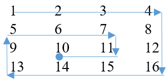


**Đầu vào:**
- Dòng đầu tiên đưa vào số lượng bộ test T.
- Những dòng kế tiếp đưa vào T bộ test. Mỗi bộ test gồm hai dòng: dòng đầu tiên đưa vào N, M là cấp của ma trận A[][]; dòng tiếp theo đưa vào N×M số A[i][j] ; các số được viết cách nhau một vài khoảng trống.
- T, M, N, A[i][j] thỏa mãn ràng buộc: 1≤ T ≤100; 1≤ M, N ≤100; 1≤ A[i][j] ≤10<sup>5</sup>.

**Đầu ra:**
- Đưa ra kết quả mỗi test theo từng dòng.

**input:**
```
2
4 4
1 2 3 4 5 6 7 8 9 10 11 12 13 14 15 16
3 4
1 2 3 4 5 6 7 8 9 10 11 12
```

**output:**
```
1 2 3 4 8 12 16 15 14 13 9 5 6 7 11 10
1 2 3 4 8 12 11 10 9 5 6 7
```

### CPP0224 ĐẾM SỐ MIỀN MA TRẬN
Cho ma trận A[N][M] bao gồm các số 0 và 1. Ta gọi mỗi miền của ma trận A[][] là nhóm các số 1 được bao quanh bởi các số 0. Hãy tìm số miền của ma trận. số miền của ma trận A[][] là 4.

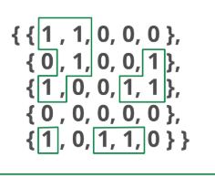


**Đầu vào:**
- Dòng đầu tiên đưa vào số lượng bộ test T.
- Những dòng kế tiếp đưa vào T bộ test. Mỗi bộ test gồm hai dòng: dòng đầu tiên đưa vào N, M là cấp của ma trận A[][]; dòng tiếp theo đưa vào N×M số A[i][j] ; các số được viết cách nhau một vài khoảng trống.
- T, M, N, A[i][j] thỏa mãn ràng buộc: 1≤ T ≤100; 1≤ M, N ≤100; 0≤ A[i][j] ≤1.

**Đầu ra:**
- Đưa ra kết quả mỗi test theo từng dòng.

**input:**
```
2
3 3
1 1 0 0 0 1 1 0 1
4 4
1 1 0 0 0 0 1 0 0 0 0 1 0 1 0 0
```

**output:**
```
2
2
```

### CPP0225 BIẾN ĐỔI MA TRẬN
Cho ma trận vuông A[N][N]. Tìm số phép biến đổi ít nhất để tổng theo các hàng, các cột của ma trận đều bằng nhau. Biết mỗi phép biến đổi bạn chỉ được phép tăng một phần tử bất kỳ của ma trận lên 1 đơn vị. với ma trận

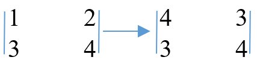


**Đầu vào:**
- Dòng đầu tiên đưa vào số lượng bộ test T.
- Những dòng kế tiếp đưa vào T bộ test. Mỗi bộ test gồm hai dòng: dòng đầu tiên đưa vào N là cấp của ma trận A[N][N]; dòng tiếp theo đưa vào N×N số A[i][j] ; các số được viết cách nhau một vài khoảng trống.
- T, N, A[i][j] thỏa mãn ràng buộc: 1≤ T ≤100; 1≤ N ≤100; 1≤ A[i][j] ≤150.

**Đầu ra:**
- Đưa ra kết quả mỗi test theo từng dòng.

**input:**
```
2
2
1 2 3 4
3
1 2 3 4 2 3 3 2 1
```

**output:**
```
4
6
```

### CPP0227 IN MA TRẬN - 1
Cho ma trận vuông A[N][N]. Hãy in các phần tử thuộc theo hình con rắn.

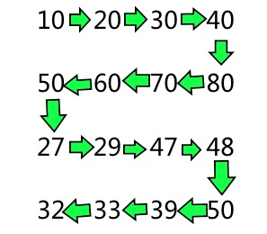


**Đầu vào:**
- Dòng đầu tiên đưa vào số lượng bộ test T.
- Những dòng kế tiếp đưa vào T bộ test. Mỗi bộ test gồm hai dòng: dòng đầu tiên đưa vào N là cấp của ma trận A[N][N]; dòng tiếp theo đưa vào N×N số A[i][j] ; các số được viết cách nhau một vài khoảng trống.
- T, N, A[i][j] thỏa mãn ràng buộc: 1≤ T ≤100; 1≤ N ≤100; 1≤ A[i][j] ≤150.

**Đầu ra:**
- Đưa ra kết quả mỗi test theo từng dòng.

**input:**
```
2
3
45 48 54 21 89 87 70 78 15
2
25 27 23 21
```

**output:**
```
45 48 54 87 89 21 70 78 15
25 27 21 23
```

### CPP0228 IN MA TRẬN - 2
Cho số N biểu diễn cho ma trận vuông A[4*N][4*N] được điền các con số từ 1 đến 4*N*4*N theo thứ tự từ nhỏ đến lớn, từ trái qua phải. Nhiệm vụ của bạn là in các phần tử của ma trận theo hai hình cuộn dây. với N = 2 ta có ma trận 4×4 và hai cuộn dây sau:

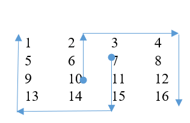

Cuộn 1: 10  6  2  3  4  8  12  16
Cuộn 2: 7  11  15  14  13  9  5  1

**Đầu vào:**
- Dòng đầu tiên đưa vào số lượng bộ test T.
- Những dòng kế tiếp đưa vào T bộ test. Mỗi bộ test là một số N được viết trên 1 dòng.
- T, N thỏa mãn ràng buộc: 1≤ T ≤100; 1≤ N ≤10.

**Đầu ra:**
- Đưa ra kết quả mỗi test theo từng dòng.

**input:**
```
1
1
```

**output:**
```
10 6 2 3 4 8 12 16
7 11 15 14 13 9 5 1
```

### CPP0229 IN MA TRẬN - 3
Cho ma trận A[N][M]. Nhiệm vụ của bạn là in các phần tử của ma trận theo đường chéo. về in ma trận theo đường chéo: 1 2 5 9 6 3 4 7 10 13 14 11 8 12 15 16.

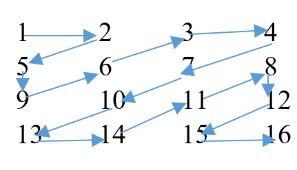


**Đầu vào:**
- Dòng đầu tiên đưa vào số lượng bộ test T.
- Những dòng kế tiếp đưa vào T bộ test. Mỗi bộ test gồm hai dòng: dòng đầu tiên đưa vào N, M là cấp của ma trận A[][]; dòng tiếp theo đưa vào N×M số A[i][j] ; các số được viết cách nhau một vài khoảng trống.
- T, M, N, A[i][j] thỏa mãn ràng buộc: 1≤ T ≤100; 1≤ M, N ≤100; 1≤ A[i][j] ≤10<sup>5</sup>.

**Đầu ra:**
- Đưa ra kết quả mỗi test theo từng dòng.

**input:**
```
2
3 3
1 2 3
4 5 6
7 8 9
2 2
1 2
3 4
```

**output:**
```
1 2 4 7 5 3 6 8 9
1 2 3 4
```

### CPP0230 MA TRẬN NHỊ PHÂN
Cho ma trận A[] có N hàng và 3 cột, trong đó các vị trí là các giá trị nhị phân (0 hoặc 1). Hãy đếm xem có bao nhiêu hàng mà số lượng số 1 nhiều hơn số lượng số 0.

**Đầu vào:**
Dòng đầu ghi số nguyên dương N (không quá 1000).
N dòng tiếp theo, mỗi dòng ghi 3 giá trị nhị phân.

**Đầu ra:**
Ghi ra số dòng mà số lượng số 1 nhiều hơn số lượng số 0.

**input:**
```
3
1 1 0
1 1 1
1 0 0
```

**output:**
```
2
```

**input:**
```
2
1 0 0
0 1 1
```

**output:**
```
1
```

### CPP0232 HÌNH CHỮ NHẬT LỚN NHẤT - 1
Cho ma trận A[N][M] chỉ bao gồm các số 0 và 1. Hãy tìm hình chữ nhật lớn nhất có các phần tử đều bằng 1 bằng cách tráo đổi các cột của ma trận với nhau. với ma trận dưới đây ta sẽ có hình chữ nhật lớn nhất có các phần tử là 1 bằng 6.
0          1          0          1          0                      0          0          1          1          0
0          1          0          1          1                      0          0          1          1          1
1          1          0          1          0                      1          0          1          1          0

**Đầu vào:**
- Dòng đầu tiên đưa vào số lượng bộ test T.
- Những dòng kế tiếp đưa vào T bộ test. Mỗi bộ test gồm hai dòng: Dòng đầu tiên đưa vào hai số N, M ; dòng tiếp là N×M các phần tử của ma trận A[][]; các phần tử được viết cách nhau một vài khoảng trống.
- T, N, M thỏa mãn ràng buộc: 1≤T≤100; 1≤ N, M ≤15.

**Đầu ra:**
- Đưa ra kết quả mỗi test theo từng dòng.

**input:**
```
2
2 3
1 1 1
0 1 1
2 2
1 0
1 1
```

**output:**
```
4
2
```

### CPP0233 MA TRẬN XOẮN ỐC - 2
Cho ma trận A[N][M]. Nhiệm vụ của bạn là in các phần tử của ma trận theo hình xoắn ốc ngược. về in ma trận theo hình xoắn ốc ngược như dưới đây: 10  11  7  6  5  9  13  14  15 16  12  8  4  3  2  1.

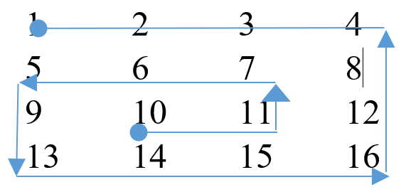


**Đầu vào:**
- Dòng đầu tiên đưa vào số lượng bộ test T.
- Những dòng kế tiếp đưa vào T bộ test. Mỗi bộ test gồm hai dòng: dòng đầu tiên đưa vào N, M là cấp của ma trận A[][]; dòng tiếp theo đưa vào N×M số A[i][j] ; các số được viết cách nhau một vài khoảng trống.
- T, M, N, A[i][j] thỏa mãn ràng buộc: 1≤ T ≤100; 1≤ M, N ≤100; 1≤ A[i][j] ≤10<sup>5</sup>.

**Đầu ra:**
- Đưa ra kết quả mỗi test theo từng dòng.

**input:**
```
2
4 4
1 2 3 4
5 6 7 8
9 10 11 12
13 14 15 16
3 6
1 2 3 4 5 6
7 8 9 10 11 12
13 14 15 16 17 18
```

**output:**
```
10 11 7 6 5 9 13 14 15 16 12  8  4  3  2  1
11 10 9 8 7 13 14 15 16 17 18 12 6 5 4 3 2 1
```

### CPP0234 MA TRẬN XOẮN ỐC - 3
Cho ma trận A[N][M]. Nhiệm vụ của bạn là đưa ra phần tử thứ k phép duyệt theo mô hình xoắn ốc trên ma trận của ma trận theo hình xoắn ốc. với k=6 của ma trận dưới đây sẽ cho ta kết quả là 12 ( Phép duyệt xoắn ốc: 1  2  3  4  8  12  16  15  14  13  9  5  6  7  11  10 ).

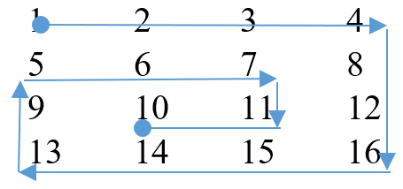


**Đầu vào:**
- Dòng đầu tiên đưa vào số lượng bộ test T.
- Những dòng kế tiếp đưa vào T bộ test. Mỗi bộ test gồm hai dòng: dòng đầu tiên đưa vào N, M là cấp của ma trận A[][] và số k; dòng tiếp theo đưa vào N×M số A[i][j] ; các số được viết cách nhau một vài khoảng trống.
- T, M, N, k, A[i][j] thỏa mãn ràng buộc: 1≤ T ≤100; 1≤ M, N, k ≤100; 1≤ A[i][j] ≤10<sup>5</sup>.

**Đầu ra:**
- Đưa ra kết quả mỗi test theo từng dòng.

**input:**
```
2
4 4 6
1 2 3 4
5 6 7 8
9 10 11 12
13 14 15 16
3 4 10
1 2 3 4
5 6 7 8
9 10 11 12
```

**output:**
```
12
5
```

### CPP0237 MA TRẬN VUÔNG LỚN NHẤT
Cho ma trận vuông A[N][N] có các phần tử hoặc là ký tự ‘O’ hoặc là ký tự ‘X’. Hãy tìm cấp của ma trận vuông lớn nhất có các phần tử ‘X’ bao quanh các phần tử ‘O’. với ma trận dưới đây ta sẽ có kết quả là 3.
X         O         X         X         X
X         X         X         X         X
X         X         O         X         O
X         X         X         X         X
X         X         X         O         O

**Đầu vào:**
- Dòng đầu tiên đưa vào số lượng bộ test T.
- Những dòng kế tiếp đưa vào T bộ test. Mỗi bộ test gồm hai dòng: Dòng đầu tiên đưa vào số N ; dòng tiếp là N×N các phần tử của ma trận A[][]; các phần tử được viết cách nhau một vài khoảng trống.
- T, N thỏa mãn ràng buộc: 1≤T≤100; 1≤ N ≤20.

**Đầu ra:**
- Đưa ra kết quả mỗi test theo từng dòng.

**input:**
```
2
2
X X
X X
4
X X X O
X O X X
X X X O
X O X X
```

**output:**
```
2
3
```

### CPP0238 THAY THẾ X - O
Cho ma trận A[N][M] có các phần tử hoặc là ký tự ‘’O’’ hoặc là ký tự ‘’X’’. Hãy thay thế các miền bao quanh ‘O’ bằng ‘X’. Một miền các ký tự ‘O’ bị bao quang bởi ký tự ‘X’ nếu các ký tự ‘X’ xuất hiện ở phía dưới, phía trên, bên trái, bên phải các ký tự ‘O’. với ma trận dưới đây ta sẽ có kết quả như sau:
X         X         X         X                     X         X         X         X
X         O         X         X                     X         X         X         X
X         O         O         X                     X         X         X         X
X         O         X         X                     X         X         X         X
X         X         O         O                     X         X         O         O

**Đầu vào:**
- Dòng đầu tiên đưa vào số lượng bộ test T.
- Những dòng kế tiếp đưa vào T bộ test. Mỗi bộ test gồm hai dòng: Dòng đầu tiên đưa vào hai số N, M ; dòng tiếp là N×M các phần tử của ma trận A[][]; các phần tử được viết cách nhau một vài khoảng trống.
- T, N, M thỏa mãn ràng buộc: 1≤T≤100; 1≤ N, M ≤20.

**Đầu ra:**
- Đưa ra kết quả mỗi test theo từng dòng.

**input:**
```
2
1 5
X O X O X
3 3
X X X
X O X
X X X
```

**output:**
```
X O X O X
X X X
X X X
X X X
```

### CPP0239 TÍNH HẠNG CỦA MA TRẬN
Cho ma trận A[N][M]. Hãy tìm hạng của ma trận A[N][M]. Hạng của ma trận (Rank Matrix) là số các cột hoặc các hàng độc lập tuyến tính. . hạng của ma trận dưới đây là 2 vì có hàng 1 và hàng 2 là phụ thuộc tuyến tính.
10        20        10
20        40        20
30        50        0

**Đầu vào:**
- Dòng đầu tiên đưa vào số lượng bộ test T.
- Những dòng kế tiếp đưa vào T bộ test. Mỗi bộ test gồm hai dòng: Dòng đầu tiên đưa vào hai số N, M ; dòng tiếp là N×M các phần tử của ma trận A[][]; các phần tử được viết cách nhau một vài khoảng trống.
- T, N, M, A[i][j] thỏa mãn ràng buộc: 1≤T≤100; 1≤ N, M ≤15; -10<sup>2</sup>≤ A[i][j] ≤10<sup>2</sup>.

**Đầu ra:**
- Đưa ra kết quả mỗi test theo từng dòng.

**input:**
```
2
3 3
10 20 10 20 40 20 30 50 0
3 3
10 20 10 -20 -30 10 30 50 0
```

**output:**
```
2
2
```

### CPP0259 TÍCH MA TRẬN
Viết chương trình tính tích hai ma trận A cỡ n*m và ma trận B cỡ m*p.
Với 1 < n,m,p < 50. Các giá trị trong ma trận đều nguyên dương và không vượt quá 1000.

**Đầu vào:**
Dòng đầu ghi 3 số n,m,p
n dòng tiếp theo ghi ma trận A
m dòng tiếp theo ghi ma trận B

**Đầu ra:**
Ghi ra ma trận tích

**input:**
```
3 4 3
1 2 3 4
4 2 3 1
2 4 1 3
1 1 1
2 2 2
3 3 3
4 4 4
```

**output:**
```
30 30 30
21 21 21
25 25 25
```

### CPP0260 MA TRẬN XOẮN ỐC - 4
Cho ma trận vuông A cỡ N*N chỉ bao gồm các số nguyên dương không quá 1000. Hãy sắp đặt các giá trị trong ma trận A sao cho các số được điền lần lượt theo kiểu xoắn ốc tăng dần, theo chiều kim đồng hồ.

**Đầu vào:**
Dòng đầu ghi số N (2 < N < 20).
N dòng tiếp theo ghi ma trận A, các giá trị nguyên dương và không quá 1000.

**Đầu ra:**
Ghi ra ma trận kết quả

**input:**
```
3
3 6 1
8 7 9
4 12 5
```

**output:**
```
1 3 4
9 12 5
8 7 6
```

### CPP0261 CỬA SỔ TRƯỢT
Cho ma trận vuông A cỡ N*N. Một ma trận vuông B nhỏ hơn cỡ M*M có thể dùng làm “cửa sổ trượt” trên ma trận A nếu M là ước số của N.
Hãy thực hiện tính tích chập của ma trận B với từng “khung cửa số” tương ứng trên ma trận A. Tích chập được hiểu là tính giá trị tích từng vị trí tương ứng trên 2 ma trận kích thước bằng nhau.
Xem để hiểu rõ hơn.

**Đầu vào:**
Dòng đầu ghi số N (3 < N < 100) . Tiếp theo là N dòng ghi ma trận A. Các giá trị đều nguyên dương và không quá 1000.
Tiếp theo là một dòng ghi số M (1 < M <10). Tiếp theo là M dòng ghi ma trận B. Các giá trị lớn hơn hoặc bằng 0 và không quá 20.
Dữ liệu vào đảm bảo M là ước số của N.

**Đầu ra:**
Ghi ra N dòng mô tả ma trận kết quả.

**Ví dụ:**
**input:**
```
4
1 2 3 4
5 6 7 8
9 10 11 12
13 14 15 16
2
1 0
0 2
```

**output:**
```
1 0 3 0
0 12 0 16
9 0 11 0
0 28 0 32
```

### CPP0263 GIÁ TRỊ LỚN NHẤT CỦA MA TRẬN
Giả sử giá trị của một ma trận là hiệu giữa tổng các số trên đường chéo chính và tổng các số trên đường chéo phụ. Cho ma trận A kích thước N * N, hãy tìm ma trận con của A sao cho ma trận con đó có giá trị lớn nhất.

**Đầu vào:**
Dòng đầu ghi số N (2 ≤ N ≤ 400)
N dòng tiếp theo ghi ma trận A. Các số trong đoạn [-1000, 1000].

**Đầu ra:**
Ghi ra giá trị lớn nhất tìm được.

**input:**
```
4
9 -2 -8 0
-6 -2 0 -9
4 -5 6 1
1 3 4 9
```

**output:**
```
26
```

### CPP0270 TÍCH CHẬP
Phép tích chập (convolution) là kỹ thuật quan trọng trong xử lý ảnh. Kết quả phép tích chập giữa ma trận x[] và ma trận kernel h[] được xác định bằng công thức:

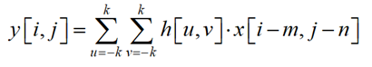

Trong đó ma trận kernel có kích thước bằng 2k+1. Với kernel 3x3 thì -1 ≤u,v≤1, do đó, giá trị các phần tử của ma trận kết quả có dạng:

.png)

Cho ma trận ảnh và ma trận kernel 3x3. Nhiệm vụ của bạn là hãy thực hiện phép nhân tích chập của 2 ma trận, sau đó tính tổng tất cả các phần tử của ma trận thu được.

.png)

Giải thích test: Vị trí ô đầu tiên của ma trận kết quả:

.png)


**Đầu vào:**
- Dòng đầu tiên là số lượng bộ test T (T≤ 20).
- Mỗi test bắt đầu bởi hai số nguyên N và M. (3≤N,M≤300).
- Kế tiếp là N dòng, mỗi dòng gồm M số nguyên mô tả ma trận ảnh.
- 3 dòng tiếp theo, mỗi dòng gồm 3 số nguyên mô tả ma trận kernel.
- Giá trị các phần tử của hai ma trận có giá trị tuyệt đối không vượt quá 100.

**Đầu ra:**
Với mỗi test, hãy in ra tổng các phần tử của ma trận mới tìm được.

**input:**
```
2
4 4
2 1 0 0
3 2 1 1
4 3 2 1
2 2 1 0
-1 -1 -1
-1 8 -1
-1 -1 -1
3 3
1 2 3
4 5 6
7 8 9
1 1 1
1 1 1
1 1 1
```

**output:**
```
10
45
```

### CPP0271 LÀM MỊN ẢNH
Phương pháp làm mịn ảnh được thực hiện bằng cách sử dụng phép tích chập (convolution) giữa ma trận ảnh và một ma trận kernel có dạng:

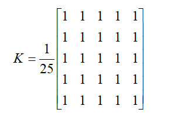

Ma trận kernel trong trên có kích thước bằng 5. Với ma trận kernel có kích thước L = 2k + 1, giá trị điểm ảnh (i,j) của ma trận mới sẽ bằng tổng của (2k + 1) x (2k + 1) phần tử (i+u, j+v) với mọi –k ≤ u,v ≤ k, sau đó chia cho (2k + 1) x (2k + 1). Kết quả điểm ảnh mới thu được sau khi thực hiện phép chia sẽ được làm tròn xuống.
Cho ma trận ảnh đầu vào và kích thước L của ma trận kernel, nhiệm vụ của bạn là hãy in ra ma trận ảnh sau khi được làm mịn.

**Đầu vào:**
Dòng đầu tiên là số lượng bộ test T (T ≤ 10).
Mỗi test bắt đầu bởi hai số nguyên N, M và L (3 ≤ N,M ≤ 500; L ≤ min(n,m)). L được đảm bảo là một số nguyên lẻ.
Kế tiếp là N dòng, mỗi dòng gồm M số nguyên mô tả ma trận ảnh đầu vào, có giá trị trong phạm vi từ 0 tới 255.

**Đầu ra:**
Với mỗi test, hãy in ra ma trận ảnh sau khi đã được làm mịn.
Ví dụ:

**input:**
```
2
4 4 3
2 1 0 0
3 2 1 1
4 5 2 1
2 2 9 0
3 3 3
1 2 3
4 5 6
7 8 9
```

**output:**
```
2 1
3 1
5
```
Giải thích test 1: Giá trị phần tử (1,1) = floor[(2+1+0+3+2+1+4+5+2) / 9] = floor [20/9] = 2.

## Kiểu dữ liệu string và áp dụng

### CPP0308 KÝ TỰ KHÔNG LẶP
Cho xâu ký tự S. Nhiệm vụ của bạn là in ra tất cả các ký tự không lặp khác nhau trong S. S =”ABCDEABC” ta nhận được kết quả là “DE”.

**Đầu vào:**
- Dòng đầu tiên đưa vào số lượng bộ test T.
- Những dòng kế tiếp đưa vào T bộ test. Mỗi bộ test là một xâu ký tự S được viết trên một dòng.
- T, S thỏa mãn ràng buộc: 1≤ T ≤100; 1≤ Length(S)≤10<sup>5</sup>.

**Đầu ra:**
- Đưa ra kết quả mỗi test theo từng dòng. In ra theo thứ tự chữ cái xuất hiện trong xâu ban đầu.

**input:**
```
2
ABCDEAABC
ABC
```

**output:**
```
DE
ABC
```

### CPP0309 ĐẾM TỪ
Một từ được hiểu là dãy các ký tự liên tiếp không chứa ký tự space, ‘\t’, ‘\n’, Cho xâu ký tự S có các ký tự space, ‘\t’, ‘\n’, hãy đếm số các từ của S.

**Đầu vào:**
- Dòng đầu tiên đưa vào số lượng bộ test T.
- Những dòng kế tiếp đưa vào T bộ test. Mỗi bộ test là một xâu ký tự S được viết trên một dòng.
- T, S thỏa mãn ràng buộc: 1≤ T ≤100; 1≤ length(S)≤10<sup>3</sup>.

**Đầu ra:**
- Đưa ra kết quả mỗi test theo từng dòng.

**input:**
```
2
Print the number of words
Print the number of words present in the string
```

**output:**
```
5
9
```

### CPP0310 TỔNG LỚN NHẤT VÀ NHỎ NHẤT
Cho hai số nguyên dương X1, X2. Ta chỉ được phép thay đổi chữ số 5 thành 6 và ngược lại chữ số 6 thành chữ số 5 của các số X1 và X2. Hãy đưa ra tổng nhỏ nhất và tổng lớn nhất các số X1 và X2 được tạo ra theo nguyên tắc kể trên.

**Đầu vào:**
- Dòng đầu tiên đưa vào số lượng bộ test T.
- Những dòng kế tiếp đưa vào T bộ test. Mỗi bộ test là cặp các số X1, X2.
- T, X1, X2 thỏa mãn ràng buộc: 1≤ T ≤100; 0≤ X1, X2 ≤10<sup>18</sup>.

**Đầu ra:**
- Đưa ra kết quả mỗi test theo từng dòng.

**input:**
```
2
645  666
5466 4555
```

**output:**
```
1100  1312
10010 11132
```

### CPP0311 SẮP ĐẶT XÂU KÝ TỰ - 1
Cho xâu ký tự S bao gồm các ký tự ‘a’,..,’z’. Các ký tự trong S có thể lặp lại. Nhiệm vụ của bạn sắp đặt lại các ký tự trong S sao cho các ký tự kề nhau đều khác nhau.

**Đầu vào:**
- Dòng đầu tiên đưa vào số lượng bộ test T.
- Những dòng kế tiếp đưa vào T bộ test. Mỗi bộ test là một xâu ký tự S.
- T, S thỏa mãn ràng buộc: 1≤ T ≤100; 0≤ Length(S) ≤10<sup>3</sup>.

**Đầu ra:**
- Đưa ra 1 hoặc 0 nếu có thể hoặc không thể sắp đặt lại các ký tự trong xâu S thỏa mãn yêu cầu bài toán.

**input:**
```
3
geeksforgeeks
bbbabaaacd
bbbbb
```

**output:**
```
1
1
0
```

### CPP0312 XÂU PANGRAM
Một xâu ký tự được gọi là Pangram nếu nó chứa đầy đủ các ký tự từ ‘a’, ..’z’. Cho xâu ký tự S và số K. Hãy xác định xem có thể thực hiện nhiều nhất K phép biến đổi các ký tự để S trở thành Pangram hay không? Mỗi phép biến đổi là một phép thay thế ký tự này bằng một ký tự khác.

**Đầu vào:**
- Dòng đầu tiên đưa vào số lượng bộ test T.
- Những dòng kế tiếp đưa vào T bộ test. Mỗi bộ test gồm hai dòng: dòng đầu tiên đưa vào xâu ký tự S; dòng tiếp theo đưa vào số K.
- T, S, K thỏa mãn ràng buộc: 1≤ T ≤100; 0≤ K ≤62; 1≤ Length(S) ≤10<sup>6</sup>.

**Đầu ra:**
- Đưa ra kết quả mỗi test theo từng dòng.

**input:**
```
2
qwqqwqeqqwdsdadsdasadsfsdsdsdasasas
4
qwqqwqeqqwdsdadsdasadsfsdsdsdasasas
24
```

**output:**
```
0
1
```

### CPP0313 LOẠI BỎ TỪ TRONG XÂU
Viết chương trình cho phép nhập vào một chuỗi và từ cần loại bỏ khỏi chuỗi. Thực hiện loại bỏ từ và in ra kết quả
Trong đó:

**Đầu vào:**
- Hàng thứ nhất là chuỗi ban đầu
- Hàng tiếp theo là từ cần loại bỏ

**Đầu ra:**
- Chuỗi kết quả

**input:**
```
Toi Yeu PTIT
Toi
```

**output:**
```
Yeu PTIT
```

### CPP0314 CHÚC MỪNG NĂM MỚI
Tí năm nay đã lên lớp 1 rồi, Tết đến Tí rất vui vì nhận được rất nhiều lời chúc.
Vì mới tập viết nên Tí đã ghi lại tất cả các lời chúc đó. Cũng vì rất trân trọng các lời chúc nên Tí đã ghi tất cả các lời chúc bằng chữ IN HOA, tuy nhiên do mới tập viết nên Tí ghi không có dấu. Giờ ngồi lật lại cuốn nhật ký ghi các lời chúc, Tí thấy mình đã ghi được n lời chúc.
Tí muốn biết có bao nhiêu lời chúc khác nhau (hai lời chúc được gọi là khác nhau nếu chúng có độ dài khác nhau hoặc tồn tại ít nhất một vị trí mà ký tự ở vị trí đó của hai lời chúc là khác nhau, hay nói cách khác, đó là hai xâu ký tự khác nhau). Bạn hãy lập chương trình giúp Tí đếm xem có bao nhiêu lời chúc khác nhau nhé.

**Đầu vào:**
Dòng đầu chứa số nguyên dương n là số lời chúc Tí ghi được;
n dòng tiếp theo, mỗi dòng chứa một xâu ký tự S là một lời chúc.
n, S thỏa mãn ràng buộc: 1 ≤ n ≤ 10^4; Các lời chúc S có độ dài không quá 30 ký tự gồm các chữ cái la tinh IN HOA ‘A’…’Z’ và dấu cách.

**Đầu ra:**
Một số nguyên dương duy nhất là số lời chúc khác nhau.

**input:**
```
4
CHUC MUNG NAM MOI
HAPPY NEW YEAR
CHUC MUNG TUOI MOI
CHUC MUNG NAM MOI
```

**output:**
```
3
```

### CPP0315 ĐỔI CHỖ CHỮ SỐ
Cho số tự nhiên N. Bạn chỉ được phép sử dụng nhiều nhất một phép đổi chỗ giữa 2 chữ số để nhận được số lớn nhất nhỏ hơn N. với số N=12435, sử dụng một phép đổi chỗ ta nhận được số lớn nhất nhỏ hơn N là 12345. Mặc dù 12354 > 12345 nhưng ta không thể tạo ra số 12345 với chỉ một phép hoán vị. Với số N=12345 ta không có phép đổi chỗ.

**Đầu vào:**
- Dòng đầu tiên đưa vào T là số lượng bộ test.
- T dòng tiếp đưa các bộ test. Mỗi bộ test được viết trên một dòng là một xâu ký tự số không có ký tự ‘0’ đầu tiên.
- Các số T, N thỏa mãn ràng buộc: 1≤T≤100; 1≤length(N) ≤10<sup>5</sup>;

**Đầu ra:**
- Đưa ra kết quả mỗi test theo từng dòng, trong đó -1 được xem là test không có phép đổi chỗ.

**input:**
```
2
12435
12345
```

**output:**
```
12345
-1
```

### CPP0317 SỐ ĐẸP
Một số được coi là đẹp nếu đó là số thuận nghịch và chỉ toàn các chữ số chẵn. Viết chương trình đọc vào các số nguyên dương có không quá 500 chữ số và kiếm tra xem số đó có đẹp hay không.

**Đầu vào:**
Dòng đầu tiên ghi số bộ test.
Mỗi bộ test viết trên một dòng số nguyên dương n không quá 500 chữ số.

**Đầu ra:**
Mỗi bộ test viết ra trên một dòng chữ YES nếu đó là số đẹp, chữ NO nếu ngược lại

**input:**
```
4
123456787654321
86442824468
8006000444422220000222244440006008
235365789787654324567856578654356786556
```

**output:**
```
NO
YES
YES
NO
```

### CPP0318 BIỂN SỐ ĐẸP
Biển số xe máy được quy định gồm các thành phần:
- Hai chữ số đầu là mã quản lý theo tỉnh – thành phố (mã của Hà Nội là 29 đến 31)
- Tiếp theo là dấu gạch ngang, sau đó là một chữ cái in hoa (từ A đến Z) và một chữ số. Cặp chữ cái và chữ số này được cấp theo khu vực quận – huyện.
- Tiếp theo là một dãy 5 số gồm 2 cụm: 3 chữ số đầu và hai chữ số sau, phân tách bởi dấu chấm.
Thông thường, người ta chỉ quan tâm đến 5 chữ số cuối. Giả sử các trường hợp sau được coi là đẹp:
- Cả 5 chữ số được sắp theo thứ tự tăng chặt từ trái qua phải.
- Cả 5 chữ số đều bằng nhau
- Ba chữ số đầu bằng nhau và hai chữ số cuối bằng nhau
- Cả 5 chữ số đều là 6 và/hoặc 8 (số lộc phát).
Theo quy tắc trên, các biển số sau được coi là đẹp:
- 29-T1 123.79
- 29-T1 555.55
- 29-T1 222.33
- 29-T1 686.88
Và các biển số sau không đẹp:
- 29-T1 123.33
- 29-T1 555.54
- 29-T1 606.88
Viết chương trình kiểm tra xem các biển số xe có đẹp hay không.

**Đầu vào:**
- Dòng đầu ghi số bộ test, không quá 50
- Mỗi bộ test là một biển số. Dữ liệu vào đảm bảo biển số được viết đúng quy định.

**Đầu ra:**
- In ra kết quả kiểm tra với từng bộ test

**Ví dụ:**
**input:**
```
7
29T1–123.45
29T1–555.55
29T1–222.33
29T1–686.88
29T1–123.33
29T1–555.54
29T1–606.88
```

**output:**
```
YES
YES
YES
YES
NO
NO
NO
```

### CPP0319 NHỎ NHẤT - LỚN NHẤT
Cho số tự nhiên m và số nguyên s không âm. Nhiệm vụ của bạn là tìm số bé nhất và lớn nhất có m chữ số và tổng chữ số bằng s.

**Đầu vào:**
Dòng đầu gồm 2 số m và s (1 ≤ m ≤ 100, 0 ≤ s ≤ 900).

**Đầu ra:**
In ra kết quả của bài toán.
Số đầu tiên là số bé nhất, số thứ hai là số lớn nhất. Nếu không có đáp án in ra “-1 -1”.

**Ví dụ:**
**input:**
```
2 15
```

**output:**
```
69 96
```

### CPP0320 SỐ ĐẦY ĐỦ
Cho một số nguyên dương lớn có nhiều hơn 20 chữ số nhưng không quá 1000 chữ số. Hãy kiểm tra xem số đó có đầy đủ tất cả các chữ số từ 0 đến 9 hay không.

**Đầu vào:**
- Dòng đầu ghi số bộ test, không quá 10
- Mỗi bộ test là một dãy ký tự có độ dài không quá 1000, không có khoảng trống

**Đầu ra:**
- Nếu dữ liệu vào không phải là một số nguyên hợp lệ (có ký tự không phải số hoặc bắt đầu bằng chữ số 0) thì in ra INVALID
- Nếu dữ liệu vào thỏa mãn đầy đủ thì in ra YES, nếu không in ra NO

**input:**
```
3
01234aa32432432432534545b987978
123444444444444566666666667890
324562783924723543243243242354354354333234324
```

**output:**
```
INVALID
YES
NO
```

### CPP0331 SUM STRING
Cho xâu ký tự S bao gồm các chữ số. Xâu S được gọi là Sum String nếu tồn tại một số tự nhiên k>2 sao cho ta có thể chia xâu S thành k xâu con khác nhau S =(S1, S2, ..Sk) sao cho các số được tạo bởi các xâu con thỏa mãn điều kiện  Si=Si-1 + Si-2 (i=3, 4, .., k). xâu S =”123415538” là một Sum String vì tồn tại số k = 3 để phân tích xâu S thành 3 xâu con S = (“123”, “415”,”538”) thỏa mãn 123 + 414 = 538. Tương tự như vậy xâu S=”12345” không phải là một Sum String.
Hãy kiểm tra xem S có phải là xâu Sum String hay không?

**Đầu vào:**
- Dòng đầu tiên đưa vào số lượng test T.
- Những dòng kế tiếp đưa vào các test. Mỗi test là một xâu ký tự số S.
- T và S thỏa mãn ràng buộc 1≤T≤100, 3≤length(S)≤105.

**Đầu ra:**
- Đưa ra kết quả mỗi test theo từng dòng.

**input:**
```
3
123415538
12345
1122335588143
```

**output:**
```
Yes
No
Yes
```

### CPP0334 TÍNH TỔNG CÁC SỐ TRONG XÂU
Cho xâu ký tự S bao gồm các ký tự ‘a’,..,’z’ và các chữ số. Nhiệm vụ của bạn là hãy tính tổng các số có mặt trong xâu.

**Đầu vào:**
- Dòng đầu tiên đưa vào số lượng bộ test T.
- Những dòng kế tiếp đưa vào T bộ test. Mỗi bộ test là một xâu ký tự S.
- T, S thỏa mãn ràng buộc: 1≤ T ≤100; 0≤ Length(S) ≤10<sup>5</sup>.
- Input đảm bảo đáp asn không vượt quá 10^9.

**Đầu ra:**
- Đưa ra kết quả mỗi test theo từng dòng.

**input:**
```
4
1abc23
geeks4geeks
1abc2x30yz67
123abc
```

**output:**
```
24
4
100
123
```

### CPP0335 TÌM SỐ LỚN NHẤT TRONG XÂU
Cho xâu ký tự S bao gồm các ký tự ‘a’,..,’z’ và các chữ số. Nhiệm vụ của bạn là hãy tìm số lớn nhất có mặt trong xâu.

**Đầu vào:**
- Dòng đầu tiên đưa vào số lượng bộ test T.
- Những dòng kế tiếp đưa vào T bộ test. Mỗi bộ test là một xâu ký tự S.
- T, S thỏa mãn ràng buộc: 1≤ T ≤100; 0≤ Length(S) ≤10<sup>5</sup>.
- Input đảm bảo đáp số không vượt quá 10^9.

**Đầu ra:**
- Đưa ra kết quả mỗi test theo từng dòng.

**input:**
```
3
100klh564abc365bg
abvhd9sdnkjdfs
abchsd0sdhs
```

**output:**
```
564
9
0
```

### CPP0336 XÂU CON NHỎ NHẤT - 1
Cho hai xâu ký tự S1 và S2. Nhiệm vụ của bạn là hãy tìm xâu con nhỏ nhất của S1 chứa đầy đủ các ký tự của S2. Nếu không tồn tại xâu con thỏa mãn yêu cầu bài toán, hãy đưa ra -1.

**Đầu vào:**
- Dòng đầu tiên đưa vào số lượng bộ test T.
- Những dòng kế tiếp đưa vào T bộ test. Mỗi bộ test là bộ đôi S1 và xâu ký tự S2 được viết trên các dòng khác nhau.
- T, S1, S2 thỏa mãn ràng buộc: 1≤ T ≤100; 1≤ Length(S1), Length(S2) ≤100.

**Đầu ra:**
- Đưa ra kết quả mỗi test theo từng dòng.

**input:**
```
2
timetopractice
toc
zoomlazapzo
oza
```

**output:**
```
toprac
apzo
```

### CPP0337 XÂU CON NHỎ NHẤT - 2
Cho xâu ký tự S. Nhiệm vụ của bạn là hãy tìm độ dài xâu con nhỏ nhất của S chứa đầy đủ các ký tự của S mỗi ký tự ít nhất một lần. với xâu S=”aabcbcdbca” ta có xâu con nhỏ nhất là “dbca”.

**Đầu vào:**
- Dòng đầu tiên đưa vào số lượng bộ test T.
- Những dòng kế tiếp đưa vào T bộ test. Mỗi bộ test là một xâu ký tự S được viết trên một dòng.
- T, S thỏa mãn ràng buộc: 1≤ T ≤100; 1≤ Length(S)≤10<sup>5</sup>.

**Đầu ra:**
- Đưa ra kết quả mỗi test theo từng dòng.

**input:**
```
2
aabcbcdbca
aaab
```

**output:**
```
4
2
```

### CPP0338 ĐẾM XÂU CON
Cho xâu ký tự S và số k. Nhiệm vụ của bạn là đếm số xâu con của S có đúng k ký tự khác nhau. Các xâu con không nhất thiết phải khác nhau. với xâu S=”abc” và k = 2, ta có kết quả là 2 bao gồm các xâu con: “ab”, “bc”.

**Đầu vào:**
- Dòng đầu tiên đưa vào số lượng bộ test T.
- Những dòng kế tiếp đưa vào T bộ test. Mỗi bộ test là một xâu ký tự S và số k được viết trên một dòng.
- T, S thỏa mãn ràng buộc: 1≤ T ≤100; 1≤ k ≤26;1≤ Length(S)≤10<sup>3</sup>.

**Đầu ra:**
- Đưa ra kết quả mỗi test theo từng dòng.

**input:**
```
2
abc  2
aba  2
```

**output:**
```
2
3
```

### CPP0339 ĐẦU CUỐI GIỐNG NHAU
Cho xâu ký tự S. Hãy đếm tất cả các xâu con của S có ký tự đầu và ký tự cuối giống nhau. với xâu “aba” ta có 4 xâu con bao gồm: “a”, “b”, “a”, “aba”.

**Đầu vào:**
- Dòng đầu tiên đưa vào số lượng bộ test T.
- Những dòng kế tiếp đưa vào T bộ test. Mỗi bộ test là một xâu ký tự S được viết trên một dòng.
- T, S thỏa mãn ràng buộc: 1≤ T ≤100; 1≤ k ≤26;1≤ Length(S)≤10<sup>3</sup>.

**Đầu ra:**
- Đưa ra kết quả mỗi test theo từng dòng.

**input:**
```
2
abcab
aba
```

**output:**
```
7
4
```

### CPP0342 TÁCH CHỮ SỐ
Cho xâu ký tự S bao gồm các ký tự ‘A’,..,’Z’ và các chữ số ‘0’,...,’9’. Nhiệm vụ của bạn in các ký tự từ ’A’,.., ‘Z’ trong S theo thứ tự anphabet và nối với tổng các chữ số trong S ở cuối cùng. S =”ACCBA10D2EW30” ta nhận được kết quả: “AABCCDEW6”.

**Đầu vào:**
- Dòng đầu tiên đưa vào số lượng bộ test T.
- Những dòng kế tiếp đưa vào T bộ test. Mỗi bộ test là một xâu ký tự S.
- T, S thỏa mãn ràng buộc: 1≤ T ≤100; 1≤ Length(S)≤10<sup>5</sup>.

**Đầu ra:**
- Đưa ra kết quả mỗi test theo từng dòng.

**input:**
```
2
AC2BEW3
ACCBA10D2EW30
```

**output:**
```
ABCEW5
AABCCDEW6
```

### CPP0353 ĐIỆN THOẠI CỤC GẠCH
Một thời không quá xa, điện thoại di động với chỉ các tính năng nghe, gọi, nhắn tin vẫn còn chiếm đại đa số thiết bị cầm tay tại Việt Nam. Khi nhắn tin, người nhắn sẽ bấm các phím số một đến bốn lần liên tiếp tương ứng với ký tự đi kèm ghi trên đó.
Cụ thể: các số và chữ cái tương ứng gồm:
2: ABC, 3: DEF, 4: GHI, 5: JKL
6: MNO, 7: PQRS, 8: TUV, 9: WXYZ
Cho trước dãy ký tự mô tả tin nhắn (không tính các ký tự khác ngoài danh sách nêu trên). Hãy kiểm tra xem dãy số được nhấn ứng với dãy ký tự đó có phải số thuận nghịch hay không (chỉ xét tương ứng giữa số và ký tự, không tính số đó được nhấn bao nhiêu lần, tất cả A,B,C,a,b,c đều chỉ là một chữ số 2).

**Đầu vào:**
Dòng đầu tiên là số bộ test, không quá 1000.
Mỗi test là dãy ký tự mô tả tin nhắn.

**Đầu ra:**
Ghi ra kết quả kiểm tra, YES nếu dãy số là thuận nghịch, NO nếu ngược lại.

**Ví dụ:**
**input:**
```
2
BOHIMA
IamACoder
```

**output:**
```
YES
NO
```

### CPP0354 MÃ HÓA
Cho một xâu ký tự độ dài không quá 100 chỉ bao gồm các chữ cái in hoa. Người ta thực hiện mã hóa bằng cách đếm các ký tự cạnh nhau giống nhau và viết số lượng phía sau các chữ cái đó.
xâu AAECCCCGGGD thì được mã hóa thành A2E1C4G3D1
Với giả thiết không có ký tự nào xuất hiện nhiều hơn 9 lần liên tiếp. Hãy viết chương trình mã hóa xâu ký tự theo cách như trên.

**Đầu vào:**
Dòng đầu ghi số bộ test. Mỗi bộ test ghi xâu chữ cái in hoa không quá 100 ký tự. Không có ký tự nào xuất hiện nhiều hơn 9 lần liên tiếp.

**Đầu ra:**
Với mỗi test ghi ra kết quả mã hóa.

**Ví dụ:**
**input:**
```
2
AAAAAAAA
AAECCCCGGGD
```

**output:**
```
A8
A2E1C4G3D1
```

### CPP0361 MẬT KHẨU
(Giới hạn thời gian chạy: 10 giây)
Hệ thống quản lý đào tạo của PTIT đang gặp một vấn đề về bảo mật. Do sự cố này, các account bị đổi thành tên viết liền của các sinh viên. Và chỉ cần đánh một chuỗi kí tự có chứa mật khẩu là có thể đăng nhập vào hệ thống. Chẳng hạn sinh viên A có mật khẩu là “abcd”, nếu ai đó đăng nhập với tài khoản là tên của A, mật khẩu “abcdef” hay “aaaabcd” đều được chấp nhận.
Nhân cơ hội này, rất nhiều bạn sinh viên đã cố gắng hack vào tài khoản của những người khác. Cho biết danh sách mật khẩu của tất cả các user, bài toán đặt ra là hãy xác định xem có nhiều nhất bao nhiêu trường hợp user này có thể login vào user khác?

**Đầu vào:**
Dòng đầu tiên là số nguyên N (1 ≤  N ≤  100 000).
N dòng tiếp theo, mỗi dòng chứa mật khẩu của một user, có độ dài không quá 10 kí tự và chỉ gồm các kí tự thường.

**Đầu ra:**
In ra một số nguyên là đáp án đáp án tìm được.
Giải thích test 2: User 1 có thể login vào user 2 và ngược lại. User 3 có thể login vào tài khoản của user 1 và 2.

**input:**
```
3
aaa
aa
abb
```

**output:**
```
1
```

**input:**
```
3
x
x
xy
```

**output:**
```
4
```

### CPP0371 LOẠI BỎ NGUYÊN ÂM
Cho một xâu ký tự S chỉ bao gồm các ký tự chữ cái và không có khoảng trống. Hãy loại bỏ các nguyên âm trong S.
Kết quả được viết ra dưới dạng chữ cái viết thường của các phụ âm có mặt trong S, trước mỗi phụ âm ghi một ký tự dấu chấm ‘.’
Các nguyên âm bao gồm: ‘A’, ‘E’, ‘I’, ‘O’, ‘U’, ‘Y’ (cả viết hoa và viết thường).

**Đầu vào:**
Chỉ có xâu S, độ dài không quá 100.

**Đầu ra:**
Ghi ra xâu kết quả

**input:**
```
HocVienCNBCVT
```

**output:**
```
.h.c.v.n.c.n.b.c.v.t
```

### CPP0374 BIẾN ĐỔI A – B
Cho xâu ký tự s chỉ bao gồm hai chữ cái là ‘A’ và ‘B’.
Mỗi bước được phép biến đổi một vị trí bất kỳ trong xâu (A thành B, B thành A) hoặc cũng có thể biến đổi một dãy liên tiếp các ký tự nào đó tính từ đầu xâu.
Hãy tính xem cần ít nhất bao nhiêu bước để biến đổi xâu về dạng toàn chữ cái A.

**Đầu vào:**
Chỉ có 1 dòng ghi xâu ký tự s, độ dài không quá 1 triệu ký tự.

**Đầu ra:**
Ghi ra kết quả bài toán

**input:**
```
AAABBBAAABBB
```

**output:**
```
4
```

## Xử lý số nguyên lớn

### CPP0316 SỐ MAY MẮN - 2
Một số nguyên không âm n được gọi là số may mắn nếu tổng các chữ của n bằng 9 hoặc tổng các chữ số của n là số may mắn. các số 9, 108, 279 là các số may mắn, còn các số 19, 289 không phải là số may mắn.
Yêu cầu: Cho số nguyên không âm n, hãy kiểm tra xem n có phải là số may mắn hay không?

**Đầu vào:**
Dữ liệu vào gồm nhiều bộ dữ liệu tương ứng với nhiều test. Dòng đầu tiên chứa một số nguyên dương không vượt quá 100 là số lượng các bộ dữ liệu. Các dòng tiếp theo chứa các bộ dữ liệu.
Mỗi bộ dữ liệu gồm một dòng duy nhất chứa một số nguyên không âm n (n ≤ 10<sup>100</sup>).

**Đầu ra:**
Với mỗi bộ dữ liệu, ghi ra trên một dòng câu trả lời, ghi số 1 nếu n là số may mắn, ghi số 0 trong trường hợp ngược lại.

**Ví dụ:**
**input:**
```
3
888
666
289
```

**output:**
```
0
1
0
```

### CPP0321 HIỆU HAI SỐ NGUYÊN LỚN
Cho hai số rất lớn X và Y được biểu diễn như hai xâu ký tự. Nhiệm vụ của bạn là tìm |X-Y|?

**Đầu vào:**
- Dòng đầu tiên đưa vào số lượng test T.
- Những dòng kế tiếp đưa vào các bộ test. Mỗi test gồm hai dòng: dòng thứ nhất đưa xâu X; dòng tiếp theo đưa vào xâu Y.
- T, X, Y  thỏa mãn ràng buộc : 1≤T≤100; 0≤length(X), length(Y)≤10<sup>3</sup>.

**Đầu ra:**
- Đưa ra số kết quả mỗi test theo từng dòng.

**input:**
```
2
978
12977
100
1000000
```

**output:**
```
11999
0999900
```

### CPP0322 TỔNG HAI SỐ NGUYÊN LỚN
Cho hai số rất lớn X và Y được biểu diễn như hai xâu ký tự. Nhiệm vụ của bạn là tìm X+Y?

**Đầu vào:**
- Dòng đầu tiên đưa vào số lượng test T.
- Những dòng kế tiếp đưa vào các bộ test. Mỗi test gồm hai dòng: dòng thứ nhất đưa xâu X; dòng tiếp theo đưa vào xâu Y.
- T, X, Y  thỏa mãn ràng buộc : 1≤T≤100; 0≤length(X), length(Y)≤10<sup>3</sup>.

**Đầu ra:**
- Đưa ra số kết quả mỗi test theo từng dòng.

**input:**
```
1
12
198111
```

**output:**
```
198123
```

### CPP0323 PHÉP CHIA DƯ CỦA SỐ NGUYÊN LỚN
Cho số nguyên dương N rất lớn được biểu diễn như một xâu và số M. Hãy tìm K = N%M. N=123456789873123456778976, M = 100 thì K=76.

**Đầu vào:**
- Dòng đầu tiên đưa vào số lượng test T.
- Những dòng kế tiếp mỗi dòng đưa vào các test. Mỗi test là bộ đôi N, M được viết trên hai dòng khác nhau.
- T, N, M thỏa mãn ràng buộc : 1≤T≤100; 0≤length(N) ≤1000; 2≤M ≤10<sup>12</sup>.

**Đầu ra:**
- Đưa ra kết quả mỗi test theo từng dòng.

**input:**
```
1
12345
10
```

**output:**
```
5
```

### CPP0324 PHÉP CHIA DƯ CỦA LŨY THỪA SỐ NGUYÊN LỚN
Cho số nguyên dương a, b, M, trong đó a là số rất lớn được biểu diễn như một xâu ký tự số. Hãy tìm K = (a<sup>b</sup>) %M. a = 3, b=2, M = 4 thì K = (3<sup>2</sup>)%4 = 1

**Đầu vào:**
- Dòng đầu tiên đưa vào số lượng test T.
- Những dòng kế tiếp mỗi dòng đưa vào một test. Mỗi test là bộ ba a, b, M được viết trên một dòng.
- T, a, b, M thỏa mãn ràng buộc : 1≤T≤100; 0≤length(a) ≤1000; 2≤ b, M ≤10<sup>12</sup>.

**Đầu ra:**
- Đưa ra kết quả mỗi test theo từng dòng.

**input:**
```
1
3 2 4
```

**output:**
```
1
```

### CPP0325 CHIA HẾT CHO 11
Cho số tự nhiên N, hãy kiểm tra xem N có phải là số chia hết cho 11 hay không? Đưa ra 1 nếu N chia hết cho 11, trái lại đưa ra 0.

**Đầu vào:**
- Dòng đầu tiên đưa vào số lượng bộ test T.
- Những dòng kế tiếp đưa vào T bộ test. Mỗi bộ test là một số tự nhiên N.
- T, N thỏa mãn ràng buộc: 1≤ T ≤100; 0≤ N ≤10<sup>1000</sup>.

**Đầu ra:**
- Đưa ra kết quả mỗi test theo từng dòng.

**input:**
```
2
76945
363588395960667043875487
```

**output:**
```
1
0
```

### CPP0326 TÍCH HAI SỐ NGUYÊN LỚN
Cho hai số rất lớn X và Y được biểu diễn như hai xâu ký tự. Nhiệm vụ của bạn là tìm X × Y?

**Đầu vào:**
- Dòng đầu tiên đưa vào số lượng test T.
- Những dòng kế tiếp đưa vào các bộ test. Mỗi test gồm hai dòng: dòng thứ nhất đưa xâu X; dòng tiếp theo đưa vào xâu Y.
- T, X, Y  thỏa mãn ràng buộc : 1≤T≤100; 0≤length(X), length(Y)≤10<sup>3</sup>.

**Đầu ra:**
- Đưa ra số kết quả mỗi test theo từng dòng.

**input:**
```
1
2  3
```

**output:**
```
6
```

### CPP0327 CHIA HẾT CHO 5
Cho số tự nhiên N được biểu diễn dưới dạng nhị phân. Hãy kiểm tra xem N có phải là số chia hết cho 5 hay không? Đưa ra “Yes” nếu N chia hết cho 5, trái lại đưa ra “No”.

**Đầu vào:**
- Dòng đầu tiên đưa vào số lượng bộ test T.
- Những dòng kế tiếp đưa vào T bộ test. Mỗi bộ test là một biểu diễn nhị phân của N.
- T, N thỏa mãn ràng buộc: 1≤ T ≤100; 0≤ N ≤10<sup>1000</sup>.

**Đầu ra:**
- Đưa ra kết quả mỗi test theo từng dòng.

**input:**
```
2
1010
10000101001
```

**output:**
```
Yes
Yes
```

### CPP0328 CHIA HẾT CHO 8
Cho xâu ký tự S bao gồm các số từ 0 đến 9. Nhiệm vụ của bạn là đếm số các xâu con của S là số chia hết cho 8 và không chia hết cho 3.

**Đầu vào:**
- Dòng đầu tiên đưa vào số lượng bộ test T.
- Những dòng kế tiếp đưa vào T bộ test. Mỗi bộ test là một xâu ký tự số S.
- T, S thỏa mãn ràng buộc: 1≤ T ≤100; 0≤ Length(S) ≤10<sup>3</sup>.

**Đầu ra:**
- Đưa ra kết quả mỗi test theo từng dòng.

**input:**
```
2
888
6564525600
```

**output:**
```
5
15
```

### CPP0329 THƯƠNG HAI SỐ NGUYÊN LỚN
Cho hai số rất lớn X và Y được biểu diễn như hai xâu ký tự. Nhiệm vụ của bạn là tìm X / Y?

**Đầu vào:**
- Dòng đầu tiên đưa vào số lượng test T.
- Những dòng kế tiếp đưa vào các bộ test. Mỗi test gồm hai dòng: dòng thứ nhất đưa xâu X; dòng tiếp theo đưa vào xâu Y.
- T, X, Y  thỏa mãn ràng buộc : 1≤T≤100; 0≤length(X), length(Y)≤10<sup>3</sup>.

**Đầu ra:**
- Đưa ra số kết quả mỗi test theo từng dòng.

**input:**
```
1
8  4
```

**output:**
```
2
```

### CPP0330 SỐ ĐỐI XỨNG LỚN NHẤT
Cho số nguyên dương gồm N chữ số. Bạn chỉ được phép thực hiện hai thao tác:
Thao tác A: loại bỏ tất cả các chữ số giống nhau.
Thao tác B: sắp đặt lại vị trí các chữ số.
Hãy tìm số nguyên đối xứng lớn nhất có thể được tạo ra bằng cách thực hiện hai thao tác A hoặc B ở trên. với số N = 1122233300000998, ta có thể tạo ra số đối xứng lớn nhất là 910000019 bằng cách thực hiện các thao tác A, B như sau:
Thao tác A: loại bỏ các chữ số 2 ta nhận được số 1133300000998.
Thao tác A: loại bỏ các chữ số 3 ta nhận được số 1100000998.
Thao tác A: loại bỏ các chữ số 8 ta nhận được số 110000099.
Thao tác B: sắp đặt lại các số còn lại 110000099 để được số 910000019.

**Đầu vào:**
- Dòng đầu tiên đưa vào số lượng bộ test T.
- Những dòng kế tiếp đưa vào các bộ test. Mỗi bộ test là một số nguyên dương có N chữ số.
- T, N thỏa mãn ràng buộc: 1≤T≤100; 1≤N≤1000.

**Đầu ra:**
- Đưa ra số nguyên lớn nhất được tạo ra bởi thao tác A, B của mỗi test theo từng dòng.

**input:**
```
5
12345000
11233300000998
3335
333566
```

**output:**
```
5
910000019
333
63336
```

### CPP0340 ĐẾM CÁC SỐ CHIA HẾT CHO N
Cho xâu ký tự S chỉ bao gồm các ký tự số. Nhiệm vụ của bạn là đếm các xâu con của S chia hết cho N. S =”1234”, N = 4 ta nhận được kết quả là 4 tương ứng với 4 xâu con chia hết cho 4: 4, 12, 24, 124. Xâu con có thể chứa các kí tự không liên tiếp nhau.

**Đầu vào:**
- Dòng đầu tiên đưa vào số lượng bộ test T.
- Những dòng kế tiếp đưa vào T bộ test. Mỗi bộ test gồm hai phần: phần thứ nhất là hai số M, N, trong đó M là độ dài xâu S; phần tiếp theo là xâu S gồm M số.
- T, M, N, S thỏa mãn ràng buộc: 1≤ T ≤100; 1≤ M, N <= 100.

**Đầu ra:**
- Đưa ra kết quả mỗi test theo từng dòng.

**input:**
```
2
4 4
1234
3 6
676
```

**output:**
```
4
3
```

### CPP0343 DÃY ƯU THẾ
Cho dãy A[] chỉ bao gồm các số nguyên dương không quá 10<sup>5</sup> nhưng không biết trước số phần tử của dãy. Người ta gọi dãy A[] là dãy ưu thế nếu thỏa mãn 1 trong 2 điều kiện sau đây:
- Dãy gọi là ưu thế chẵn nếu số phần tử của dãy là chẵn và số lượng số chẵn trong dãy nhiều hơn số lượng số lẻ.
- Dãy gọi là ưu thế lẻ nếu số phần tử của dãy là lẻ và số lượng số lẻ trong dãy nhiều hơn số lượng số chẵn.
Hãy kiểm tra xem dãy A[] có phải là dãy ưu thế hay không.

**Đầu vào:**
- Dòng đầu ghi số bộ test, không quá 10
- Mỗi bộ test là một dãy các số nguyên dương (không quá 10<sup>4</sup>) và có không quá 200 số, các số cách nhau 1 khoảng trống, không biết trước số lượng phần tử.

**Đầu ra:**
- Nếu dãy A[] thỏa mãn là dãy ưu thế thì in ra YES, nếu không in ra NO

**input:**
```
2
11 22 33 44 55 66 77
23 34 45 56 67 78 89 90 121 131 141 151 161 171
```

**output:**
```
YES
NO
```

## Các bài toán chuẩn hóa

### CPP0307 HIỆU CỦA HAI TẬP TỪ
Cho hai xâu ký tự S1 và S2. Hãy viết chương trình tìm các từ chỉ xuất hiện trong S1 mà không xuất hiện trong S2. Chú ý: mỗi từ chỉ liệt kê 1 lần.

**Đầu vào:**
Dòng 1 ghi số bộ test. Mỗi bộ test gồm 2 dòng, mỗi dòng ghi một xâu ký tự độ dài không quá 200, chỉ bao gồm các ký tự viết thường và các khoảng trống.

**Đầu ra:**
Với mỗi bộ test ghi ra các từ có trong S1 mà không có trong S2. Các từ được ghi theo thứ tự từ điển.

**input:**
```
2
abc ab ab ab abcd
ab abc
aaa xyz ab zzz abc dd dd abc
xyz dd ttt sas cdc
```

**output:**
```
abcd
aaa ab abc zzz
```

### CPP0332 ĐỊA CHỈ EMAIL - 1
Địa chỉ email của cán bộ PTIT được cấp theo nguyên tắc ghép tên với chữ cái đầu tiên của họ và tên đệm. Viết chương trình cho phép tạo các địa chỉ email theo tên cán bộ

**Đầu vào:**
Chỉ có một xâu ký tự họ tên độ dài không quá 100.

**Đầu ra:**
Ghi ra địa chỉ email theo mẫu trong .

**Ví dụ:**
**input:**
```
Nguyen vAn nAM
```

**output:**
```
namnv@ptit.edu.vn
```

### CPP0333 CHUẨN HÓA HỌ TÊN
Tên người dùng sẽ được chuẩn hóa theo nguyên tắc tên được viết sau cùng, phân tách với phần tên đệm và tên bởi dấu phẩy. Các chữ cái nằm trong tên đều được viết hoa; chữ cái đầu tiên của tên đệm và họ được viết hoa, các chữ cái còn lại viết thường.

**Đầu vào:**
Chỉ có một xâu họ tên độ dài không quá 100

**Đầu ra:**
Ghi ra xâu họ tên đã chuẩn hóa theo mẫu trong

**Ví dụ:**
**input:**
```
ngUyeN   vAN Nam
```

**output:**
```
Nguyen Van, NAM
```

### CPP0351 CHUẨN HÓA HỌ TÊN
Khi viết tên người Việt Nam sang dạng chuẩn Tiếng Anh không dấu, người ta có thể lựa chọn 1 trong 2 cách viết:
- Cách 1: tên có 1 từ.
Nguyen Manh Son được viết thành Son Nguyen Manh
- Cách 2: họ có 1 từ.
Ví dụ: Nguyen Manh Son được viết thành Manh Son Nguyen
Hãy viết chương trình chuẩn hóa xâu ký tự họ tên theo một trong hai dạng trên.

**Đầu vào:**
Dòng đầu ghi số bộ test.
Mỗi bộ test gồm 2 dòng. Dòng đầu ghi số 1 hoặc số 2 cho biết cách chuẩn hóa được chọn. Dòng thứ 2 ghi xâu họ tên có độ dài không quá 60 ký tự.

**Đầu ra:**
Ghi ra danh sách các xâu họ tên đã chuẩn hóa.
Chú ý: có thể phải loại bỏ khoảng trống, chuyển đổi chữ hoa chữ thường cho đúng với cách viết họ tên chuẩn trước khi áp dụng một trong hai cách viết nói trên.

**Ví dụ:**
**input:**
```
2
1
NguyeN    vAn    Nam
2
hoAng  le Nhat THONG chi
```

**output:**
```
Nam Nguyen Van
Le Nhat Thong Chi Hoang
```

### CPP0355 XỬ LÝ VĂN BẢN
Cho dữ liệu vào là luồng văn bản bất kỳ, gồm các ký tự viết hoa, viết thường, các ký tự số và các dấu câu, không có các ký tự đặc biệt khác. Người ta muốn tách văn bản thành các câu. Mỗi câu in trên một dòng.
Một câu được định nghĩa là dãy ký tự có ít nhất 1 ký tự chữ cái hoặc chữ số, không chứa các dấu ngắt câu gồm: dấu chấm (.), dấu chấm hỏi (?) và dấu chấm cảm (!).
Dấu phẩy (,) và dấu hai chấm (:\) không được coi là dấu ngắt câu.
Nhiệm vụ của bạn là in ra mỗi câu trên một dòng, ký tự đầu câu viết hoa, các ký tự khác viết thường, các từ cách nhau đúng một khoảng trống. Không có khoảng trống ở đầu và cuối câu, và không in ra các dấu ngắt câu.

**Đầu vào:**
Gồm một luồng văn bản không quá 100 dòng, mỗi dòng không quá 200 ký tự.

**Đầu ra:**
In ra các câu, mỗi câu trên một dòng theo quy tắc đã cho.

**input:**
```
ky thi LAP TRINH ICPC PTIT  bat dau to chuc     tu     nam 2010. nhu vay, nam nay la          tron 10 nam!
     vay CO PHAI NAM NAY LA KY THI LAN THU 10?        khong phai! nam nay la KY THI LAN THU 11.
```

**output:**
```
Ky thi lap trinh icpc ptit bat dau to chuc tu nam 2010
Nhu vay, nam nay la tron 10 nam
Vay co phai nam nay la ky thi lan thu 10
Khong phai
Nam nay la ky thi lan thu 11
```

## Sắp xếp cơ bản

### CPP0412 SẮP XẾP 0 -1 - 2
Cho mảng A[] gồm n phần tử. Các phần tử của mảng A[] chỉ bao gồm các số 0, 1, 2. Hãy sắp xếp mảng A[] theo thứ tự tăng dần. với A[] = {0, 2, 1, 2, 0} ta kết quả A[] = {0, 0, 1, 2, 2}.

**Đầu vào:**
- Dòng đầu tiên đưa vào số lượng bộ test T.
- Những dòng kế tiếp đưa vào T bộ test. Mỗi bộ test gồm hai dòng: dòng đầu tiên đưa vào n là số phần tử của mảng A[]; dòng tiếp theo là n số A [i] của mảng A []các số được viết cách nhau một vài khoảng trống.
- T, n, A[i] thỏa mãn ràng buộc: 1≤ T ≤100; 0≤ A[i] ≤2; 1≤ n ≤10<sup>6</sup>.

**Đầu ra:**
- Đưa ra kết quả mỗi test theo từng dòng.

**input:**
```
2
5
0 2 1 2 0
3
0 1 0
```

**output:**
```
0 0 1 2 2
0 0 1
```

### CPP0413 SẮP XẾP XEN KẼ - 1
Cho mảng A[] gồm n số nguyên khác nhau. Hãy đưa ra các phần tử của mảng theo khuôn dạng lớn nhất, nhỏ nhất, lớn thứ hai, nhỏ thứ 2, … với A[] = {9, 7, 12, 8, 6, 5} ta đưa ra : 12, 5, 9, 6, 8, 7.

**Đầu vào:**
- Dòng đầu tiên đưa vào số lượng bộ test T.
- Những dòng kế tiếp đưa vào T bộ test. Mỗi bộ test gồm hai dòng: dòng đầu tiên là số phần tử của mảng n; dòng tiếp theo là n số A [i] của mảng A [];các số được viết cách nhau một vài khoảng trống.
- T, n thỏa mãn ràng buộc: 1≤ T ≤100; 1≤ n ≤10<sup>3</sup>.

**Đầu ra:**
- Đưa ra kết quả mỗi test theo từng dòng.

**input:**
```
2
7
7 1 2 3 4 5 6
8
1 6 9 4 3 7 8 2
```

**output:**
```
7 1 6 2 5 3 4
9 1 8 2 7 3 6 4
```

### CPP0414 SẮP XẾP CHỮ SỐ
Cho mảng A[] gồm n phần tử. Nhiệm vụ của bạn là đưa ra mảng đã được sắp xếp bao gồm các chữ số của mỗi phần tử trong A[]. A[] = {110, 111, 112, 113, 114 }ta có kết quả là {0, 1, 2, 3, 4}.

**Đầu vào:**
- Dòng đầu tiên đưa vào số lượng bộ test T.
- Những dòng kế tiếp đưa vào T bộ test. Mỗi bộ test gồm hai dòng: dòng đầu tiên đưa vào n là số phần tử của mảng A[]; dòng tiếp theo là n số A[i] ; các số được viết cách nhau một vài khoảng trống.
- T, n, A[i] thỏa mãn ràng buộc: 1≤ T ≤100; 1≤ n ≤10<sup>7</sup>; 0≤ A[i] ≤10<sup>16</sup>.

**Đầu ra:**
- Đưa ra kết quả mỗi test theo từng dòng.

**input:**
```
2
3
131 11 48
4
111 222 333 446
```

**output:**
```
1 3 4 8
1 2 3 4 6
```

### CPP0421 SẮP ĐẶT DÃY SỐ
Cho mảng A[] gồm n phần tử. Nhiệm vụ của bạn là hãy sắp đặt lại các phần tử của mảng sao cho A[i] = i. Nếu phần tử A[j] của có giá trị khác j, hãy đưa ghi vào -1. với mảng A[] = {-1,-1,6,1,9, 3, 2, -1, 4, -1} ta có kết quả A[] = {-1, 1, 2, 3, 4, -1, 1, -1, -1, 9}.

**Đầu vào:**
- Dòng đầu tiên đưa vào số lượng bộ test T.
- Những dòng kế tiếp đưa vào T bộ test. Mỗi bộ test gồm hai dòng: dòng đầu tiên đưa vào n là số phần tử của mảng A[]; dòng kế tiếp đưa vào n số A[i] của mảng; các số được viết cách nhau một vài khoảng trống.
- T, n, A[i] thỏa mãn ràng buộc: 1≤ T ≤100; 1≤ n ≤10<sup>7</sup>; 1≤ A[i] ≤10<sup>18</sup>;

**Đầu ra:**
- Đưa ra kết quả mỗi test theo từng dòng.

**input:**
```
2
10
-1 -1 6 1 9 3 2 -1 4 -1
6
0  -3  1  -2  3 - 4
```

**output:**
```
-1 1 2 3 4 -1 6 -1 -1 9
0 1 -1 3 -1 -1
```

### CPP0422 SỐ 0 Ở CUỐI DÃY
Cho mảng A[] gồm n phần tử. Nhiệm vụ của bạn là hãy sắp đặt lại các phần tử của mảng sao cho các số 0 để ở cuối cùng, các phần tử khác không được bảo toàn thứ tự trước sau. với mảng A[] = {1, 2, 0, 0, 0, 3, 6} ta có kết quả A[] = {1, 2, 3, 6, 0, 0, 0}.

**Đầu vào:**
- Dòng đầu tiên đưa vào số lượng bộ test T.
- Những dòng kế tiếp đưa vào T bộ test. Mỗi bộ test gồm hai dòng: dòng đầu tiên đưa vào n là số phần tử của mảng A[]; dòng kế tiếp đưa vào n số A[i] của mảng; các số được viết cách nhau một vài khoảng trống.
- T, n, A[i] thỏa mãn ràng buộc: 1≤ T ≤100; 1≤ n ≤10<sup>7</sup>; 0≤ A[i] ≤10<sup>18</sup>;

**Đầu ra:**
- Đưa ra kết quả mỗi test theo từng dòng.

**input:**
```
2
7
1  2 0  0  0  3  6
6
0  1  0  2  0  3
```

**output:**
```
1  2  3  6  0  0  0
1  2  3  0  0  0
```

### CPP0423 SỐ NHỎ HƠN K
Cho mảng A[] gồm n số nguyên dương và số k. Nhiệm vụ của bạn là hãy sắp đặt lại các phần tử của mảng sao cho các số nhỏ hơn hoặc bằng k đứng cạnh nhau. với mảng A[] = {2, 1, 5, 6, 3}, k = 3 ta chỉ cần thực hiện 1 phép đổi chỗ để có mảng A[] = {2, 1, 3, 6, 5}.

**Đầu vào:**
- Dòng đầu tiên đưa vào số lượng bộ test T.
- Những dòng kế tiếp đưa vào T bộ test. Mỗi bộ test gồm hai dòng: dòng đầu tiên đưa vào n là số phần tử của mảng A[] và số k; dòng kế tiếp đưa vào n số A[i] của mảng; các số được viết cách nhau một vài khoảng trống.
- T, n, k, A[i] thỏa mãn ràng buộc: 1≤ T ≤100; 1≤ n ≤10<sup>7</sup>; 1≤ A[i], k ≤10<sup>7</sup>;

**Đầu ra:**
- Đưa ra kết quả mỗi test theo từng dòng.

**input:**
```
2
5  3
2  1  5  6  3
7  5
2  7  9  5  8  7  4
```

**output:**
```
1
2
```

### CPP0424 GHÉP DÃY SỐ
Cho k mảng mỗi mảng gồm n phần tử đã được sắp xếp. Hãy đưa ra kết quả là một dãy đã được sắp xếp. với k = 3, n=4 và mảng
A[] =   { {1, 3, 5, 7},
{2, 4, 6, 8}
{0, 9, 10, 11}
};
sẽ cho ta kết quả A[] = {0, 1, 2, 3, 4, 5, 6, 7, 8, 9, 10, 11}.

**Đầu vào:**
- Dòng đầu tiên đưa vào số lượng bộ test T.
- Những dòng kế tiếp đưa vào T bộ test. Mỗi bộ test gồm hai phần: phần thứ nhất dòng thứ nhất đưa là hai số k, n; k dòng tiếp, mỗi dòng gồm n số của mảng A[k][n]. Các số được viết cách nhau một vài khoảng trống.
- T, n, k, A[i][j] thỏa mãn ràng buộc: 1≤ T ≤100; 1≤ n ≤10<sup>3</sup>; 1≤ k ≤10; 1≤ A1[i][j] ≤10<sup>6</sup>.

**Đầu ra:**
- Đưa ra kết quả mỗi test theo từng dòng.

**input:**
```
1
3 4
1 3 5 7
2 4 6 8
0 9 10 11
```

**output:**
```
0 1 2 3 4 5 6 7 8 9 10 11
```

### CPP0425 SẮP XẾP CHẴN LẺ
Cho mảng A[] gồm n số nguyên dương. Nhiệm vụ của bạn là hãy sắp xếp lại các phần tử của mảng sao cho A[i] ≥A[i-1] nếu i chẵn,  A[i] ≤A[i-1] nếu i lẻ. với mảng A[] = {1, 2, 2, 1} ta được mảng được sắp A[] = { 1, 2, 1, 2}.

**Đầu vào:**
- Dòng đầu tiên đưa vào số lượng bộ test T.
- Những dòng kế tiếp đưa vào T bộ test. Mỗi bộ test gồm hai dòng: dòng đầu tiên đưa vào n là số phần tử của mảng A[]; dòng kế tiếp đưa vào n số A[i] của mảng; các số được viết cách nhau một vài khoảng trống.
- T, n, A[i] thỏa mãn ràng buộc: 1≤ T ≤100; 1≤ n ≤10<sup>3</sup>; 1≤ A[i] ≤10<sup>3</sup>;

**Đầu ra:**
- Đưa ra kết quả mỗi test theo từng dòng.

**input:**
```
2
4
1  2  2 1
3
1  3  2
```

**output:**
```
1  2  1  2
1  3  2
```

## Ứng dụng sắp xếp

### CPP0415 TÍNH TÍCH
Cho mảng A[] gồm n phần tử và mảng B[] gồm m phần tử. Nhiệm vụ của bạn là tìm tích giữa phần tử lớn nhất của mảng A[] và phần tử nhỏ nhất của mảng B[]. A[] = {5, 7, 112, 9, 3, 6, 2 }, B[] = {1, 2, 6, -1, 0, 9} ta có kết quả là -9 = 9*(-1).

**Đầu vào:**
- Dòng đầu tiên đưa vào số lượng bộ test T.
- Những dòng kế tiếp đưa vào T bộ test. Mỗi bộ test gồm ba dòng: dòng đầu tiên đưa vào n, m tương ứng với số phần tử của mảng A[] và B[]; dòng tiếp theo là n số A[i] ; dòng cuối cùng là m số B[i]; các số được viết cách nhau một vài khoảng trống.
- T, n, m, A[i], B[i] thỏa mãn ràng buộc: 1≤ T ≤100; 1≤ n, m ≤10<sup>6</sup>; -10<sup>8</sup>≤ A[i] ≤10<sup>8</sup>.

**Đầu ra:**
- Đưa ra kết quả mỗi test theo từng dòng.

**input:**
```
2
6 6
5 7 9 3 6 2
1 2 6 -1 0 9
6 6
1 4 2 3 10 2
4 2 6 5 2 9
```

**output:**
```
-9
20
```

### CPP0416 ĐẾM CẶP PHẦN TỬ CÓ TỔNG BẰNG K
Cho mảng A[] gồm n phần tử và số k. Đếm tất cả các cặp phần tử của mảng có tổng bằng k. A[] = {1, 5, 3, 4, 2 }, k = 7 ta có kết quả là 2 cặp (3, 4), (5, 2).

**Đầu vào:**
- Dòng đầu tiên đưa vào số lượng bộ test T.
- Những dòng kế tiếp đưa vào T bộ test. Mỗi bộ test gồm hai dòng: dòng đầu tiên đưa vào n là số phần tử của mảng A[] và k; dòng tiếp theo là n số A[i] của mảng A[]các số được viết cách nhau một vài khoảng trống.
- T, n, k, A[i] thỏa mãn ràng buộc: 1≤ T ≤100; 1≤ n ≤100; 0≤ k ≤100, 0≤ A[i] ≤10<sup>3</sup>.

**Đầu ra:**
- Đưa ra kết quả mỗi test theo từng dòng.

**input:**
```
2
5 0
1 5 4 1 2
3 2
1 1 1
```

**output:**
```
0
3
```

### CPP0417 SẮP XẾP LẠI DÃY CON
Cho mảng A[] gồm n phần tử. Hãy tìm dãy con liên tục của mảng A[R], .., A[L] sao cho khi sắp xếp lại dãy con ta nhận được một mảng được sắp xếp. với A[] = {10, 12, 20, 30, 25, 40, 32, 31, 35, 50, 60} ta chỉ cần sắp xếp lại dãy con từ A[4],.., A[9]: {30, 25, 40, 32, 31, 35} để có mảng được sắp.

**Đầu vào:**
- Dòng đầu tiên đưa vào số lượng bộ test T.
- Những dòng kế tiếp đưa vào T bộ test. Mỗi bộ test gồm hai dòng: dòng đầu tiên đưa vào n là số phần tử của mảng A[]; dòng tiếp theo là n số A [i] của mảng A []các số được viết cách nhau một vài khoảng trống.
- T, n, A[i] thỏa mãn ràng buộc: 1≤ T ≤100; 1≤ n ≤10<sup>6</sup>; 0≤ A[i] ≤10<sup>7</sup>.

**Đầu ra:**
- Đưa ra kết quả mỗi test theo từng dòng.

**input:**
```
2
11
10 12 20 30 25 40 32 31 35 50 60
9
0 1 15 25 6 7 30 40 50
```

**output:**
```
4 9
3 6
```

### CPP0418 HỢP VÀ GIAO CỦA HAI DÃY SỐ -1
Cho mảng A[] gồm n phần tử, mảng B[] gồm m phần tử khác nhau. Các phần tử của mảng A[] và B[] đã được sắp xếp. Hãy tìm mảng hợp và giao được sắp giữa A[] và B[]. với A[] = {1, 3, 4, 5, 7}, B[]={2, 3, 5, 6} ta có mảng hợp Union = {1, 2, 3, 4, 5, 6, 7}, mảng giao Intersection = {3, 5}. In ra đáp án theo giá trị phần tử từ nhỏ đến lớn.

**Đầu vào:**
- Dòng đầu tiên đưa vào số lượng bộ test T.
- Những dòng kế tiếp đưa vào T bộ test. Mỗi bộ test gồm ba dòng: dòng đầu tiên đưa vào n, m là số phần tử của mảng A[] và B[]; dòng tiếp theo là n số A [i] của mảng A [];dòng tiếp theo là m số B[i] của mảng B[]; các số được viết cách nhau một vài khoảng trống.
- T, n, m, A[i], B[i] thỏa mãn ràng buộc: 1≤ T ≤100; 1≤ n, m, A[i], B[i] ≤10<sup>5</sup>.

**Đầu ra:**
- Đưa ra kết quả mỗi test theo từng dòng.

**input:**
```
1
5 3
1 2 3 4 5
1 2 3
```

**output:**
```
1 2 3 4 5
1 2 3
```

### CPP0419 HỢP VÀ GIAO CỦA HAI DÃY SỐ - 2
Cho mảng A[] gồm n phần tử, mảng B[] gồm m phần tử khác nhau. Các phần tử của mảng A[] và B[] chưa được sắp xếp. Hãy tìm mảng hợp và giao được sắp giữa A[] và B[]. với A[] = {7, 1, 5, 2, 3, 6}, B[]={3, 8, 6, 20, 7} ta có mảng hợp Union = {1, 2, 3, 5, 6, 7, 8, 20}, mảng giao Intersection = {3, 6}.

**Đầu vào:**
- Dòng đầu tiên đưa vào số lượng bộ test T.
- Những dòng kế tiếp đưa vào T bộ test. Mỗi bộ test gồm ba dòng: dòng đầu tiên đưa vào n, m là số phần tử của mảng A[] và B[]; dòng tiếp theo là n số A [i] của mảng A [];dòng tiếp theo là m số B[i] của mảng B[]; các số được viết cách nhau một vài khoảng trống.
- T, n, m, A[i], B[i] thỏa mãn ràng buộc: 1≤ T ≤100; 1≤ n, m, A[i], B[i] ≤10<sup>5</sup>.

**Đầu ra:**
- Đưa ra kết quả mỗi test theo từng dòng.

**input:**
```
1
6 5
7  1  5  2  3  6
3  8  6  20  7
```

**output:**
```
1  2  3  5  6  7  8  20
3 6 7
```

### CPP0420 SẮP XẾP THEO KHOẢNG CÁCH
Cho mảng A[] gồm n phần tử và số X. Hãy đưa sắp xếp các phần tử của mảng theo trị tuyệt đối của |X - A[i] |. với A[] = {10, 5, 3, 9, 2} và X = 7 ta đưa ra mảng được sắp xếp theo nguyên tắc kể trên: A[] = {5, 9, 10, 3, 2} vì |7-10|=3, |7-5|=2, |7-3|=4, |7-9|=2, |7-2|=5. Trong trường hợp có nhiều phần tử có giá trị tuyệt đối như nhau, ưu tiên theo thứ tự số xuất hiện trước trong mảng ban đầu.

**Đầu vào:**
- Dòng đầu tiên đưa vào số lượng bộ test T.
- Những dòng kế tiếp đưa vào T bộ test. Mỗi bộ test gồm hai dòng: dòng đầu tiên là số phần tử của mảng n và X; dòng tiếp theo là n số A [i] của mảng A [];các số được viết cách nhau một vài khoảng trống.
- T, n, X thỏa mãn ràng buộc: 1≤ T ≤100; 1≤ n, X, A[i] ≤10<sup>5</sup>.

**Đầu ra:**
- Đưa ra kết quả mỗi test theo từng dòng.

**input:**
```
2
5 7
10 5 3 9 2
5 6
1 2 3 4 5
```

**output:**
```
5 9 10 3 2
5 4 3 2 1
```

### CPP0426 SẮP XẾP XEN KẼ - 2
Cho mảng A[] gồm n số nguyên dương. Nhiệm vụ của bạn là hãy sắp đặt lại các phần tử của mảng sao theo nguyên tắc số lớn nhất ở đầu, số nhỏ nhất thứ 2, số lớn thứ nhì ở vị trí tiếp theo, số nhỏ thứ nhì ở vị trí kế tiếp …. với mảng A[] = {1, 7, 3, 5, 9 } ta được mảng được sắp A[] = { 9, 1, 7, 3, 5}.

**Đầu vào:**
- Dòng đầu tiên đưa vào số lượng bộ test T.
- Những dòng kế tiếp đưa vào T bộ test. Mỗi bộ test gồm hai dòng: dòng đầu tiên đưa vào n là số phần tử của mảng A[]; dòng kế tiếp đưa vào n số A[i] của mảng; các số được viết cách nhau một vài khoảng trống.
- T, n, A[i] thỏa mãn ràng buộc: 1≤ T ≤100; 1≤ n ≤10<sup>3</sup>; 1≤ A[i] ≤10<sup>3</sup>;

**Đầu ra:**
- Đưa ra kết quả mỗi test theo từng dòng.

**input:**
```
2
4
1  5  2  7
6
1  3  2  7  9  8
```

**output:**
```
7  1  5  2
9  1  8  2  7  3
```

### CPP0427 NHÂN ĐÔI CẶP SỐ BẰNG NHAU
Cho mảng A[] gồm n số nguyên không âm. Ta gọi phần tử A[i] là hợp lệ nếu A[i]≠0 ngược lại là không hợp lệ. Nhiệm vụ của bạn là hãy sắp đặt lại các phần tử của mảng theo nguyên tắc nếu số A[i+1] (i=0,..,n-2) là số hợp lệ và A[i] = A[i+1] thì nhân đôi A[i] và thiết lập A[i+1] = 0. Sau khi thay đổi, hãy di chuyển các số không hợp lệ vào cuối mảng. Các số hợp lệ phải bảo toàn quan hệ trước sau. với mảng A[] = {2, 2, 0, 4, 0, 8 }thực hiện theo nguyên tắc trên ta được kết quả A[] = { 4, 4, 8, 0, 0, 0}.

**Đầu vào:**
- Dòng đầu tiên đưa vào số lượng bộ test T.
- Những dòng kế tiếp đưa vào T bộ test. Mỗi bộ test gồm hai dòng: dòng đầu tiên đưa vào n là số phần tử của mảng A[]; dòng kế tiếp đưa vào n số A[i] của mảng; các số được viết cách nhau một vài khoảng trống.
- T, n, A[i] thỏa mãn ràng buộc: 1≤ T ≤100; 1≤ n ≤10<sup>5</sup>; 1≤ A[i] ≤10<sup>5</sup>;

**Đầu ra:**
- Đưa ra kết quả mỗi test theo từng dòng.

**input:**
```
2
6
2  2  0  4  0  8
10
0  2  2  2  0  6  6  0  0  8
```

**output:**
```
4  4  8  0  0  0
4  2  12  8  0  0  0  0  0  0
```

### CPP0428 TRỘN HAI DÃY VÀ SẮP XẾP
Cho mảng A[] gồm n phần tử và mảng B[] gồm m phần tử. Nhiệm vụ của bạn là hợp nhất hai mảng A[] và B[] để được một mảng mới đã được sắp xếp. A[] = {10, 5, 15}, B[] = {20, 3, 2} ta có kết quả là C[] = {2, 3, 5, 10, 15, 20}.

**Đầu vào:**
- Dòng đầu tiên đưa vào số lượng bộ test T.
- Những dòng kế tiếp đưa vào T bộ test. Mỗi bộ test gồm ba dòng: dòng đầu tiên đưa vào n, m tương ứng với số phần tử của mảng A[] và B[]; dòng tiếp theo là n số A[i] ; dòng cuối cùng là m số B[i]; các số được viết cách nhau một vài khoảng trống.
- T, n, m, A[i], B[i] thỏa mãn ràng buộc: 1≤ T ≤100; 1≤ n, m ≤10<sup>6</sup>; -10<sup>8</sup>≤ A[i] ≤10<sup>8</sup>.

**Đầu ra:**
- Đưa ra kết quả mỗi test theo từng dòng.

**input:**
```
1
3 3
10 5 15
20 3 2
```

**output:**
```
2 3 5 10 15 20
```

### CPP0429 SỬA ĐÈN
Tuyến đường ven biển của thành phố Highland có N chiếc đèn. Không may cơn bão vừa rồi đã làm hỏng B chiếc đèn.
Để khắc phục sự cố và nhanh chóng khôi phục lại hoạt động du lịch, chính quyền thành phố đã quyết định sửa tạm thời một số đèn đường bị hỏng sao cho có ít nhất một khu vực có K chiếc đèn liên tiếp hoạt động.
Các bạn hãy xác định xem số đèn đường cần phải sữa chữa ít nhất là bao nhiêu?

**Đầu vào:**
Dòng đầu tiên gồm 3 số nguyên dương N, K và B (1 ≤ B, K ≤ N ≤ 100 000).
B dòng tiếp theo, mỗi dòng chứa vị trí của một chiếc đèn bị hỏng.

**Đầu ra:**
In ra số đèn đường cần sửa ít nhất sao cho có một khu vực có nhiều hơn hoặc bằng K chiếc đèn hoạt động.

**input:**
```
10 6 5
2
10
1
5
9
```

**output:**
```
1
```

### CPP0430 BỔ SUNG PHẦN TỬ
Cho mảng A[] gồm n số nguyên dương. Gọi L, R là max và min các phần tử của A[]. Nhiệm vụ của bạn là tìm số phần tử cần thiết cần thêm vào mảng để mảng có đầy đủ các số trong khoảng [L, R]. A[] = {5, 7, 9, 3, 6, 2 } ta nhận được kết quả là 2 tương ứng với các số còn thiếu là 4, 8.

**Đầu vào:**
- Dòng đầu tiên đưa vào số lượng bộ test T.
- Những dòng kế tiếp đưa vào T bộ test. Mỗi bộ test gồm hai dòng: dòng đầu tiên đưa vào n, tương ứng với số phần tử của mảng A[]; dòng tiếp theo là n số A[i] ; các số được viết cách nhau một vài khoảng trống.
- T, n, A[i] thỏa mãn ràng buộc: 1≤ T ≤100; 1≤ n, A[i] ≤10<sup>3</sup>.

**Đầu ra:**
- Đưa ra kết quả mỗi test theo từng dòng.

**input:**
```
2
5
4 5 3 8 6
3
2 1 3
```

**output:**
```
1
0
```

### CPP0431 ĐẾM CẶP PHẦN TỬ CÓ HIỆU NHỎ HƠN K
Cho mảng A[] gồm n số nguyên dương và số k. Nhiệm vụ của bạn là đếm số các cặp phần tử có hiệu nhỏ hơn k. A[] = {1, 10, 4, 2 }, k=3 ta nhận được kết quả là 2 tương ứng với hiệu các cặp (1, 2), (4, 2).

**Đầu vào:**
- Dòng đầu tiên đưa vào số lượng bộ test T.
- Những dòng kế tiếp đưa vào T bộ test. Mỗi bộ test gồm hai dòng: dòng đầu tiên đưa vào n, tương ứng với số phần tử của mảng A[] và số k; dòng tiếp theo là n số A[i] ; các số được viết cách nhau một vài khoảng trống.
- T, n, A[i] thỏa mãn ràng buộc: 1≤ T ≤100; 1≤ n ≤10<sup>5</sup>; 1≤ k ≤10<sup>3</sup>; 1≤ A[i] ≤10<sup>5</sup>.

**Đầu ra:**
- Đưa ra kết quả mỗi test theo từng dòng.

**input:**
```
2
4 3
1 10 4 2
3 5
2 3 4
```

**output:**
```
2
3
```

### CPP0432 SẮP XẾP THEO CHỮ SỐ
Cho mảng A[] gồm n số nguyên không âm. Hãy sắp đặt lại các phần tử trong mảng sao cho khi nối các số lại với nhau ta được một số lớn nhất. với mảng A[] = {54, 546, 548, 60 } thực hiện theo nguyên tắc trên ta được số lớn nhất là  6054854654.

**Đầu vào:**
- Dòng đầu tiên đưa vào số lượng bộ test T.
- Những dòng kế tiếp đưa vào T bộ test. Mỗi bộ test gồm hai dòng: dòng đầu tiên đưa vào n là số phần tử của mảng A[]; dòng kế tiếp đưa vào n số A[i] của mảng; các số được viết cách nhau một vài khoảng trống.
- T, n, A[i] thỏa mãn ràng buộc: 1≤ T ≤100; 1≤ n ≤10<sup>5</sup>; 1≤ A[i] ≤10<sup>5</sup>;

**Đầu ra:**
- Đưa ra kết quả mỗi test theo từng dòng.

**input:**
```
2
4
54  546  548  60
8
1  34  3  98  9  76  45  4
```

**output:**
```
6054854654
998764543431
```

### CPP0433 SẮP XẾP THEO SỐ LẦN XUẤT HIỆN
Cho mảng A[] gồm n số nguyên. Nhiệm vụ của bạn là sắp xếp mảng theo số lần xuất hiện các phần tử của mảng. Số xuất hiện nhiều lần nhất đứng trước. Nếu hai phần tử có số lần xuất hiện như nhau, số nhỏ hơn đứng trước. A[] = {5, 5, 4, 6, 4 }, ta nhận được kết quả là A[] = {4, 4, 5, 5, 6}.

**Đầu vào:**
- Dòng đầu tiên đưa vào số lượng bộ test T.
- Những dòng kế tiếp đưa vào T bộ test. Mỗi bộ test gồm hai dòng: dòng đầu tiên đưa vào n, tương ứng với số phần tử của mảng A[] và số k; dòng tiếp theo là n số A[i] ; các số được viết cách nhau một vài khoảng trống.
- T, n, A[i] thỏa mãn ràng buộc: 1≤ T ≤100; 1≤ n ≤10<sup>4</sup>; 1≤ k ≤10<sup>3</sup>; 1≤ A[i] ≤10<sup>5</sup>.

**Đầu ra:**
- Đưa ra kết quả mỗi test theo từng dòng.

**input:**
```
2
5
5 5 4 6 4
5
9 9 9 2 5
```

**output:**
```
4 4 5 5 6
9 9 9 2 5
```

### CPP0434 BIẾN ĐỔI DÃY SỐ - 2
Cho mảng A[] gồm n số nguyên không âm. Hãy sắp đặt lại các phần tử trong mảng theo nguyên tắc:
- Phần tử đầu tiên được thay bằng tích của nó và phần tử kế tiếp.
- Phần  tử cuối cùng được thay bằng tích của nó và sau nó.
- Các phần tử còn lại được thay bằng tích của phẩn tử sau nó và phẩn tử trước nó.
với mảng A[] = {2, 3, 4, 5, 6 } thực hiện theo nguyên tắc trên ta được mảng A[] = {6, 8, 15, 24, 30}.

**Đầu vào:**
- Dòng đầu tiên đưa vào số lượng bộ test T.
- Những dòng kế tiếp đưa vào T bộ test. Mỗi bộ test gồm hai dòng: dòng đầu tiên đưa vào n là số phần tử của mảng A[]; dòng kế tiếp đưa vào n số A[i] của mảng; các số được viết cách nhau một vài khoảng trống.
- T, n, A[i] thỏa mãn ràng buộc: 1≤ T ≤100; 1≤ n ≤10<sup>5</sup>; 1≤ A[i] ≤10<sup>5</sup>;

**Đầu ra:**
- Đưa ra kết quả mỗi test theo từng dòng.

**input:**
```
2
5
2  3  4  5  6
6
9  7  12  8  6  5
```

**output:**
```
6  8  15  24 30
63 108  56  72  40  30
```

### CPP0436 SỐ NHỎ NHẤT LỚN HƠN A[i]
Cho mảng A[] gồm n phần tử. Nhiệm vụ của bạn là tìm giá trị nhỏ nhất lớn hơn A[i] (i=0, 1, 2,.., n-1). Đưa ra ‘_’ nếu A[i] không có phần tử nhỏ hơn nó. với mảng A[] = {13, 6, 7, 12}, ta có kết quả là { _ , 7 . 12, 13}.

**Đầu vào:**
- Dòng đầu tiên đưa vào số lượng bộ test T.
- Những dòng kế tiếp đưa vào T bộ test. Mỗi bộ test gồm hai dòng: dòng đầu tiên đưa vào n là số phần tử của mảng A[]; dòng kế tiếp đưa vào n số A[i] của mảng; các số được viết cách nhau một vài khoảng trống.
- T, n, A[i] thỏa mãn ràng buộc: 1≤ T ≤100; 1≤ n ≤10<sup>6</sup>; 10<sup>-6</sup>≤ A[i] ≤10<sup>6</sup>;

**Đầu ra:**
- Đưa ra kết quả mỗi test theo từng dòng.

**input:**
```
2
9
6 3 9 8 10 2 1 15 7
4
13 6 7 12
```

**output:**
```
7 6 10 9 15 3 2 _ 8
_ 7 12 13
```

### CPP0454 TAM GIÁC VUÔNG
Theo định lý Pytago, ta đã biết một bộ 3 số (a, b, c) thỏa mãn  a<sup>2</sup> + b<sup>2</sup> = c<sup>2 </sup>thì đó là ba cạnh của một tam giác vuông.
Cho dãy số A[] gồm có N phần tử. Nhiệm vụ của bạn là kiểm tra xem *có tồn tại bộ ba số thỏa mãn là ba cạnh của tam giác vuông hay không*.

**Đầu vào:**
- Dòng đầu tiên là số lượng bộ test T (T ≤ 20).
- Mỗi test gồm số nguyên N (1≤ N ≤5000).
- Dòng tiếp theo gồm N số nguyên A[i] (1 ≤ A[i] ≤ 10<sup>9</sup>).

**Đầu ra:**
Với mỗi test, in ra trên một dòng “YES” nếu tìm được, và “NO” trong trường hợp ngược lại.

**input:**
```
2
5
3 1 4 6 5
3
1 1 1
```

**output:**
```
YES
NO
```

## Tìm kiếm cơ bản

### CPP0441 TÌM KIẾM TUẦN TỰ
Cho mảng A[] gồm n phần tử. Hãy tìm vị trí của phần tử đầu tiên có giá trị X trong mảng A[]. Nếu không tìm thấy X hãy đưa ra -1.

**Đầu vào:**
- Dòng đầu tiên đưa vào số lượng bộ test T.
- Những dòng kế tiếp đưa vào các bộ test. Mỗi bộ test gồm hai dòng: dòng thứ nhất đưa vào n là số các phần tử của mảng A[] và số X cần tìm; dòng tiếp theo đưa vào n số A[i] (1≤i≤n) các số được viết cách nhau một vài khoảng trống.
- T, n, A, X thỏa mãn ràng buộc: 1≤T≤100; 1≤N, X, A[i] ≤10<sup>6</sup>.

**Đầu ra:**
- Đưa ra kết quả mỗi test theo từng dòng.

**input:**
```
2
5  16
9  7  2  16  4
7  98
1  22  57  47  34  18  66
```

**output:**
```
4
-1
```

### CPP0442 TÌM KIẾM NHỊ PHÂN
Cho mảng A[] gồm n phần tử đã được sắp xếp. Hãy đưa ra 1 nếu X có mặt trong mảng A[], ngược lại đưa ra -1.

**Đầu vào:**
- Dòng đầu tiên đưa vào số lượng bộ test T.
- Những dòng kế tiếp đưa vào các bộ test. Mỗi bộ test gồm hai dòng: dòng thứ nhất đưa vào n, X là số các phần tử của mảng A[] và số X cần tìm; dòng tiếp theo đưa vào n số A[i] (1≤i≤n) các số được viết cách nhau một vài khoảng trống.
- T, n, A, X thỏa mãn ràng buộc: 1≤T≤100; 1≤N, X, A[i] ≤10<sup>6</sup>.

**Đầu ra:**
- Đưa ra kết quả mỗi test theo từng dòng.

**input:**
```
2
5  16
9  7  2  16  4
7  98
1  22  57  47  34  18  66
```

**output:**
```
1
-1
```

### CPP0443 SỐ NHỎ NHẤT CÒN THIẾU
Cho mảng A[] gồm n-1 phần tử bao gồm các khác nhau từ 1, 2, .., n. Hãy tìm số nguyên dương nhỏ nhất không có mặt trong mảng A[].

**Đầu vào:**
- Dòng đầu tiên đưa vào số lượng bộ test T.
- Những dòng kế tiếp đưa vào các bộ test. Mỗi bộ test gồm hai dòng: dòng thứ nhất đưa vào n; dòng tiếp theo đưa vào n-1 số A[i]; các số được viết cách nhau một vài khoảng trống.
- T, n, A thỏa mãn ràng buộc: 1≤T≤100; 1≤N, A[i] ≤10<sup>7</sup>.

**Đầu ra:**
- Đưa ra kết quả mỗi test theo từng dòng.

**input:**
```
2
5
1 2 3 5
10
1 2 3 4 5 6 7 8 10
```

**output:**
```
4
9
```

### CPP0444 TÌM KIẾM TRONG DÃY SẮP XẾP VÒNG
Một mảng được sắp được chia thành hai đoạn tăng dần được gọi là mảng sắp xếp vòng. mảng A[] = { 5, 6, 7, 8, 9, 10, 1, 2, 3, 4} là mảng sắp xếp vòng. Cho mảng A[] gồm n phần tử, hãy tìm vị trí của phần tử x trong mảng A[].

**Đầu vào:**
- Dòng đầu tiên đưa vào số lượng bộ test T.
- Những dòng kế tiếp đưa vào các bộ test. Mỗi bộ test gồm hai dòng: dòng thứ nhất đưa vào n và x; dòng tiếp theo đưa vào n số A[i]; các số được viết cách nhau một vài khoảng trống.
- T, n, A[i], x  thỏa mãn ràng buộc: 1≤T≤100; 1≤N, x, A[i] ≤10<sup>7</sup>.

**Đầu ra:**
- Đưa ra kết quả mỗi test theo từng dòng.

**input:**
```
2
10 3
5 6 7 8 9 10 1 2 3 4
10 3
1 2 3 4 5 6 7 8 9 10
```

**output:**
```
9
3
```

### CPP0445 SỐ NHỎ NHẤT VÀ NHỎ THỨ HAI
Cho mảng A[] gồm n phần tử, hãy đưa ra số nhỏ nhất và số nhỏ thứ hai của mảng. Nếu không có số nhỏ thứ hai, hãy đưa ra -1.

**Đầu vào:**
- Dòng đầu tiên đưa vào số lượng bộ test T.
- Những dòng kế tiếp đưa vào các bộ test. Mỗi bộ test gồm hai dòng: dòng thứ nhất đưa vào n là số phần tử của mảng A[]; dòng tiếp theo đưa vào n số A[i]; các số được viết cách nhau một vài khoảng trống.
- T, n, A[i] thỏa mãn ràng buộc: 1≤T≤100; 1≤N, A[i] ≤10<sup>7</sup>.

**Đầu ra:**
- Đưa ra kết quả mỗi test theo từng dòng.

**input:**
```
2
10
5 6 7 8 9 10 1 2 3 4
5
1 1 1 1 1
```

**output:**
```
1  2
-1
```

### CPP0446 TỔNG GẦN 0 NHẤT
Cho mảng A[] gồm n phần tử, hãy tìm cặp phần tử có tổng gần nhất so với 0.

**Đầu vào:**
- Dòng đầu tiên đưa vào số lượng bộ test T.
- Những dòng kế tiếp đưa vào các bộ test. Mỗi bộ test gồm hai dòng: dòng thứ nhất đưa vào n là số phần tử của mảng A[]; dòng tiếp theo đưa vào n số A[i]; các số được viết cách nhau một vài khoảng trống.
- T, n, A[i] thỏa mãn ràng buộc: 1≤T≤100; 2≤N ≤10<sup>3</sup>, -10<sup>6</sup>≤A[i] ≤10<sup>6</sup>.

**Đầu ra:**
- Đưa ra tổng gần nhất với 0 của cặp phần tử.

**input:**
```
2
3
-8 -66 -60
6
-21 -67 -37 -18 4 -65
```

**output:**
```
-68
-14
```

### CPP0447 LIỆT KÊ K PHẦN TỬ LỚN NHẤT
Cho mảng A[] gồm n phần tử, hãy tìm k phần tử lớn nhất của mảng. Các phần tử được đưa ra theo thứ tự giảm dần.

**Đầu vào:**
- Dòng đầu tiên đưa vào số lượng bộ test T.
- Những dòng kế tiếp đưa vào các bộ test. Mỗi bộ test gồm hai dòng: dòng thứ nhất đưa vào N và K; dòng tiếp theo đưa vào n số A[i]; các số được viết cách nhau một vài khoảng trống.
- T, N, K, A[i] thỏa mãn ràng buộc: 1≤T≤100; 1≤K < N ≤10<sup>3</sup>, 1≤A[i] ≤10<sup>6</sup>.

**Đầu ra:**
- Đưa ra kết quả mỗi bộ test trên một dòng.

**input:**
```
2
5 3
10 7 9 12 6
6 2
9 7 12 8 6 5
```

**output:**
```
12 10 9
12 9
```

## Ứng dụng tìm kiếm

### CPP0448 ĐẾM SỐ LẦN XUẤT HIỆN
Cho mảng A[] gồm n phần tử đã được sắp xếp. Hãy tìm số lần xuất hiện số X trong mảng. Nếu số lần xuất hiện số x trong mảng là 0 hãy đưa ra -1.

**Đầu vào:**
- Dòng đầu tiên đưa vào số lượng bộ test T.
- Những dòng kế tiếp đưa vào các bộ test. Mỗi bộ test gồm hai dòng: dòng thứ nhất đưa vào N và X; dòng tiếp theo đưa vào n số A[i]; các số được viết cách nhau một vài khoảng trống.
- T, N, X, A[i] thỏa mãn ràng buộc: 1≤T≤100; 1≤ N ≤10<sup>3</sup>, 1≤A[i], X ≤10<sup>6</sup>.

**Đầu ra:**
- Đưa ra kết quả mỗi test theo từng dòng.

**input:**
```
2
7 2
1 1 2 2 2 2 3
7 4
1 1 2 2 2 2 3
```

**output:**
```
4
-1
```

### CPP0449 KHOẢNG CÁCH BẰNG X
Cho mảng A[] gồm N phần tử và số X. Nhiệm vụ của bạn là tìm cặp phần tử A[i] - A[j] = X.  Nếu tồn tại A[i] - A[j] = X đưa ra 1, ngược lại đưa ra -1.

**Đầu vào:**
- Dòng đầu tiên đưa vào số lượng bộ test T.
- Những dòng kế tiếp đưa vào các bộ test. Mỗi bộ test gồm hai dòng: dòng thứ nhất là cặp số N, X; dòng tiếp theo là N số A[i] là các phần tử của mảng A[].
- T, N, X, A[i] thỏa mãn ràng buộc: 1≤T≤100; 1≤ N ≤10<sup>5</sup>, 1≤ X, A[i] ≤10<sup>5</sup>.

**Đầu ra:**
- Đưa ra kết quả mỗi test theo từng dòng.

**input:**
```
2
6 78
5 20 3 2 5 80
5 45
90 70 20 80 50
```

**output:**
```
1
-1
```

### CPP0450 PHẦN TỬ ĐẦU TIÊN LẶP LẠI
Cho mảng A[] gồm N phần tử. Hãy tìm phần tử lặp lại đầu tiên của mảng. với mảng A[] = {5, 6, 1, 2, 1, 4} thì ta có 1 là phần tử đầu tiên lặp lại trong mảng. Nếu không tồn tại đáp án, in ra -1.

**Đầu vào:**
- Dòng đầu tiên đưa vào số lượng bộ test T.
- Những dòng kế tiếp đưa vào các bộ test. Mỗi bộ test gồm hai dòng: dòng thứ nhất đưa vào số phần tử của mảng N; dòng tiếp theo là N số A[i] là các phần tử của mảng A[].
- T, N, A[i] thỏa mãn ràng buộc: 1≤T≤100; 1≤ N ≤10<sup>6</sup>, 1≤ A[i] ≤10<sup>6</sup>.

**Đầu ra:**
- Đưa ra kết quả mỗi test theo từng dòng.

**input:**
```
2
5
4 5 1 2 1
6
10 20 30 30 20 5 7
```

**output:**
```
1
30
```

### CPP0451 PHẦN TỬ GẦN NHẤT
Cho mảng A[] gồm N phần tử đã được sắp xếp. Hãy tìm K phần tử gần nhất của X khác X. với mảng A[] = {1, 3, 5, 7, 9, 11}, X = 7, K=2 thì ta có 2 phần tử gần nhất của 7 là 5 và 9. K là số chẵn và cần lấy một nửa lớn, một nửa nhỏ hơn X.

**Đầu vào:**
- Dòng đầu tiên đưa vào số lượng bộ test T.
- Những dòng kế tiếp đưa vào các bộ test. Mỗi bộ test gồm ba dòng: dòng thứ nhất đưa vào số phần tử của mảng N; dòng tiếp theo là N số A[i] là các phần tử của mảng A[]; dòng tiếp theo đưa vào hai số K và X.
- T, N, K, X, A[i] thỏa mãn ràng buộc: 1≤T≤100; 1≤ N, K, X ≤10<sup>6</sup>, 1≤ A[i] ≤10<sup>6</sup> ;

**Đầu ra:**
- Đưa ra kết quả mỗi test theo từng dòng.

### CPP0452 PHẦN TỬ CHUNG CỦA BA DÃY SỐ
Cho mảng A[], B[], C[] gồm N1, N2, N3 phần tử đã được sắp xếp. Hãy đưa ra các phần tử có mặt trong cả ba mảng theo thứ tự tăng dần. Nếu không có đáp án, in ra -1.

**Đầu vào:**
- Dòng đầu tiên đưa vào số lượng bộ test T.
- Những dòng kế tiếp đưa vào các bộ test. Mỗi bộ test gồm bốn dòng: dòng thứ nhất đưa vào N1, N2, N3 là số phần tử của mảng A[], B[], C[]; các dòng tiếp theo đưa vào N1 số A[i], N2 số B[j], N3 số C[k].
- T, N1, N2, N3, A[i], B[j], C[k] thỏa mãn ràng buộc: 1≤T≤100; 1≤ N1, N2, N3 ≤10<sup>6</sup>, 0≤ A[i], B[j], C[k] ≤10<sup>18</sup>.

**Đầu ra:**
- Đưa ra kết quả mỗi test theo từng dòng.

**input:**
```
1
6 5 8
1 5 10 20 40 80
6 7 20 80 100
3 4 15 20 30 70 80 120
```

**output:**
```
20 80
```

### CPP0453 NHỎ NHẤT THỨ K
Cho mảng A[]gồm N phần tử. Hãy đưa ra các phần tử nhỏ nhất thứ k của mảng.

**Đầu vào:**
- Dòng đầu tiên đưa vào số lượng bộ test T.
- Những dòng kế tiếp đưa vào các bộ test. Mỗi bộ test gồm hai dòng: dòng thứ nhất đưa vào N,k là số phần tử của mảng A[] và số k; các dòng tiếp theo đưa vào N số A[i].
- T, N, A[i], k thỏa mãn ràng buộc: 1≤T≤100; 1≤ k< N ≤10<sup>6</sup>, 0≤ A[i] ≤10<sup>6</sup>.

**Đầu ra:**
- Đưa ra kết quả mỗi test theo từng dòng.

**input:**
```
1
6 3
10 5 15 50 40 80
```

**output:**
```
15
```

## 	Kỹ thuật chia và trị

### CPP0741 TÍNH LŨY THỪA
Cho ba số nguyên dương x, y, p. Nhiệm vụ của bạn là tính (x<sup>y</sup>) %p. Ví dụ với x = 2, y = 3, p = 5 thì (2<sup>3</sup>)%5=3.

**Đầu vào:**
- Dòng đầu tiên đưa vào số lượng test T.
- Những dòng kế tiếp mỗi dòng đưa vào một test. Mỗi test là bộ ba x, y, p được viết cách nhau một vài khoảng trống.
- T, x, y, p thỏa mãn ràng buộc : 1≤T≤100; 1≤x, y≤10<sup>6</sup>; 1≤P≤10<sup>9</sup>+7.

**Đầu ra:**
- Đưa ra kết quả mỗi test theo từng dòng.

**input:**
```
2
2 3 5
3 2 4
```

**output:**
```
3
1
```

### CPP0745 TÍNH SỐ FIBONACCI LỚN
Dãy số Fibonacci được định nghĩa F<sub>n</sub> = F<sub>n-1</sub> + F<sub>n-2</sub>, n>1 và F<sub>0</sub> = 0, F<sub>1</sub> = 1. Dưới đây là một số số Fibonacci : 0, 1, 1, 2, 3, 5, 8, 13, 21…
Nhiệm vụ của bạn là tìm số Fibonacci thứ n.

**Đầu vào:**
- Dòng đầu tiên đưa vào số lượng bộ test T.
- Những dòng kế tiếp đưa vào các bộ test. Mỗi bộ test là một số nguyên dương n.
- T, n thỏa mãn ràng buộc :1 ≤ T ≤ 100; 1≤n≤1000.

**Đầu ra:**
- Đưa ra kết quả mỗi test theo modulo 10<sup>9</sup> + 7 theo từng dòng.

**input:**
```
2
2
5
```

**output:**
```
1
5
```

## Vào ra trên tệp

### CPP0801 SAO CHÉP TỆP TIN
Cho tệp dữ liệu đầu vào có tên: PTIT.in đặt cùng thư mục với tệp mã nguồn.
Nhiệm vụ của bạn là sao chép nội trong tệp PTIT.in tới tệp PTIT.out
Ví dụ:

**input:**
```
Ngon ngu lap trinh C++
```

**output:**
```
Ngon ngu lap trinh C++
```

### CPP0802 TÍNH TỔNG
Cho file dữ liệu dạng văn bản DATA.in có thể chứa cả số và ký tự.
Hãy lọc ra các số nguyên int trong file và tính tổng các số đó.
Chú ý: file dữ liệu có rất nhiều dòng với rất nhiều số và ký tự xen kẽ nhau. Chỉ tính tổng các số thỏa mãn điều kiện là số kiểu int.

**Đầu vào:**
File văn bản DATA.in có không quá 1000 dòng.

**Đầu ra:**
Ghi ra giá trị tổng các số tính được.

**Ví dụ:**
**input:**
```
12 3 4 5 6 7
Aaa 1 1 Bbb XXX yyy 5 5
999999999999999999999999
9
```

**output:**
```
58
```

### CPP0803 SỐ KHÁC NHAU TRONG FILE
Cho file văn bản DATA.in có không quá 100000 số nguyên dương, giá trị các số nhỏ hơn 1000.
Hãy liệt kê các số khác nhau xuất hiện trong file và số lần xuất hiện của từng số đó.

**Đầu vào:**
File DATA.in có không quá 100000 số nguyên dương.

**Đầu ra:**
Ghi ra các số khác nhau và số lần xuất hiện theo thứ tự tăng dần

**Ví dụ:**
**input:**
```
17 20 25 20 15 10 24 17 25 17 22 11 23 18
14 25 12 10 12 17 21 25
```

**output:**
```
10 2
11 1
12 2
14 1
15 1
17 4
18 1
20 2
21 1
22 1
23 1
24 1
25 4
```

### CPP0804 LIỆT KÊ TỪ KHÁC NHAU
Cho file văn bản VANBAN.in.
Một từ được định nghĩa là một dãy ký tự liên tiếp không có khoảng trống, dấu tab hay dấu xuống dòng. Tạm thời chưa xét đến các dấu câu trong bải toán này.
Hãy chuyển tất cả các từ về dạng chữ thường sau đó liệt kê các từ khác nhau xuất hiện trong file VANBAN.in theo thứ tự từ điển.

**Đầu vào:**
File VANBAN.in có không quá 200 dòng.

**Đầu ra:**
Ghi ra danh sách các từ khác nhau xuất hiện trong file. Mỗi từ trên một dòng theo thứ tự từ điển.

**Ví dụ:**
**input:**
```
lap trinh Huong doi tuong
lap trinh Huong thanh phan
```

**output:**
```
doi
huong
lap
phan
thanh
trinh
tuong
```

### CPP0805 HỢP VÀ GIAO CỦA HAI FILE VĂN BẢN
Cho hai file DATA1.in và DATA2.in.
Một từ được định nghĩa là một dãy ký tự liên tiếp không có khoảng trống, dấu tab hay dấu xuống dòng. Tạm thời chưa xét đến các dấu câu trong bải toán này.
Hãy viết chương trình liệt kê hợp và giao của hai tập từ khác nhau trong hai file.
Các từ được liệt kê theo thứ tự từ điển.

**Đầu vào:**
Hai file văn bản DATA1.in và DATA2.in, có không quá 200 dòng.

**Đầu ra:**
Hợp và giao của hai tập từ khác nhau trong hai file ban đầu. Mỗi tập trên một dòng, các từ liệt kê theo thứ tự từ điển và cách nhau đúng một khoảng trống.

**Ví dụ:**
**input:**
```
lap trinh huong doi tuong
ngon ngu lap trinh C++
```

**output:**
```
ban c++ co doi huong lap ngon ngu phan thanh trinh tuong
huong lap trinh
```

### CPP0807 LỚP INTSET
Trong lý thuyết tập hợp, một tập hợp chỉ được phép chứa các giá trị phân biệt và luôn luôn lưu các giá trị theo thứ tự tăng dần.
Khai báo lớp IntSet và viết các phương thức để thực hiện các thao tác trên tập hợp số nguyên. Sử dụng lớp IntSet để in ra tập hợp các số nguyên là giao của hai tập số trong 2 dãy ban đầu.
**Input - file văn bản DATA.in**
Dòng đầu ghi 2 số n và m (1 < n,m <100).
Dòng thứ 2 ghi n số của a[].
Dòng thứ 3 ghi m số của b[].
Các số đều dương và nhỏ hơn 1000.

**Đầu ra:**
Ghi tập giao của A và B trên một dòng theo thứ tự từ nhỏ đến lớn.

**Ví dụ:**
**input:**
```
5 6
1 2 3 4 5
3 4 5 6 7 8
```

**output:**
```
3 4 5
```


## Mảng cấu trúc

### CPP0513 DANH SÁCH SINH VIÊN - 1
Viết chương trình khai báo cấu trúc Sinh Viên gồm các thông tin: Mã SV, Họ tên, Lớp, Ngày sinh và Điểm GPA (dạng số thực float). 
Đọc thông tin N sinh viên từ bàn phím (không có mã sinh viên) và in ra lần lượt màn hình mỗi dòng 1 sinh viên theo đúng thứ tự ban đầu. Trong đó Mã SV được tự tạo ra theo quy tắc thêm mã **B20DCCN** sau đó là giá trị nguyên tự động tăng tính từ 001 (tối đa là 099). Ngày sinh được chuẩn hóa về dạng dd/mm/yyyy 

**Đầu vào:**
Dòng đầu tiên ghi số sinh viên N (0 < N < 50). 
Mỗi sinh viên ghi trên 4 dòng lần lượt là Họ tên, Lớp, Ngày sinh và Điểm GPA. 
Trong đó: 
Họ tên không quá 30 chữ cái. 
Lớp theo đúng định dạng thường dùng ở PTIT
Ngày sinh có đủ 3 phần ngày tháng năm nhưng có thể chưa đúng chuẩn dd/mm/yyyy. 
Điểm GPA đảm bảo trong thang điểm 4 với 2 nhiều nhất 2 số sau dấu phẩy.  

**Đầu ra:**
Ghi ra danh sách lần lượt các sinh viên có đầy đủ Mã sinh viên, Họ tên, Lớp, Ngày sinh (đã chuẩn hóa về dạng dd/mm/yyyy), Điểm GPA (với đúng 2 số sau dấu phẩy). 
Mỗi sinh viên ghi trên 1 dòng, mỗi thông tin cách nhau 1 khoảng trống. 

**Ví dụ:**
**Bài tập này yêu cầu sử dụng hàm main cho sẵn như sau:**
```cpp
int main(){
    struct SinhVien ds[50];
    int N;
    cin >> N;
    nhap(ds, N);
    in(ds, N);
    return 0;
}
```

**input:**
```
1
Nguyen Van An
D20CQCN01-B
2/12/2002
3.19
```

**output:**
```
B20DCCN001 Nguyen Van An D20CQCN01-B 02/12/2002 3.19
```

### CPP0514 DANH SÁCH SINH VIÊN - 2
Viết chương trình khai báo cấu trúc Sinh Viên gồm các thông tin: Mã SV, Họ tên, Lớp, Ngày sinh và Điểm GPA (dạng số thực float). 
Đọc thông tin N sinh viên từ bàn phím (không có mã sinh viên) và in ra lần lượt màn hình mỗi dòng 1 sinh viên theo đúng thứ tự ban đầu. Trong đó Mã SV được tự tạo ra theo quy tắc thêm mã **B20DCCN** sau đó là giá trị nguyên tự động tăng tính từ 001 (tối đa là 099). Họ tên được xử lý đưa về dạng chuẩn. Ngày sinh được chuẩn hóa về dạng dd/mm/yyyy 

**Đầu vào:**
Dòng đầu tiên ghi số sinh viên N (0 < N < 50). 
Mỗi sinh viên ghi trên 4 dòng lần lượt là Họ tên, Lớp, Ngày sinh và Điểm GPA. 
Trong đó: 
Họ tên không quá 30 chữ cái. 
Lớp theo đúng định dạng thường dùng ở PTIT
Ngày sinh có đủ 3 phần ngày tháng năm nhưng có thể chưa đúng chuẩn dd/mm/yyyy. 
Điểm GPA đảm bảo trong thang điểm 4 với 2 nhiều nhất 2 số sau dấu phẩy.  

**Đầu ra:**
Ghi ra danh sách lần lượt các sinh viên có đầy đủ Mã sinh viên, Họ tên, Lớp, Ngày sinh (đã chuẩn hóa), điểm GPA (với đúng 2 số sau dấu phẩy). 
Mỗi sinh viên ghi trên 1 dòng, mỗi thông tin cách nhau 1 khoảng trống. 

**Ví dụ:**
**Bài tập này yêu cầu sử dụng hàm main cho sẵn như sau:**
```cpp
int main(){
    struct SinhVien ds[50];
    int N;
    cin >> N;
    nhap(ds, N);
    in(ds, N);
    return 0;
}
```

**input:**
```
1
nGuyEn  vaN    biNH
D20CQCN01-B
2/12/2002
3.1
```

**output:**
```
B20DCCN001 Nguyen Van Binh D20CQCN01-B 02/12/2002 3.10
```

### CPP0515 DANH SÁCH SINH VIÊN - 3
Viết chương trình khai báo cấu trúc Sinh Viên gồm các thông tin: Mã SV, Họ tên, Ngày sinh, Lớp và Điểm GPA (dạng số thực float). 
Đọc thông tin N sinh viên từ bàn phím (không có mã sinh viên) sau đó sắp xếp theo điểm GPA giảm dần và in ra lần lượt màn hình mỗi dòng 1 sinh viên. 
Trong đó Mã SV được tự tạo ra theo quy tắc thêm mã **B20DCCN** sau đó là giá trị nguyên tự động tăng tính từ 001 (tối đa là 099). Họ tên được xử lý đưa về dạng chuẩn. Ngày sinh được chuẩn hóa về dạng dd/mm/yyyy 

**Đầu vào:**
Dòng đầu tiên ghi số sinh viên N (0 < N < 50). 
Mỗi sinh viên ghi trên 4 dòng lần lượt là Họ tên, Lớp, Ngày sinh và Điểm GPA. 
Trong đó: 
Họ tên không quá 30 chữ cái. 
Lớp theo đúng định dạng thường dùng ở PTIT
Ngày sinh có đủ 3 phần ngày tháng năm nhưng có thể chưa đúng chuẩn dd/mm/yyyy. 
Điểm GPA đảm bảo trong thang điểm 4 với 2 nhiều nhất 2 số sau dấu phẩy.  
Dữ liệu đảm bảo không có hai sinh viên nào có điểm GPA bằng nhau. 

**Đầu ra:**
Ghi ra danh sách lần lượt các sinh viên có đầy đủ Mã sinh viên, Họ tên, Lớp, Ngày sinh (đã chuẩn hóa), điểm GPA (với đúng 2 số sau dấu phẩy) đã được sắp xếp theo điểm GPA giảm dần. 
Mỗi sinh viên ghi trên 1 dòng, mỗi thông tin cách nhau 1 khoảng trống. 

**Ví dụ:**
**Bài tập này yêu cầu sử dụng hàm main cho sẵn như sau:**
```cpp
int main(){
    struct SinhVien ds[50];
    int N;
    cin >> N;
    nhap(ds, N);
    sapxep(ds,N);
    in(ds, N);
    return 0;
}
```

**input:**
```
2
ngUYen Van NaM
D20DCCN01-B
2/12/1994
2.17 
Nguyen QuanG hAi
D20DCCN02-B
1/9/1994
3.0
```

**output:**
```
B20DCCN002 Nguyen Quang Hai D20DCCN02-B 01/09/1994 3.00
B20DCCN001 Nguyen Van Nam D20DCCN01-B 02/12/1994 2.17
```

### CPP0516 SẮP XẾP DANH SÁCH MẶT HÀNG
Xây dựng cấp trúc mặt hàng gồm các thông tin: Mã mặt hàng (là một số nguyên, tự động tăng, tính từ 1); Tên mặt hàng, nhóm hàng: là các xâu ký tự; Giá mua, giá bán: là các số thực (không quá 9 chữ số)
Hãy sắp xếp danh sách các mặt hàng theo lợi nhuận giảm dần. 

**Đầu vào:**
Dòng đầu chứa số mặt hàng. Mỗi mặt hàng viết trên 4 dòng: Dòng 1: Tên mặt hàng. Dòng 2: Nhóm hàng. Dòng 3: Giá mua. Dòng 4: Giá bán

**Đầu ra:** Ghi ra danh sách mặt hàng đã sắp xếp theo lợi nhuận giảm dần (lợi nhuận tính bằng giá bán trừ đi giá mua). Mỗi mặt hàng viết trên một dòng gồm: mã, tên, nhóm hàng và lợi nhuận. Các thông tin cách nhau đúng 1 khoảng trống. Lợi nhuận viết với 2 chữ  số sau dấu phẩy. 

**Ví dụ:**
**input:**
```
3
May tinh SONY VAIO
Dien tu
16400
17699
Tu lanh Side by Side
Dien lanh
18300
25999
Banh Chocopie
Tieu dung
27.5
37
```

**output:**
```
2 Tu lanh Side by Side Dien lanh 7699.00
1 May tinh SONY VAIO Dien tu 1299.00
3 Banh Chocopie Tieu dung 9.50
```

### CPP0517 DANH SÁCH NHÂN VIÊN
Một nhân viên làm việc trong công ty được lưu lại các thông tin sau: 
Mã nhân viên: được gán tự động tăng, bắt đầu từ 00001
Họ tên: Xâu ký tự không quá 40 chữ cái. 
Giới tính: Nam hoặc Nu
Ngày sinh: đúng theo chuẩn dd/mm/yyyy
Địa chỉ: Xâu ký tự không quá 100 chữ cái 
Mã số thuế: Dãy số có đúng 10 chữ số
Ngày ký hợp đồng: đúng theo chuẩn dd/mm/yyyy
Viết chương trình nhập danh sách nhân viên (không nhập mã) và in ra màn hình danh sách nhân viên vừa nhập. 

**Đầu vào:**
Dòng đầu ghi số N là số nhân viên (không quá 40). Mỗi nhân viên ghi trên 6 dòng lần lượt ghi các thông tin theo thứ tự đã ghi trong đề bài. Không có mã nhân viên.

**Đầu ra:**
Ghi ra danh sách đầy đủ nhân viên theo đúng thứ tự nhập, mỗi nhân viên trên một dòng, các thông tin cách nhau đúng một khoảng trống. 

**Ví dụ:**
**Bài tập này yêu cầu sử dụng hàm main cho sẵn như sau:**
```cpp
int main(){
    struct NhanVien ds[50];
    int N,i;
    cin >> N;
    for(i = 0; i < N; i++) nhap(ds[i]);
    inds(ds,N);
    return 0;
}
```

**input:**
```
3
Nguyen Van A
Nam
10/22/1982
Mo Lao-Ha Dong-Ha Noi
8333012345
31/12/2013
Ly Thi B
Nu
10/15/1988
Mo Lao-Ha Dong-Ha Noi
8333012346
22/08/2011
Hoang Thi C
Nu
04/02/1981
Mo Lao-Ha Dong-Ha Noi
8333012347
22/08/2011
```

**output:**
```
00001 Nguyen Van A Nam 10/22/1982 Mo Lao-Ha Dong-Ha Noi 8333012345 31/12/2013
00002 Ly Thi B Nu 10/15/1988 Mo Lao-Ha Dong-Ha Noi 8333012346 22/08/2011
00003 Hoang Thi C Nu 04/02/1981 Mo Lao-Ha Dong-Ha Noi 8333012347 22/08/2011
```

### CPP0518 SẮP XẾP DANH SÁCH NHÂN VIÊN
Một nhân viên làm việc trong công ty được lưu lại các thông tin sau: 
Mã nhân viên: được gán tự động tăng, bắt đầu từ 00001
Họ tên: Xâu ký tự không quá 40 chữ cái. 
Giới tính: Nam hoặc Nu
Ngày sinh: đúng theo chuẩn dd/mm/yyyy
Địa chỉ: Xâu ký tự không quá 100 chữ cái 
Mã số thuế: Dãy số có đúng 10 chữ số
Ngày ký hợp đồng: đúng theo chuẩn dd/mm/yyyy
Viết chương trình nhập danh sách nhân viên (không nhập mã), sau đó sắp xếp theo thứ tự ngày sinh từ già nhất đến trẻ nhất và in ra màn hình danh sách nhân viên đã sắp xếp. 

**Đầu vào:**
Dòng đầu ghi số N là số nhân viên (không quá 40). Mỗi nhân viên ghi trên 6 dòng lần lượt ghi các thông tin theo thứ tự đã ghi trong đề bài. Không có mã nhân viên.

**Đầu ra:**
Ghi ra danh sách đầy đủ nhân viên đã sắp xếp, mỗi nhân viên trên một dòng, các thông tin cách nhau đúng một khoảng trống. 

**Ví dụ:**
**Bài tập này yêu cầu sử dụng hàm main cho sẵn như sau:**
```cpp
int main(){
    struct NhanVien ds[50];
    int N,i;
    cin >> N;
    for(i = 0; i < N; i++) nhap(ds[i]);
    sapxep(ds, N);
    inds(ds, N);
    return 0;
}
```

**input:**
```
3
Nguyen Van A
Nam
10/22/1982
Mo Lao-Ha Dong-Ha Noi
8333012345
31/12/2013
Ly Thi B
Nu
10/15/1988
Mo Lao-Ha Dong-Ha Noi
8333012346
22/08/2011
Hoang Thi C
Nu
04/02/1981
Mo Lao-Ha Dong-Ha Noi
8333012347
22/08/2011
```

**output:**
```
00003 Hoang Thi C Nu 04/02/1981 Mo Lao-Ha Dong-Ha Noi 8333012347 22/08/2011
00001 Nguyen Van A Nam 10/22/1982 Mo Lao-Ha Dong-Ha Noi 8333012345 31/12/2013
00002 Ly Thi B Nu 10/15/1988 Mo Lao-Ha Dong-Ha Noi 8333012346 22/08/2011
```

### CPP0524 BẢNG ĐIỂM THÀNH PHẦN - 1
Cho dữ liệu bảng điểm thành phần trong đó thông tin của mỗi sinh viên gồm:
Mã sinh viên (xâu ký tự độ dài không quá 15, không có khoảng trống)
Tên sinh viên (xâu ký tự, độ dài không quá 50)
Lớp (xâu ký tự độ dài không quá 15, không có khoảng trống)
Điểm 1, Điểm 2, Điểm 3: mỗi điểm là một số thực (hệ 10)
Hãy sắp xếp lại bảng điểm thành phần theo mã sinh viên (thứ tự từ điển tăng dần). 

**Đầu vào:**
Dòng đầu ghi số sinh viên (không quá 100). 
Mỗi sinh viên ghi trên 6 dòng lần lượt là: Mã SV, Họ tên, Lớp, Điểm 1, Điểm 2, Điểm 3. 

**Đầu ra:**
Ghi ra danh sách sinh viên đã sắp xếp theo mã sinh viên. 
Mỗi sinh viên ghi trên 1 dòng gồm các thông tin: thứ tự, mã sv, họ tên, lớp, điểm 1, điểm 2, điểm 3. Các thông tin cách nhau đúng một khoảng trống. 
Các giá trị điểm ghi ra với đúng 1 chữ số phần thập phân. 

**Ví dụ:**
**Bài tập này yêu cầu sử dụng hàm main cho sẵn như sau:**
```cpp
int main(){
    int n;
    cin >> n;
    struct SinhVien *ds = new SinhVien[n];
    for(int i = 0; i < n; i++) {
    nhap(ds[i]);
}
sap_xep(ds, n);
    in_ds(ds,n);
    return 0;
}
```

**input:**
```
3
B20DCCN999 
Nguyen Van An
D20CQCN04-B 
10.0 
9.0 
8.0
B20DCAT001 
Le Van Nam
D20CQAT02-B 
6.0 
6.0 
4.0
B20DCCN111
Tran Hoa Binh
D20CQCN04-B 
9.0
5.0 
6.0
```

**output:**
```
1 B20DCAT001 Le Van Nam D20CQAT02-B 6.0 6.0 4.0
2 B20DCCN111 Tran Hoa Binh D20CQCN04-B 9.0 5.0 6.0
3 B20DCCN999 Nguyen Van An D20CQCN04-B 10.0 9.0 8.0
```

### CPP0525 BẢNG ĐIỂM THÀNH PHẦN - 2
Cho dữ liệu bảng điểm thành phần trong đó thông tin của mỗi sinh viên gồm:
Mã sinh viên (xâu ký tự độ dài không quá 15, không có khoảng trống)
Họ tên sinh viên (xâu ký tự, độ dài không quá 50)
Lớp (xâu ký tự độ dài không quá 15, không có khoảng trống)
Điểm 1, Điểm 2, Điểm 3: mỗi điểm là một số thực (hệ 10)
Hãy sắp xếp lại bảng điểm thành phần theo họ tên (thứ tự từ điển tăng dần - so sánh cả xâu ký tự họ tên để sắp xếp, không cần tách tên). 

**Đầu vào:**
Dòng đầu ghi số sinh viên (không quá 100). 
Mỗi sinh viên ghi trên 6 dòng lần lượt là: Mã SV, Họ tên, Lớp, Điểm 1, Điểm 2, Điểm 3. 

**Đầu ra:**
Ghi ra danh sách sinh viên đã sắp xếp theo họ tên. 
Mỗi sinh viên ghi trên 1 dòng gồm các thông tin: thứ tự, mã sv, họ tên, lớp, điểm 1, điểm 2, điểm 3. Các thông tin cách nhau đúng một khoảng trống. Các giá trị điểm ghi ra với đúng 1 chữ số phần thập phân. 

**Ví dụ:**
**input:**
```
3
B20DCCN999 
Nguyen Van Nam
D20CQCN04-B 
10.0 
9.0 
8.0
B20DCAT001 
Le Van An
D20CQAT02-B 
6.0 
6.0 
4.0
B20DCCN111
Nguyen Van Binh
D20CQCN01-B 
9.0
5.0 
6.0
```

**output:**
```
1 B20DCAT001 Le Van An D20CQAT02-B 6.0 6.0 4.0
2 B20DCCN111 Nguyen Van Binh D20CQCN01-B 9.0 5.0 6.0
3 B20DCCN999 Nguyen Van Nam D20CQCN04-B 10.0 9.0 8.0
```

### CPP0527 SẮP XẾP THỜI GIAN
Giá trị độ đo thời gian được biểu diễn bởi ba thành phần: giờ, phút, giây. 
Cho N giá trị thời gian, hãy sắp xếp danh sách theo thứ tự tăng dần. 

**Đầu vào:**
Dòng đầu ghi số nguyên dương N (không quá 5000) là số lượng giá trị thời gian cần sắp xếp. 
Mỗi giá trị thời gian biểu diễn trên một dòng bằng ba số nguyên dương, lần lượt là số giờ, số phút, số giây. Trong đó số giờ đảm bảo nhỏ hơn 100, số phút và số giây đảm bảo đúng quy tắc (tức là không quá 59). 

**Đầu ra:**
In ra danh sách đã sắp xếp theo thứ tự tăng dần. 

**Ví dụ:**
**input:**
```
3
11 20 20
14 20 14
11 15 12
```

**output:**
```
11 15 12
11 20 20
14 20 14
```

### CPP0528 DANH SÁCH THỰC TẬP - 1
Sinh viên CNTT PTIT đến năm cuối được cử đi thực tập tại các doanh nghiệp. 
Thông tin của mỗi sinh viên trong danh sách thực tập bao gồm: 
Số thứ tự: là 1 số nguyên tự động tăng
Mã sinh viên: là một xâu ký tự không có khoảng trống, không quá 12 ký tự
Họ tên: là một xâu ký tự họ tên đã chuẩn hóa, không quá 50 ký tự
Lớp: là một xâu ký tự không có khoảng trống, không quá 10 ký tự
Email: là một địa chỉ email, không có khoảng trống, không quá 100 ký tự
Doanh nghiệp: tên viết tắt của doanh nghiệp, không có khoảng trống, không quá 15 ký tự. 
Hãy viết chương trình đọc vào danh sách thực tập sau đó in danh sách cho từng doanh nghiệp theo yêu cầu. 

**Đầu vào:**
Dòng đầu ghi số N là sinh viên
Mỗi sinh viên ghi trên 5 dòng gồm mã, họ tên, lớp, email và doanh nghiệp. 
Không có số thứ tự, cần tự gán theo thứ tự tăng dần từ 1. 
Sau khi hết danh sách sinh viên sẽ có một số nguyên Q (không quá 5) cho biết danh sách truy vấn. 
Tiếp theo là Q dòng, mỗi dòng ghi tên một doanh nghiệp (đúng như trong danh sách, không có trường hợp nào không tồn tại trong danh sách)

**Đầu ra:**
Với mỗi doanh nghiệp, liệt kê danh sách sinh viên thực tập ở doanh nghiệp đó theo thứ tự sắp xếp họ tên (so sánh cả xâu họ tên theo thứ tự từ điển, không cần tách riêng phần tên). 
Mỗi sinh viên trên một dòng. Mỗi thông tin trong danh sách cách nhau đúng một khoảng trống. 

**Ví dụ:**
**input:**
```
6
B17DCCN016  
Le Khac Tuan Anh  
D17HTTT2    
test1@stu.ptit.edu.vn
VIETTEL
B17DCCN107  
Dao Thanh Dat     
D17CNPM5    
test2@stu.ptit.edu.vn
FPT
B17DCAT092  
Cao Danh Huy      
D17CQAT04-B 
test3@stu.ptit.edu.vn
FPT
B17DCCN388  
Cao Sy Hai Long   
D17CNPM2    
test4@stu.ptit.edu.vn
VNPT
B17DCCN461  
Dinh Quang Nghia  
D17CNPM2    
test5@stu.ptit.edu.vn
FPT
B17DCCN554  
Bui Xuan Thai     
D17CNPM1    
test6@stu.ptit.edu.vn
GAMELOFT
1
FPT
```

**output:**
```
3 B17DCAT092 Cao Danh Huy D17CQAT04-B test3@stu.ptit.edu.vn FPT
2 B17DCCN107 Dao Thanh Dat D17CNPM5 test2@stu.ptit.edu.vn FPT
5 B17DCCN461 Dinh Quang Nghia D17CNPM2 test5@stu.ptit.edu.vn FPT
```

### CPP0529 DANH SÁCH THỰC TẬP - 2
Sinh viên CNTT PTIT đến năm cuối được cử đi thực tập tại các doanh nghiệp. 
Thông tin của mỗi sinh viên trong danh sách thực tập bao gồm: 
Số thứ tự: là 1 số nguyên tự động tăng
Mã sinh viên: là một xâu ký tự không có khoảng trống, không quá 12 ký tự
Họ tên: là một xâu ký tự họ tên đã chuẩn hóa, không quá 50 ký tự
Lớp: là một xâu ký tự không có khoảng trống, không quá 10 ký tự
Email: là một địa chỉ email, không có khoảng trống, không quá 100 ký tự
Doanh nghiệp: tên viết tắt của doanh nghiệp, không có khoảng trống, không quá 15 ký tự. 
Hãy viết chương trình đọc vào danh sách thực tập sau đó in danh sách cho từng doanh nghiệp theo yêu cầu. 

**Đầu vào:**
Dòng đầu ghi số N là sinh viên
Mỗi sinh viên ghi trên 5 dòng gồm mã, họ tên, lớp, email và doanh nghiệp. 
Không có số thứ tự, cần tự gán theo thứ tự tăng dần từ 1. 
Sau khi hết danh sách sinh viên sẽ có một số nguyên Q (không quá 5) cho biết danh sách truy vấn. 
Tiếp theo là Q dòng, mỗi dòng ghi tên một doanh nghiệp (đúng như trong danh sách, không có trường hợp nào không tồn tại trong danh sách)

**Đầu ra:**
Với mỗi doanh nghiệp, liệt kê danh sách sinh viên thực tập ở doanh nghiệp đó theo thứ tự sắp xếp mã sinh viên (so sánh theo thứ tự từ điển). 
Mỗi sinh viên trên một dòng. Mỗi thông tin trong danh sách cách nhau đúng một khoảng trống. 

**Ví dụ:**
**input:**
```
6
B17DCCN016  
Le Khac Tuan Anh  
D17HTTT2    
test1@stu.ptit.edu.vn
VIETTEL
B17DCCN107  
Dao Thanh Dat     
D17CNPM5    
test2@stu.ptit.edu.vn
FPT
B17DCAT092  
Cao Danh Huy      
D17CQAT04-B 
test3@stu.ptit.edu.vn
FPT
B17DCCN388  
Cao Sy Hai Long   
D17CNPM2    
test4@stu.ptit.edu.vn
VNPT
B17DCCN461  
Dinh Quang Nghia  
D17CNPM2    
test5@stu.ptit.edu.vn
FPT
B17DCCN554  
Bui Xuan Thai     
D17CNPM1    
test6@stu.ptit.edu.vn
GAMELOFT
1
FPT
```

**output:**
```
3 B17DCAT092 Cao Danh Huy D17CQAT04-B test3@stu.ptit.edu.vn FPT
2 B17DCCN107 Dao Thanh Dat D17CNPM5 test2@stu.ptit.edu.vn FPT
5 B17DCCN461 Dinh Quang Nghia D17CNPM2 test5@stu.ptit.edu.vn FPT
```

## 	Ứng dụng cấu trúc

### CPP0512 PHÉP TOÁN VỚI PHÂN SỐ
Phân số là sự biểu diễn số hữu tỷ dưới dạng tỷ lệ của hai số nguyên, trong đó số ở trên được gọi là tử số, còn số ở dưới được gọi là mẫu số. Cho hai phân số A và B có tử số và mẫu số được nhập từ bàn phím.
Viết chương trình thực hiện hai nhiệm vụ sau:
- Tính C = (A + B)<sup>2 </sup>và rút gọn kết quả.
- Tính D = A x B x C và rút gọn kết quả.

**Đầu vào:**
Dòng đầu tiên là số bộ test T (T <= 100)
T dòng tiếp theo, mỗi dòng gồm 4 số lần lượt là tử và mẫu số của phân số A và phân số B với -10<sup>2</sup><= tử số, mẫu số <= 10<sup>2</sup>. Mẫu số là số khác 0.

**Đầu ra:**
Kết quả của hai phép tính theo định dạng phân số.

**Ví dụ:**
**Bài tập này yêu cầu sử dụng hàm main cho sẵn như sau:**
```cpp
int main() {
	int t;
	cin >> t;
	while (t--) {
		PhanSo A;
		PhanSo B;
		cin >> A.tu >> A.mau >> B.tu >> B.mau;
		process(A, B);
	}
}
```

**input:**
```
2
1 2 3 4
2 3 4 5
```

**output:**
```
25/16 75/128
484/225 3872/3375
```

### CPP0526 TRẺ NHẤT – GIÀ NHẤT
Cho một danh sách tên người và ngày tháng năm sinh.
Hãy tìm ra người trẻ nhất và người già nhất.

**Đầu vào:**
Dòng 1 ghi số N là số người (không quá 100).
N dòng tiếp theo, mỗi dòng ghi tên (xâu ký tự không có khoảng trống và không quá 15 ký tự, sau đó là dãy ký tự mô tả ngày tháng năm sinh theo chuẩn dd/mm/yyyy.

**Đầu ra:**
Dòng đầu ghi ra tên người trẻ nhất.
Dòng thứ 2 ghi ra tên người già nhất.
Dữ liệu đảm bảo không có 2 người nào trùng ngày sinh.

**Ví dụ:**
**input:**
```
5
Nam 01/10/1991
An 30/12/1990
Binh 15/08/1993
Tam 18/09/1990
Truong 20/09/1990
```

**output:**
```
Binh
Tam
```

### CPP0531 BỐN ĐIỂM TRÊN MẶT PHẲNG
Cho 4 điểm trong không gian 3 chiều. Nhiệm vụ của bạn là kiểm tra xem chúng có cùng nằm trên một mặt phẳng hay không? Nếu có in ra “YES”, in ra “NO” trong trường hợp ngược lại.

**Đầu vào:**
Dòng đầu tiên là số lượng bộ test T (T ≤ 10000).
Mỗi test gồm 4 dòng, lần lượt là tọa độ nguyên x[i], y[i], z[i] của các điểm.
(-1000 ≤ x[i], y[i], z[i] ≤ 1000).

**Đầu ra:**
Với mỗi test, in ra đáp án tìm được trên một dòng.

**input:**
```
3
1 2 0
2 3 0
4 0 0
0 0 0
1 1 1
2 2 2
3 3 3
4 4 4
5 6 7
-8 -9 -10
12 19 0
3 1 5
```

**output:**
```
YES
YES
NO
```

### CPP0532 DIỆN TÍCH ĐA GIÁC
Cho một đa giác lồi có N đỉnh trên mặt phẳng Oxy.
Nhiệm vụ của bạn là hãy tính diện tích đa giác này.

**Đầu vào:**
Dòng đầu tiên là số lượng bộ test T (T ≤ 100).
Mỗi test bắt đầu bởi số nguyên N (N ≤ 1000).
N dòng tiếp theo, mỗi dòng gồm 2 số nguyên x[i], y[i] (-1000 ≤ x[i], y[i] ≤ 1000) là tọa độ của điểm thứ i. Các điểm được liệt kê theo thứ tự ngược chiều quay kim đồng hồ.

**Đầu ra:**
Với mỗi test, in ra đáp án tìm được trên một dòng.

**input:**
```
2
3
0 0
1 0
0 1
4
0 0
2 0
2 2
0 2
```

**output:**
```
0.500
4.000
```

### CPP0534 SỐ THUẬN NGHỊCH GIẢM DẦN
Cho dữ liệu vào dạng văn bản, với không quá 1000 số nguyên dương, các số không quá 50 chữ số. Hãy liệt kê các số thuận nghịch khác nhau theo thứ tự giảm dần và số lần xuất hiện của nó.

**Đầu vào:**
Luồng vào dạng văn bản với không quá 1000 số nguyên dương. Không biết trước số dòng hoặc số lượng chính xác bao nhiêu số nguyên.

**Đầu ra:**
Ghi ra các số thuận nghịch theo thứ tự giá trị giảm dần và số lần xuất hiện của nó, mỗi số trên một dòng. Không tính các số có 1 chữ số.

**Ví dụ:**
**input:**
```
12321 456 12321 34 56 9999999999999999999
12 3 43 34 54 34 54 34 54 657 
5 45 554 12321 12321
65 76 45 45 34 53 
546 565 65645 6 65 65 35 65 
565 565
```

**output:**
```
9999999999999999999 1
12321 4
565 3
```

### CPP0544 DIỆN TÍCH HÌNH TRÒN NGOẠI TIẾP TAM GIÁC
Cho ba điểm A, B, C trong không gian hai chiều 0xy.
Hãy tính diện tích hình tròn ngoại tiếp tam giác tạo bởi 3 điểm trên.

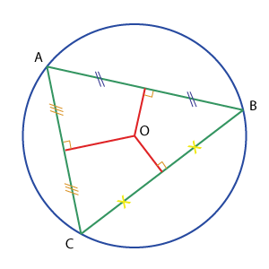

Công thức Heron tính diện tích tam giác với 3 cạnh là a, b, c:

.png)

Công thức tính bán kính hình tròn ngoại tiếp:

.png)

Khi tính diện tích nên dùng hằng số PI
#define PI 3.141592653589793238

**Đầu vào:**
Dòng đầu ghi số bộ test (không quá 20).
Mỗi bộ test ghi trên 1 dòng 6 số thực lần lượt là tọa độ của 3 điểm A, B, C. Giá trị tọa độ không quá 1000.

**Đầu ra:**
Nếu 3 điểm không thể tạo thành tam giác, in ra INVALID
Nếu 3 điểm tạo thành tam giác, in ra diện tích hình tròn ngoại tiếp với độ chính xác 3 số phần thập phân.

**Ví dụ:**
**input:**
```
3
0 0 0 5 0 199
1 1 1 1 1 1 
0 0 0 5 5 0
```

**output:**
```
INVALID
INVALID
39.270
```

## Khai báo lớp

### CPP0601 KHAI BÁO LỚP SINH VIÊN - 1
Viết chương trình khai báo lớp Sinh Viên gồm các thông tin: Mã SV, Họ tên, Lớp, Ngày sinh và Điểm GPA (dạng số thực float). Hàm khởi tạo không có tham số, gán các giá trị thuộc tính ở trạng thái mặc định (xâu ký tự rỗng, giá trị số bằng 0).
Đọc thông tin 1 sinh viên từ bàn phím (không có mã sinh viên) và in ra màn hình. Trong đó Mã SV được gán là **B20DCCN001**. Ngày sinh được chuẩn hóa về dạng dd/mm/yyyy.

**Đầu vào:**
Gồm 4 dòng lần lượt là Họ tên, Lớp, Ngày sinh và Điểm GPA.
Trong đó:
- Họ tên không quá 30 chữ cái.
- Lớp theo đúng định dạng thường dùng ở PTIT
- Ngày sinh có đủ 3 phần ngày tháng năm nhưng có thể chưa đúng chuẩn dd/mm/yyyy.
- Điểm GPA đảm bảo trong thang điểm 4 với 2 nhiều nhất 2 số sau dấu phẩy.

**Đầu ra:**
Ghi thông tin sinh viên trên 1 dòng, mỗi thông tin cách nhau 1 khoảng trống.

**Ví dụ:**
**Bài tập này yêu cầu sử dụng hàm main cho sẵn như sau:**
```cpp
int main(){
    SinhVien a;
    a.nhap();
    a.xuat();
    return 0;
}
```

**input:**
```
Nguyen Van A
D20CQCN04-B
2/2/2002
2
```

**output:**
```
B20DCCN001 Nguyen Van A D20CQCN04-B 02/02/2002 2.00
```

### CPP0602 KHAI BÁO LỚP SINH VIÊN - 2
Viết chương trình khai báo lớp Sinh Viên gồm các thông tin: Mã SV, Họ tên, Lớp, Ngày sinh và Điểm GPA (dạng số thực float). Hàm khởi tạo không có tham số, gán các giá trị thuộc tính ở trạng thái mặc định (xâu ký tự rỗng, giá trị số bằng 0).
Yêu cầu sử dụng chồng toán tử nhập và xuất để nhập đối tượng sinh viên với cin và in ra đối tượng sinh viên với cout.
Đọc thông tin 1 sinh viên từ bàn phím (không có mã sinh viên) và in ra màn hình. Trong đó Mã SV được gán là **B20DCCN001**. Ngày sinh được chuẩn hóa về dạng dd/mm/yyyy.

**Đầu vào:**
Gồm 4 dòng lần lượt là Họ tên, Lớp, Ngày sinh và Điểm GPA.
Trong đó:
- Họ tên không quá 30 chữ cái.
- Lớp theo đúng định dạng thường dùng ở PTIT
- Ngày sinh có đủ 3 phần ngày tháng năm nhưng có thể chưa đúng chuẩn dd/mm/yyyy.
- Điểm GPA đảm bảo trong thang điểm 4 với 2 nhiều nhất 2 số sau dấu phẩy.

**Đầu ra:**
Ghi thông tin sinh viên trên 1 dòng, mỗi thông tin cách nhau 1 khoảng trống.

**Ví dụ:**
**Bài tập này yêu cầu sử dụng hàm main cho sẵn như sau:**
```cpp
int main(){
    SinhVien a;
    cin >> a;
    cout << a;
    return 0;
}
```

**input:**
```
Nguyen Hoa Binh
D20CQCN04-B
2/2/2002
2
```

**output:**
```
B20DCCN001 Nguyen Hoa Binh D20CQCN04-B 02/02/2002 2.00
```

### CPP0605 KHAI BÁO LỚP PHÂN SỐ
Viết chương trình xây dựng class Phân số.
Sau đó thực hiện nhập vào một phân số và in ra phân số đó ở dạng tối giản.

**Đầu vào:**
Có hai số nguyên dương lần lượt là tử số và mẫu số. Các giá trị không quá 18 chữ số.

**Đầu ra:**
Ghi ra phân số tối giản như trong ví dụ

**Ví dụ:**
**Bài tập này yêu cầu sử dụng hàm main cho sẵn như sau:**
```cpp
int main() {
	PhanSo p(1,1);
	cin >> p;
	p.rutgon();
	cout << p;
	return 0;
}
```

**input:**
```
123 456
```

**output:**
```
41/152
```

### CPP0606 KHAI BÁO LỚP NHÂN VIÊN
Một nhân viên làm việc trong công ty được lưu lại các thông tin sau:
- Mã nhân viên: được gán giá trị là 00001
- Họ tên: Xâu ký tự không quá 40 chữ cái.
- Giới tính: Nam hoặc Nu
- Ngày sinh: đúng theo chuẩn mm/dd/yyyy
- Địa chỉ: Xâu ký tự không quá 100 chữ cái
- Mã số thuế: Dãy số có đúng 10 chữ số
- Ngày ký hợp đồng: đúng theo chuẩn dd/mm/yyyy
Viết chương trình nhập một nhân viên (không nhập mã) trong đó có sử dụng chồng toán tử nhập/xuất và in ra màn hình thông tin của nhân viên đó.

**Đầu vào:**
Gồm 6 dòng lần lượt ghi các thông tin theo thứ tự đã ghi trong đề bài. Không có mã nhân viên.

**Đầu ra:**
Ghi ra đầy đủ thông tin nhân viên trên một dòng, các thông tin cách nhau đúng một khoảng trống.

**Ví dụ:**
**Bài tập này yêu cầu sử dụng hàm main cho sẵn như sau:**
```cpp
int main(){
    NhanVien a;
    cin >> a;
    cout >> a;
    return 0;
}
```

**input:**
```
Nguyen Van Hoa
Nam
11/22/1982
Mo Lao-Ha Dong-Ha Noi
8333123456
31/12/2013
```

**output:**
```
00001 Nguyen Van Hoa Nam 11/22/1982 Mo Lao-Ha Dong-Ha Noi 8333123456 31/12/2013
```

### CPP0610 TÍNH TỔNG HAI ĐỐI TƯỢNG PHÂN SỐ
Viết chương trình xây dựng class Phân số.
Sau đó thực hiện nhập vào hai phân số p và q. Tính tổng p + q, rút gọn và in ra kết quả.

**Đầu vào:**
Có bốn số nguyên dương lần lượt là tử số và mẫu số của p rồi đến q. Các giá trị không quá 9 chữ số.

**Đầu ra:**
Ghi ra phân số tổng p + q ở dạng tối giản như trong ví dụ

**Ví dụ:**
**Bài tập này yêu cầu sử dụng hàm main cho sẵn như sau:**
```cpp
int main() {
	PhanSo p(1,1), q(1,1);
	cin >> p >> q;
	cout << p + q;
	return 0;
}
```

**input:**
```
123 456 12 34
```

**output:**
```
1609/2584
```

## Mảng đối tượng

### CPP0611 DANH SÁCH ĐỐI TƯỢNG SINH VIÊN - 1
Viết chương trình khai báo lớp Sinh Viên gồm các thông tin: Mã SV, Họ tên, Lớp và Điểm GPA (dạng số thực float). Hàm khởi tạo không có tham số, gán các giá trị thuộc tính ở trạng thái mặc định (xâu ký tự rỗng, giá trị số bằng 0).
Yêu cầu sử dụng chồng toán tử nhập và xuất để nhập đối tượng sinh viên với cin và in ra đối tượng sinh viên với cout.
Đọc thông tin N thí sinh từ bàn phím (không có mã sinh viên) và in ra lần lượt màn hình mỗi dòng 1 sinh viên theo đúng thứ tự ban đầu. Trong đó Mã SV được tự tạo ra theo quy tắc thêm mã **B20DCCN** sau đó là giá trị nguyên tự động tăng tính từ 001 (tối đa là 099). Ngày sinh được chuẩn hóa về dạng dd/mm/yyyy

**Đầu vào:**
Dòng đầu tiên ghi số sinh viên N (0 < N < 50).
Mỗi sinh viên ghi trên 4 dòng lần lượt là Họ tên, Lớp, Ngày sinh và Điểm GPA.
Trong đó:
- Họ tên không quá 30 chữ cái.
- Lớp theo đúng định dạng thường dùng ở PTIT
- Ngày sinh có đủ 3 phần ngày tháng năm nhưng có thể chưa đúng chuẩn dd/mm/yyyy.
- Điểm GPA đảm bảo trong thang điểm 4 với 2 nhiều nhất 2 số sau dấu phẩy.

**Đầu ra:**
Ghi ra danh sách lần lượt các sinh viên có đầy đủ Mã sinh viên, Họ tên, Lớp, Ngày sinh (đã chuẩn hóa về dạng dd/mm/yyyy), Điểm GPA (với đúng 2 số sau dấu phẩy).
Mỗi sinh viên ghi trên 1 dòng, mỗi thông tin cách nhau 1 khoảng trống.

**Ví dụ:**
**Bài tập này yêu cầu sử dụng hàm main cho sẵn như sau:**
```cpp
int main(){
    SinhVien ds[50];
    int N, i;
    cin >> N;
    for(i=0;i<N;i++){
        cin >> ds[i];
    }
    for(i=0;i<N;i++){
        cout << ds[i];
    }
    return 0;
}
```

**input:**
```
1
Nguyen Van An
D20CQCN01-B
2/12/2002
3.19
```

**output:**
```
B20DCCN001 Nguyen Van An D20CQCN01-B 02/12/2002 3.19
```

### CPP0612 DANH SÁCH ĐỐI TƯỢNG SINH VIÊN - 2
Viết chương trình khai báo lớp Sinh Viên gồm các thông tin: Mã SV, Họ tên, Lớp và Điểm GPA (dạng số thực float). Hàm khởi tạo không có tham số, gán các giá trị thuộc tính ở trạng thái mặc định (xâu ký tự rỗng, giá trị số bằng 0).
Yêu cầu sử dụng chồng toán tử nhập và xuất để nhập đối tượng sinh viên với cin và in ra đối tượng sinh viên với cout.
Đọc thông tin N thí sinh từ bàn phím (không có mã sinh viên) và in ra lần lượt màn hình mỗi dòng 1 sinh viên theo đúng thứ tự ban đầu. Trong đó Mã SV được tự tạo ra theo quy tắc thêm mã **B20DCCN** sau đó là giá trị nguyên tự động tăng tính từ 001 (tối đa là 099). Họ tên được xử lý đưa về dạng chuẩn. Ngày sinh được chuẩn hóa về dạng dd/mm/yyyy

**Đầu vào:**
Dòng đầu tiên ghi số sinh viên N (0 < N < 50).
Mỗi sinh viên ghi trên 4 dòng lần lượt là Họ tên, Lớp, Ngày sinh và Điểm GPA.
Trong đó:
- Họ tên không quá 30 chữ cái.
- Lớp theo đúng định dạng thường dùng ở PTIT
- Ngày sinh có đủ 3 phần ngày tháng năm nhưng có thể chưa đúng chuẩn dd/mm/yyyy.
- Điểm GPA đảm bảo trong thang điểm 4 với 2 nhiều nhất 2 số sau dấu phẩy.

**Đầu ra:**
Ghi ra danh sách lần lượt các sinh viên có đầy đủ Mã sinh viên, Họ tên, Lớp, Ngày sinh (đã chuẩn hóa), điểm GPA (với đúng 2 số sau dấu phẩy).
Mỗi sinh viên ghi trên 1 dòng, mỗi thông tin cách nhau 1 khoảng trống.

**Ví dụ:**
**Bài tập này yêu cầu sử dụng hàm main cho sẵn như sau:**
```cpp
int main(){
    SinhVien ds[50];
    int N, i;
    cin >> N;
    for(i=0;i<N;i++){
        cin >> ds[i];
    }
    for(i=0;i<N;i++){
        cout << ds[i];
    }
    return 0;
}
```

**input:**
```
1
nGuyEn  vaN    biNH
D20CQCN01-B
2/12/2002
3.1
```

**output:**
```
B20DCCN001 Nguyen Van Binh D20CQCN01-B 02/12/2002 3.10
```

### CPP0613 DANH SÁCH ĐỐI TƯỢNG SINH VIÊN - 3
Viết chương trình khai báo lớp Sinh Viên gồm các thông tin: Mã SV, Họ tên, Lớp và Điểm GPA (dạng số thực float). Hàm khởi tạo không có tham số, gán các giá trị thuộc tính ở trạng thái mặc định (xâu ký tự rỗng, giá trị số bằng 0).
Yêu cầu sử dụng chồng toán tử nhập và xuất để nhập đối tượng sinh viên với cin và in ra đối tượng sinh viên với cout.
Đọc thông tin N thí sinh từ bàn phím (không có mã sinh viên) sau đó sắp xếp theo điểm GPA giảm dần và in ra lần lượt màn hình mỗi dòng 1 sinh viên.
Trong đó Mã SV được tự tạo ra theo quy tắc thêm mã **B20DCCN** sau đó là giá trị nguyên tự động tăng tính từ 001 (tối đa là 099). Họ tên được xử lý đưa về dạng chuẩn. Ngày sinh được chuẩn hóa về dạng dd/mm/yyyy

**Đầu vào:**
Dòng đầu tiên ghi số sinh viên N (0 < N < 50).
Mỗi sinh viên ghi trên 4 dòng lần lượt là Họ tên, Lớp, Ngày sinh và Điểm GPA.
Trong đó:
- Họ tên không quá 30 chữ cái.
- Lớp theo đúng định dạng thường dùng ở PTIT
- Ngày sinh có đủ 3 phần ngày tháng năm nhưng có thể chưa đúng chuẩn dd/mm/yyyy.
- Điểm GPA đảm bảo trong thang điểm 4 với 2 nhiều nhất 2 số sau dấu phẩy.
Dữ liệu đảm bảo không có hai sinh viên nào có điểm GPA bằng nhau.

**Đầu ra:**
Ghi ra danh sách lần lượt các sinh viên có đầy đủ Mã sinh viên, Họ tên, Lớp, Ngày sinh (đã chuẩn hóa), điểm GPA (với đúng 2 số sau dấu phẩy) đã được sắp xếp theo điểm GPA giảm dần.
Mỗi sinh viên ghi trên 1 dòng, mỗi thông tin cách nhau 1 khoảng trống.

**Ví dụ:**
**Bài tập này yêu cầu sử dụng hàm main cho sẵn như sau:**
```cpp
int main(){
    SinhVien ds[50];
    int N, i;
    cin >> N;
    for(i=0;i<N;i++){
        cin >> ds[i];
    }
    sapxep(ds, N);
    for(i=0;i<N;i++){
        cout << ds[i];
    }
    return 0;
}
```

**input:**
```
2
ngUYen Van NaM
D20DCCN01-B
2/12/2002
2.17 
Nguyen QuanG hAi
D20DCCN02-B
1/9/2002
3.0
```

**output:**
```
B20DCCN002 Nguyen Quang Hai D20DCCN02-B 01/09/2002 3.00
B20DCCN001 Nguyen Van Nam D20DCCN01-B 02/12/2002 2.17
```

### CPP0614 DANH SÁCH ĐỐI TƯỢNG NHÂN VIÊN
Một nhân viên làm việc trong công ty được lưu lại các thông tin sau:
- Mã nhân viên: được gán tự động tăng, bắt đầu từ 00001
- Họ tên: Xâu ký tự không quá 40 chữ cái.
- Giới tính: Nam hoặc Nu
- Ngày sinh: đúng theo chuẩn dd/mm/yyyy
- Địa chỉ: Xâu ký tự không quá 100 chữ cái
- Mã số thuế: Dãy số có đúng 10 chữ số
- Ngày ký hợp đồng: đúng theo chuẩn dd/mm/yyyy
Viết chương trình nhập danh sách nhân viên (không nhập mã) trong đó có sử dụng chồng toán tử nhập/xuất và in ra màn hình danh sách vừa nhập.

**Đầu vào:**
Dòng đầu ghi số N là số nhân viên (không quá 40). Mối nhân viên ghi trên 6 dòng lần lượt ghi các thông tin theo thứ tự đã ghi trong đề bài. Không có mã nhân viên.

**Đầu ra:**
Ghi ra danh sách đầy đủ nhân viên, mỗi nhân viên trên một dòng, các thông tin cách nhau đúng một khoảng trống.

**Ví dụ:**
**Bài tập này yêu cầu sử dụng hàm main cho sẵn như sau:**
```cpp
int main(){
    NhanVien ds[50];
    int N,i;
    cin >> N;
    for(i=0;i<N;i++) cin >> ds[i];
    for(i=0;i<N;i++) cout << ds[i];
    return 0;
}
```

**input:**
```
3
Nguyen Van A
Nam
10/22/1982
Mo Lao-Ha Dong-Ha Noi
8333012345
31/12/2013
Ly Thi B
Nu
10/15/1988
Mo Lao-Ha Dong-Ha Noi
8333012346
22/08/2011
Hoang Thi C
Nu
04/02/1981
Mo Lao-Ha Dong-Ha Noi
8333012347
22/08/2011
```

**output:**
```
00001 Nguyen Van A Nam 10/22/1982 Mo Lao-Ha Dong-Ha Noi 8333012345 31/12/2013
00002 Ly Thi B Nu 10/15/1988 Mo Lao-Ha Dong-Ha Noi 8333012346 22/08/2011
00003 Hoang Thi C Nu 04/02/1981 Mo Lao-Ha Dong-Ha Noi 8333012347 22/08/2011
```

### CPP0615 SẮP XẾP DANH SÁCH ĐỐI TƯỢNG NHÂN VIÊN
Một nhân viên làm việc trong công ty được lưu lại các thông tin sau:
- Mã nhân viên: được gán tự động tăng, bắt đầu từ 00001
- Họ tên: Xâu ký tự không quá 40 chữ cái.
- Giới tính: Nam hoặc Nu
- Ngày sinh: đúng theo chuẩn dd/mm/yyyy
- Địa chỉ: Xâu ký tự không quá 100 chữ cái
- Mã số thuế: Dãy số có đúng 10 chữ số
- Ngày ký hợp đồng: đúng theo chuẩn dd/mm/yyyy
Viết chương trình nhập danh sách nhân viên (không nhập mã) trong đó có sử dụng chồng toán tử nhập/xuất, sau đó sắp xếp theo thứ tự ngày sinh từ già nhất đến trẻ nhất và in ra màn hình danh sách đối tượng nhân viên đã sắp xếp.

**Đầu vào:**
Dòng đầu ghi số N là số nhân viên (không quá 40). Mỗi nhân viên ghi trên 6 dòng lần lượt ghi các thông tin theo thứ tự đã ghi trong đề bài. Không có mã nhân viên.

**Đầu ra:**
Ghi ra danh sách đầy đủ nhân viên đã sắp xếp, mỗi nhân viên trên một dòng, các thông tin cách nhau đúng một khoảng trống.

**Ví dụ:**
**Bài tập này yêu cầu sử dụng hàm main cho sẵn như sau:**
```cpp
int main(){
    NhanVien ds[50];
    int N,i;
    cin >> N;
    for(i=0;i<N;i++) cin >> ds[i];
    sapxep(ds, N);
    for(i=0;i<N;i++) cout << ds[i];
    return 0;
}
```

**input:**
```
3
Nguyen Van A
Nam
10/22/1982
Mo Lao-Ha Dong-Ha Noi
8333012345
31/12/2013
Ly Thi B
Nu
10/15/1988
Mo Lao-Ha Dong-Ha Noi
8333012346
22/08/2011
Hoang Thi C
Nu
04/02/1981
Mo Lao-Ha Dong-Ha Noi
8333012347
22/08/2011
```

**output:**
```
00003 Hoang Thi C Nu 04/02/1981 Mo Lao-Ha Dong-Ha Noi 8333012347 22/08/2011
00001 Nguyen Van A Nam 10/22/1982 Mo Lao-Ha Dong-Ha Noi 8333012345 31/12/2013
00002 Ly Thi B Nu 10/15/1988 Mo Lao-Ha Dong-Ha Noi 8333012346 22/08/2011
```

### CPP0620 SẮP XẾP SINH VIÊN THEO LỚP
Thông tin về mỗi sinh viên gồm:
- Mã sinh viên: dãy ký tự không có khoảng trống (không quá 15). Đảm bảo không trùng nhau.
- Họ và tên: độ dài không quá 100
- Lớp: dãy ký tự không có khoảng trống (không quá 15)
- Email: dãy ký tự không có khoảng trống (không quá 15)
Hãy nhập danh sách sinh viên và sắp xếp theo lớp tăng dần (thứ tự từ điển)

**Đầu vào:**
Dòng đầu ghi số sinh viên.
Mỗi sinh viên ghi trên 4 dòng lần lượt là: mã, họ tên, lớp, email.
Có không quá 1000 sinh viên trong danh sách.

**Đầu ra:**
Ghi ra danh sách sinh viên đã sắp xếp theo lớp. Mỗi sinh viên trên một dòng, các thông tin cách nhau một khoảng trống.
Nếu 2 sinh viên có cùng lớp thì sắp xếp theo mã tăng dần (thứ tự từ điển)

**Ví dụ:**
**input:**
```
4
B16DCCN011
Nguyen Trong Duc Anh
D16CNPM1
sv1@stu.ptit.edu.vn
B15DCCN215
To Ngoc Hieu
D15CNPM3
sv2@stu.ptit.edu.vn
B15DCKT150
Nguyen Ngoc Son
D15CQKT02-B
sv3@stu.ptit.edu.vn
B15DCKT199
Nguyen Trong Tung
D15CQKT03-B
sv4@stu.ptit.edu.vn
```

**output:**
```
B15DCCN215 To Ngoc Hieu D15CNPM3 sv2@stu.ptit.edu.vn
B15DCKT150 Nguyen Ngoc Son D15CQKT02-B sv3@stu.ptit.edu.vn
B15DCKT199 Nguyen Trong Tung D15CQKT03-B sv4@stu.ptit.edu.vn
B16DCCN011 Nguyen Trong Duc Anh D16CNPM1 sv1@stu.ptit.edu.vn
```

### CPP0621 SẮP XẾP THEO MÃ SINH VIÊN
Thông tin về mỗi sinh viên gồm:
- Mã sinh viên: dãy ký tự không có khoảng trống (không quá 15). Đảm bảo không trùng nhau.
- Họ và tên: độ dài không quá 100
- Lớp: dãy ký tự không có khoảng trống (không quá 15)
- Email: dãy ký tự không có khoảng trống (không quá 15)
Hãy nhập danh sách sinh viên và sắp xếp theo mã sinh viên tăng dần (thứ tự từ điển)

**Đầu vào:**
Mỗi sinh viên ghi trên 4 dòng lần lượt là: mã, họ tên, lớp, email.
Không cho biết số sinh viên nhưng dữ liệu đảm bảo là chẵn lần 4 dòng.
Có không quá 1000 sinh viên trong danh sách.

**Đầu ra:**
Ghi ra danh sách sinh viên đã sắp xếp theo mã. Mỗi sinh viên trên một dòng, các thông tin cách nhau một khoảng trống.

**Ví dụ:**
**input:**
```
B16DCCN011
Nguyen Trong Duc Anh
D16CNPM1
sv1@stu.ptit.edu.vn
B15DCCN215
To Ngoc Hieu
D15CNPM3
sv2@stu.ptit.edu.vn
B15DCKT150
Nguyen Ngoc Son
D15CQKT02-B
sv3@stu.ptit.edu.vn
B15DCKT199
Nguyen Trong Tung
D15CQKT03-B
sv4@stu.ptit.edu.vn
```

**output:**
```
B15DCCN215 To Ngoc Hieu D15CNPM3 sv2@stu.ptit.edu.vn
B15DCKT150 Nguyen Ngoc Son D15CQKT02-B sv3@stu.ptit.edu.vn
B15DCKT199 Nguyen Trong Tung D15CQKT03-B sv4@stu.ptit.edu.vn
B16DCCN011 Nguyen Trong Duc Anh D16CNPM1 sv1@stu.ptit.edu.vn
```

### CPP0622 LIỆT KÊ SINH VIÊN THEO LỚP
Thông tin về mỗi sinh viên gồm:
- Mã sinh viên: dãy ký tự không có khoảng trống (không quá 15). Đảm bảo không trùng nhau.
- Họ và tên: độ dài không quá 100
- Lớp: dãy ký tự không có khoảng trống (không quá 15)
- Email: dãy ký tự không có khoảng trống (không quá 15)
Hãy nhập danh sách sinh viên và liệt kê sinh viên theo lớp

**Đầu vào:**
Dòng đầu ghi số sinh viên (không quá 1000)
Mỗi sinh viên ghi trên 4 dòng lần lượt là: mã, họ tên, lớp, email.
Sau đó sẽ có giá trị số Q là số truy vấn
Tiếp theo là Q dòng, mỗi dòng ghi một lớp

**Đầu ra:**
Với mỗi truy vấn, liệt kê danh sách sinh viên của lớp đó theo mẫu như trong ví dụ. Mỗi sinh viên ghi trên một dòng, các thông tin cách nhau một khoảng trống. Thứ tự sinh viên vẫn giữ nguyên như thứ tự ban đầu.

**Ví dụ:**
**input:**
```
4
B16DCCN011
Nguyen Trong Duc Anh
D16CNPM1
sv1@stu.ptit.edu.vn
B15DCCN215
To Ngoc Hieu
D15CNPM3
sv2@stu.ptit.edu.vn
B15DCKT150
Nguyen Ngoc Son
D15CQKT02-B
sv3@stu.ptit.edu.vn
B15DCKT199
Nguyen Trong Tung
D15CQKT02-B
sv4@stu.ptit.edu.vn
1
D15CQKT02-B
```

**output:**
```
DANH SACH SINH VIEN LOP D15CQKT02-B:
B15DCKT150 Nguyen Ngoc Son D15CQKT02-B sv3@stu.ptit.edu.vn
B15DCKT199 Nguyen Trong Tung D15CQKT02-B sv4@stu.ptit.edu.vn
```

### CPP0623 LIỆT KÊ SINH VIÊN THEO KHÓA
Thông tin về mỗi sinh viên gồm:
- Mã sinh viên: dãy ký tự không có khoảng trống (không quá 15). Đảm bảo không trùng nhau.
- Họ và tên: độ dài không quá 100
- Lớp: dãy ký tự không có khoảng trống (không quá 15)
- Email: dãy ký tự không có khoảng trống (không quá 15)
Hãy nhập danh sách sinh viên và liệt kê sinh viên theo khóa học. Chú ý: dữ liệu khóa học thể hiện qua hai chữ số thứ 2 và thứ 3 trong lớp sinh viên.

**Đầu vào:**
Dòng đầu ghi số sinh viên (không quá 1000)
Mỗi sinh viên ghi trên 4 dòng lần lượt là: mã, họ tên, lớp, email.
Sau đó sẽ có giá trị số Q là số truy vấn
Tiếp theo là Q dòng, mỗi dòng ghi năm bắt đầu khóa học theo định dạng yyyy

**Đầu ra:**
Với mỗi truy vấn, liệt kê danh sách sinh viên của khóa đó theo mẫu như trong ví dụ. Mỗi sinh viên ghi trên một dòng, các thông tin cách nhau một khoảng trống. Thứ tự sinh viên vẫn giữ nguyên như thứ tự ban đầu.

**Ví dụ:**
**input:**
```
4
B16DCCN011
Nguyen Trong Duc Anh
D16CNPM1
sv1@stu.ptit.edu.vn
B15DCCN215
To Ngoc Hieu
D15CNPM3
sv2@stu.ptit.edu.vn
B15DCKT150
Nguyen Ngoc Son
D15CQKT02-B
sv3@stu.ptit.edu.vn
B15DCKT199
Nguyen Trong Tung
D15CQKT02-B
sv4@stu.ptit.edu.vn
1
2015
```

**output:**
```
DANH SACH SINH VIEN KHOA 2015:
B15DCCN215 To Ngoc Hieu D15CNPM3 sv2@stu.ptit.edu.vn
B15DCKT150 Nguyen Ngoc Son D15CQKT02-B sv3@stu.ptit.edu.vn
B15DCKT199 Nguyen Trong Tung D15CQKT02-B sv4@stu.ptit.edu.vn
```

### CPP0624 LIỆT KÊ SINH VIÊN THEO NGÀNH
Thông tin về mỗi sinh viên gồm:
- Mã sinh viên: dãy ký tự không có khoảng trống (không quá 15). Đảm bảo không trùng nhau.
- Họ và tên: độ dài không quá 100
- Lớp: dãy ký tự không có khoảng trống (không quá 15)
- Email: dãy ký tự không có khoảng trống (không quá 50)
Hãy nhập danh sách sinh viên và liệt kê sinh viên theo ngành học. Chú ý: dữ liệu ngành học thể hiện qua 4 chữ cái từ thứ 4 đến thứ 7 trong mã sinh viên.

**Đầu vào:**
Dòng đầu ghi số sinh viên (không quá 1000)
Mỗi sinh viên ghi trên 4 dòng lần lượt là: mã, họ tên, lớp, email.
Sau đó sẽ có giá trị số Q là số truy vấn
Tiếp theo là Q dòng, mỗi dòng ghi ngành đào tạo. Chỉ có các ngành đào tạo trong danh sách sau (trong Input sẽ không có dấu):
- **Kế toán** – mã sinh viên có cụm ký tự DCKT
- **Công nghệ thông tin** – mã sinh viên có cụm DCCN – trừ đi các sinh viên lớp bắt đầu bằng chữ E
- **An toàn thông tin** – mã sinh viên có cụm DCAT – trừ các sinh viên lớp bắt đầu bằng chữ E
- **Viễn thông**–mã sinh viên có cụm DCVT
- **Điện tử**- mã sinh viên có cụm DCDT

**Đầu ra:**
Với mỗi truy vấn, liệt kê danh sách sinh viên của khóa đó theo mẫu như trong ví dụ. Mỗi sinh viên ghi trên một dòng, các thông tin cách nhau một khoảng trống. Thứ tự sinh viên vẫn giữ nguyên như thứ tự ban đầu.

**Ví dụ:**
**input:**
```
4
B16DCCN011
Nguyen Trong Duc Anh
D16CNPM1
sv1@stu.ptit.edu.vn
B15DCCN215
To Ngoc Hieu
D15CNPM3
sv2@stu.ptit.edu.vn
B15DCKT150
Nguyen Ngoc Son
D15CQKT02-B
sv3@stu.ptit.edu.vn
B15DCKT199
Nguyen Trong Tung
D15CQKT02-B
sv4@stu.ptit.edu.vn
1
Ke toan
```

**output:**
```
DANH SACH SINH VIEN NGANH KE TOAN:
B15DCKT150 Nguyen Ngoc Son D15CQKT02-B sv3@stu.ptit.edu.vn
B15DCKT199 Nguyen Trong Tung D15CQKT02-B sv4@stu.ptit.edu.vn
```

### CPP0625 SẮP XẾP DANH SÁCH GIẢNG VIÊN
Danh sách giảng viên Khoa CNTT cần được sắp xếp lại theo tên. Thông tin về giảng viên ban đầu chỉ có họ tên và Bộ môn. Mã giảng viên tự động tăng, tính từ GV01.
Cần sắp xếp lại theo tên (tức là từ cuối cùng trong xâu họ tên). Các giảng viên có cùng tên thì được sắp xếp theo mã giảng viên.

**Đầu vào:**
Dòng đầu ghi số giảng viên.
Mỗi giảng viên ghi trên 2 dòng gồm họ tên (không quá 50 ký tự) và Bộ môn (không quá 30 ký tự).

**Đầu ra:**
Danh sách đã sắp xếp trong đó mỗi giảng viên ghi trên một dòng. Mã được tự động điền theo thứ tự nhập, bộ môn được viết tắt theo các chữ cái đầu của từng từ và ở dạng in hoa.

**Ví dụ:**
**input:**
```
3
Nguyen Manh Son
Cong nghe phan mem
Vu Hoai Nam
Khoa hoc may tinh
Dang Minh Tuan
An toan thong tin
```

**output:**
```
GV02 Vu Hoai Nam KHMT
GV01 Nguyen Manh Son CNPM
GV03 Dang Minh Tuan ATTT
```

### CPP0626 DANH SÁCH GIẢNG VIÊN THEO BỘ MÔN
Thông tin về giảng viên Khoa CNTT ban đầu chỉ có họ tên và Bộ môn. Mã giảng viên sẽ tự động điền tăng dần, tính từ GV01.
Hãy liệt kê danh sách giảng viên của Bộ môn được yêu cầu.

**Đầu vào:**
Dòng đầu ghi số giảng viên.
Mỗi giảng viên ghi trên 2 dòng gồm họ tên (không quá 50 ký tự) và Bộ môn (không quá 30 ký tự).
Tiếp theo là một dòng ghi số Q là số truy vấn.
Mỗi truy vấn là tên một bộ môn trên một dòng.

**Đầu ra:**
Danh sách các giảng viên của bộ môn theo từng truy vấn, trong đó mỗi giảng viên ghi trên một dòng. Mã được tự động điền theo thứ tự nhập, bộ môn được viết tắt theo các chữ cái đầu của từng từ và ở dạng in hoa.
Thứ tự giảng viên của mỗi bộ môn được liệt kê theo đúng thứ tự ban đầu.


**Ví dụ:**
**input:**
```
3
Nguyen Manh Son
Cong nghe phan mem
Vu Hoai Nam
Khoa hoc may tinh
Dang Minh Tuan
An toan thong tin
1
Cong nghe phan mem
```

**output:**
```
DANH SACH GIANG VIEN BO MON CNPM:
GV01 Nguyen Manh Son CNPM
```

### CPP0627 TÌM KIẾM GIẢNG VIÊN
Thông tin về giảng viên Khoa CNTT ban đầu chỉ có họ tên và Bộ môn. Mã giảng viên sẽ tự động điền tăng dần, tính từ GV01.
Hãy tìm kiếm giảng viên theo tên (yêu cầu tìm gần đúng – tức là trong tên giảng viên xuất hiện từ hoặc cụm từ khóa, không phân biệt chữ hoa chữ thường).

**Đầu vào:**
Dòng đầu ghi số giảng viên.
Mỗi giảng viên ghi trên 2 dòng gồm họ tên (không quá 50 ký tự) và Bộ môn (không quá 30 ký tự).
Tiếp theo là một dòng ghi số Q là số truy vấn.
Mỗi truy vấn là một từ khóa cần tìm.

**Đầu ra:**
Danh sách các giảng viên tìm được theo từ khóa, trong đó mỗi giảng viên ghi trên một dòng. Mã được tự động điền theo thứ tự nhập, bộ môn được viết tắt theo các chữ cái đầu của từng từ và ở dạng in hoa.
Thứ tự giảng viên của mỗi bộ môn được liệt kê theo đúng thứ tự ban đầu.

**Ví dụ:**
**input:**
```
3
Nguyen Manh Son
Cong nghe phan mem
Vu Hoai Nam
Khoa hoc may tinh
Dang Minh Tuan
An toan thong tin
1
aN
```

**output:**
```
DANH SACH GIANG VIEN THEO TU KHOA aN:
GV01 Nguyen Manh Son CNPM
GV03 Dang Minh Tuan ATTT
```

### CPP0628 DANH SÁCH DOANH NGHIỆP NHẬN SINH VIÊN THỰC TẬP - 1
Để chuẩn bị cho đợt thực tập tốt nghiệp của sinh viên năm cuối, Khoa CNTT1 trao đổi với các doanh nghiệp đối tác và chốt số lượng sinh viên có thể nhận thực tập.
Hãy sắp xếp các doanh nghiệp theo số lượng sinh viên có thể nhận giảm dần.

**Đầu vào:**
Dòng đầu ghi số doanh nghiệp.
Mỗi doanh nghiệp ghi trên 3 dòng:
- Mã doanh nghiệp (xâu ký tự không có dấu cách, độ dài không quá 10)
- Tên doanh nghiệp (xâu ký tự độ dài không quá 150)
- Số sinh viên có thể nhận: giá trị nguyên không quá 1000

**Đầu ra:**
Ghi ra danh sách đã được sắp xếp theo số lượng giảm dần, mỗi thông tin ghi trên một dòng. Trong trường hợp cùng số lượng thì sắp xếp theo mã doanh nghiệp (thứ tự từ điển tăng dần).

**Ví dụ:**
**input:**
```
4
VIETTEL
TAP DOAN VIEN THONG QUAN DOI VIETTEL
40
FSOFT
CONG TY TNHH PHAN MEM FPT - FPT SOFTWARE
300
VNPT
TAP DOAN BUU CHINH VIEN THONG VIET NAM
200
SUN
SUN*
50
```

**output:**
```
FSOFT CONG TY TNHH PHAN MEM FPT - FPT SOFTWARE 300
VNPT TAP DOAN BUU CHINH VIEN THONG VIET NAM 200
SUN SUN* 50
VIETTEL TAP DOAN VIEN THONG QUAN DOI VIETTEL 40
```

### CPP0629 DANH SÁCH DOANH NGHIỆP NHẬN SINH VIÊN THỰC TẬP - 2
Để chuẩn bị cho đợt thực tập tốt nghiệp của sinh viên năm cuối, Khoa CNTT1 trao đổi với các doanh nghiệp đối tác và chốt số lượng sinh viên có thể nhận thực tập.
Hãy lọc ra các doanh nghiệp nhận số lượng sinh viên trong đoạn [a,b].

**Đầu vào:**
Dòng đầu ghi số doanh nghiệp.
Mỗi doanh nghiệp ghi trên 3 dòng:
- Mã doanh nghiệp (xâu ký tự không có dấu cách, độ dài không quá 10)
- Tên doanh nghiệp (xâu ký tự độ dài không quá 150)
- Số sinh viên có thể nhận: giá trị nguyên không quá 1000
Tiếp theo là một dòng ghi số truy vấn Q. Mỗi truy vấn là 2 số nguyên a, b viết trên một dòng trong đó a < b và dữ liệu đảm bảo luôn có ít nhất 1 doanh nghiệp nhận số lượng sinh viên trong đoạn [a,b].

**Đầu ra:**
Ghi ra danh sách đã lọc trong đoạn [a,b] và được sắp xếp theo số lượng giảm dần, mỗi thông tin ghi trên một dòng. Trong trường hợp cùng số lượng thì sắp xếp theo mã doanh nghiệp (thứ tự từ điển tăng dần).

**Ví dụ:**
**input:**
```
4
VIETTEL
TAP DOAN VIEN THONG QUAN DOI VIETTEL
40
FSOFT
CONG TY TNHH PHAN MEM FPT - FPT SOFTWARE
300
VNPT
TAP DOAN BUU CHINH VIEN THONG VIET NAM
200
SUN
SUN*
50
1
30 50
```

**output:**
```
DANH SACH DOANH NGHIEP NHAN TU 30 DEN 50 SINH VIEN:
SUN SUN* 50
VIETTEL TAP DOAN VIEN THONG QUAN DOI VIETTEL 40
```

### CPP0806 QUẢN LÝ BÁN HÀNG - 3
Khai báo lớp Khách hàng với các thuộc tính:
- Mã khách hàng: tự động tăng, tính từ KH001
- Tên khách hàng: xâu ký tự độ dài không quá 50
- Giới tính: Nam hoặc Nu
- Ngày sinh: Theo đúng chuẩn dd/mm/yyyy
- Địa chỉ: xâu ký tự độ dài không quá 100
Khai báo lớp Mặt hàng với các thuộc tính:
- Mã mặt hàng: tự động tăng, tính từ MH001
- Tên mặt hàng: xâu ký tự độ dài không quá 100
- Đơn vị tính: xâu ký tự độ dài không quá 10
- Giá mua: số nguyên dương không quá 7 chữ số
- Giá bán: số nguyên dương không quá 7 chữ số
Khai báo lớp Hóa đơn trong đó có các thông tin:
- Mã hóa đơn
- Khách hàng
- Mặt hàng
- Số lượng (không quá 1000)
Viết chương trình nhập danh sách hóa đơn và in danh sách ra màn hình.

**Input - có 3 file văn bản**
**File KH.in**
Dòng đầu ghi số N là số khách hàng (không quá 20).
Tiếp theo là thông tin của N khách hàng, mỗi khách hàng ghi trên 4 dòng theo đúng thứ tự đã mô tả (không có mã)
**File MH.in**
Dòng đầu ghi số M là số mặt hàng (không quá 40).
Tiếp theo là thông tin của M mặt hàng, mỗi mặt hàng ghi trên 4 dòng theo đúng thứ tự đã mô tả (không có mã)
**File HD.in**
Dòng đầu theo ghi số K là số hóa đơn (không quá 100)
Mỗi hóa đơn ghi trên **1 dòng** gồm 3 thông tin theo đúng thứ tự đã mô tả (không có mã).

**Đầu ra:**
Ghi ra danh sách hóa đơn theo đúng thứ tự nhập, trong đó gồm các thông tin sau, mỗi thông tin cách nhau đúng một khoảng trống.
- Mã hóa đơn
- Tên khách hàng
- Địa chỉ
- Tên mặt hàng
- Đơn vị tính
- Giá mua
- Giá bán
- Số lượng
- Thành tiền

**Ví dụ:**
**input:**
```
File KH.in
2
Nguyen Van Nam
Nam
12/12/1997
Mo Lao-Ha Dong-Ha Noi
Tran Van Binh
Nam
11/14/1995
Phung Khoang-Nam Tu Liem-Ha Noi
File MH.in
2
Ao phong tre em
Cai
25000
41000
Ao khoac nam
Cai
240000
515000
File HD.in
3
KH001 MH001 2
KH001 MH002 3
KH002 MH002 4
```

**output:**
```
HD001 Nguyen Van Nam Mo Lao-Ha Dong-Ha Noi Ao phong tre em Cai 25000 41000 2 82000
HD002 Nguyen Van Nam Mo Lao-Ha Dong-Ha Noi Ao khoac nam Cai 240000 515000 3 1545000
HD003 Tran Van Binh Phung Khoang-Nam Tu Liem-Ha Noi Ao khoac nam Cai 240000 515000 4 2060000
```

## 	Lớp bạn - Kế thừa

### CPP0631 QUẢN LÝ BÁN HÀNG – 1
Khai báo lớp Khách hàng với các thuộc tính:
- Mã khách hàng: tự động tăng, tính từ KH001
- Tên khách hàng: xâu ký tự độ dài không quá 50
- Giới tính: Nam hoặc Nu
- Ngày sinh: Theo đúng chuẩn dd/mm/yyyy
- Địa chỉ: xâu ký tự độ dài không quá 100
Khai báo lớp Mặt hàng với các thuộc tính:
- Mã mặt hàng: tự động tăng, tính từ MH001
- Tên mặt hàng: xâu ký tự độ dài không quá 100
- Đơn vị tính: xâu ký tự độ dài không quá 10
- Giá mua: số nguyên dương không quá 7 chữ số
- Giá bán: số nguyên dương không quá 7 chữ số
Khai báo lớp Hóa đơn là bạn của lớp Khách hàng và lớp Mặt hàng trong đó có các thông tin:
- Mã hóa đơn
- Mã khách hàng
- Mã mặt hàng
- Số lượng (không quá 1000)
Viết chương trình nhập danh sách hóa đơn và in danh sách ra màn hình.

**Đầu vào:**
Dòng đầu ghi số N là số khách hàng (không quá 20).
Tiếp theo là thông tin của N khách hàng, mỗi khách hàng ghi trên 4 dòng theo đúng thứ tự đã mô tả (không có mã)
Dòng tiếp theo ghi số M là số mặt hàng (không quá 40).
Tiếp theo là thông tin của M mặt hàng, mỗi mặt hàng ghi trên 4 dòng theo đúng thứ tự đã mô tả (không có mã)
Dòng tiếp theo ghi số K là số hóa đơn (không quá 100)
Mỗi hóa đơn ghi trên **1 dòng** gồm 3 thông tin theo đúng thứ tự đã mô tả (không có mã).

**Đầu ra:**
Ghi ra danh sách hóa đơn theo đúng thứ tự nhập, trong đó gồm các thông tin sau, mỗi thông tin cách nhau đúng một khoảng trống.
- Mã hóa đơn
- Tên khách hàng
- Địa chỉ
- Tên mặt hàng
- Đơn vị tính
- Giá mua
- Giá bán
- Số lượng
- Thành tiền

**Ví dụ:**
**Bài tập này yêu cầu sử dụng hàm main cho sẵn như sau:**
```cpp
int main(){
    KhachHang dskh[25];
    MatHang dsmh[45];
    HoaDon dshd[105];
    int N,M,K,i;
    cin >> N;
    for(i=0;i<N;i++) cin >> dskh[i];
    cin >> M;
    for(i=0;i<M;i++) cin >> dsmh[i];
    cin >> K;
    for(i=0;i<K;i++) cin >> dshd[i];
    for(i=0;i<K;i++) cout << dshd[i];
    return 0;
}
```

**input:**
```
2
Nguyen Van Nam
Nam
12/12/1997
Mo Lao-Ha Dong-Ha Noi
Tran Van Binh
Nam
11/14/1995
Phung Khoang-Nam Tu Liem-Ha Noi
2
Ao phong tre em
Cai
25000
41000
Ao khoac nam
Cai
240000
515000
3
KH001 MH001 2
KH001 MH002 3
KH002 MH002 4
```

**output:**
```
HD001 Nguyen Van Nam Mo Lao-Ha Dong-Ha Noi Ao phong tre em Cai 25000 41000 2 82000
HD002 Nguyen Van Nam Mo Lao-Ha Dong-Ha Noi Ao khoac nam Cai 240000 515000 3 1545000
HD003 Tran Van Binh Phung Khoang-Nam Tu Liem-Ha Noi Ao khoac nam Cai 240000 515000 4 2060000
```

### CPP0632 QUẢN LÝ BÁN HÀNG – 2
Khai báo lớp Khách hàng với các thuộc tính:
- Mã khách hàng: tự động tăng, tính từ KH001
- Tên khách hàng: xâu ký tự độ dài không quá 50
- Giới tính: Nam hoặc Nu
- Ngày sinh: Theo đúng chuẩn dd/mm/yyyy
- Địa chỉ: xâu ký tự độ dài không quá 100
Khai báo lớp Mặt hàng với các thuộc tính:
- Mã mặt hàng: tự động tăng, tính từ MH001
- Tên mặt hàng: xâu ký tự độ dài không quá 100
- Đơn vị tính: xâu ký tự độ dài không quá 10
- Giá mua: số nguyên dương không quá 7 chữ số
- Giá bán: số nguyên dương không quá 7 chữ số
Khai báo lớp Hóa đơn là bạn của lớp Khách hàng và lớp Mặt hàng trong đó có các thông tin:
- Mã hóa đơn
- Mã khách hàng
- Mã mặt hàng
- Số lượng (không quá 1000)
- Lợi nhuận
Viết chương trình nhập danh sách hóa đơn, sắp xếp theo lợi nhuận giảm dần và in danh sách ra màn hình.

**Đầu vào:**
Dòng đầu ghi số N là số khách hàng (không quá 20).
Tiếp theo là thông tin của N khách hàng, mỗi khách hàng ghi trên 4 dòng theo đúng thứ tự đã mô tả (không có mã)
Dòng tiếp theo ghi số M là số mặt hàng (không quá 40).
Tiếp theo là thông tin của M mặt hàng, mỗi mặt hàng ghi trên 4 dòng theo đúng thứ tự đã mô tả (không có mã)
Dòng tiếp theo ghi số K là số hóa đơn (không quá 100)
Mỗi hóa đơn ghi trên **1 dòng** gồm 3 thông tin theo đúng thứ tự đã mô tả (không có mã và lợi nhuận).

**Đầu ra:**
Ghi ra danh sách hóa đơn đã sắp xếp, trong đó gồm các thông tin sau, mỗi thông tin cách nhau đúng một khoảng trống.
- Mã hóa đơn
- Tên khách hàng
- Địa chỉ
- Tên mặt hàng
- Số lượng
- Thành tiền
- Lợi nhuận

**Ví dụ:**
**Bài tập này yêu cầu sử dụng hàm main cho sẵn như sau:**
```cpp
int main(){
    KhachHang dskh[25];
    MatHang dsmh[45];
    HoaDon dshd[105];
    int N,M,K,i;
    cin >> N;
    for(i=0;i<N;i++) cin >> dskh[i];
    cin >> M;
    for(i=0;i<M;i++) cin >> dsmh[i];
    cin >> K;
    for(i=0;i<K;i++) cin >> dshd[i];
    sapxep(dshd, K);
    for(i=0;i<K;i++) cout << dshd[i];
    return 0;
}
```

**input:**
```
2
Nguyen Van Nam
Nam
12/12/1997
Mo Lao-Ha Dong-Ha Noi
Tran Van Binh
Nam
11/14/1995
Phung Khoang-Nam Tu Liem-Ha Noi
2
Ao phong tre em
Cai
25000
41000
Ao khoac nam
Cai
240000
515000
3
KH001 MH001 2
KH001 MH002 3
KH002 MH002 4
```

**output:**
```
HD003 Tran Van Binh Phung Khoang-Nam Tu Liem-Ha Noi Ao khoac nam 4 2060000 1100000
HD002 Nguyen Van Nam Mo Lao-Ha Dong-Ha Noi Ao khoac nam 3 1545000 825000
HD001 Nguyen Van Nam Mo Lao-Ha Dong-Ha Noi Ao phong tre em 2 82000 32000
```

## Kỹ thuật sinh kế tiếp và Quay lui

### CPP0711 LIỆT KÊ XÂU NHỊ PHÂN
Cho số tự nhiên N. Hãy đưa ta các xâu nhị phân có độ dài N.

**Đầu vào:**
- Dòng đầu tiên đưa vào số lượng bộ test T.
- Những dòng kế tiếp đưa vào các bộ test. Mỗi bộ test là một số N được viết trên 1 dòng.
- T, N thỏa mãn ràng buộc :1 ≤ T, N ≤ 20.

**Đầu ra:**
- Đưa ra kết quả mỗi test theo từng dòng.

**input:**
```
2
2
3
```

**output:**
```
00  01  10 11
000 001 010 011 100 101 110 111
```

### CPP0712 LIỆT KÊ TỔ HỢP
Cho số tự nhiên N và số K. Hãy đưa ta các tổ hợp chập K của 1, 2, .., N.

**Đầu vào:**
- Dòng đầu tiên đưa vào số lượng bộ test T.
- Những dòng kế tiếp đưa vào các bộ test. Mỗi bộ test là bộ đôi N, K được viết trên 1 dòng.
- T, N, K thỏa mãn ràng buộc :1 ≤ T, K, N ≤ 20.

**Đầu ra:**
- Đưa ra kết quả mỗi test theo từng dòng.

**input:**
```
1
5 3
```

**output:**
```
123  124 125 134  135 145 234 235 245 345
```

### CPP0713 LIỆT KÊ HOÁN VỊ
Cho số tự nhiên N. Hãy đưa ta các hoán vị của 1, 2, .., N.

**Đầu vào:**
- Dòng đầu tiên đưa vào số lượng bộ test T.
- Những dòng kế tiếp đưa vào các bộ test. Mỗi bộ test là một số N được viết trên 1 dòng.
- T, N thỏa mãn ràng buộc :1 ≤ T, N ≤ 20.

**Đầu ra:**
- Đưa ra kết quả mỗi test theo từng dòng.

**input:**
```
1
3
```

**output:**
```
123  132 213 231 312 321
```

### CPP0714 HOÁN VỊ LIỀN KỀ PHÍA TRƯỚC
Cho số tự nhiên N và một hoán vị X[] của 1, 2, .., N. Nhiệm vụ của bạn là đưa ra hoán vị trước đó của X[]. Ví dụ N=5, X[] = {1, 2, 3, 4, 5} thì hoán vị trước đó của X[] là {5, 4, 3, 2, 1}.

**Đầu vào:**
- Dòng đầu tiên đưa vào số lượng test T.
- Những dòng kế tiếp đưa vào các bộ test. Mỗi bộ test gồm hai dòng: dòng thứ nhất là số N; dòng tiếp theo đưa vào hoán vị X[] của 1, 2, .., N.
- T, N, X[] thỏa mãn ràng buộc: 1≤T≤100; 1≤ N≤10<sup>3</sup>.
- Input đảm bảo không có trường hợp hoán vị đã cho là đầu tiên (tức là luôn có hoán vị trước nó)

**Đầu ra:**
- Đưa ra kết quả mỗi test theo từng dòng.

**Ví dụ:**
**input:**
```
2
5  
1  2  3  5  4
5
5  4  3  2  1
```

**output:**
```
1  2  3  4  5
5  4  3  1  2
```

### CPP0716 ĐẾM SỐ CÁCH DI CHUYỂN
Cho ma trận vuông A[N][N] gồm các số nguyên dương và số tự nhiên K. Hãy tìm số các cách di chuyển từ phần tử đầu tiên (A[0][0] đến phần tử cuối cùng A[N-1][N-1] sao cho tổng các phần tử của phép di chuyển đúng bằng K. Biết từ phần tử A[i][j], ta chỉ được phép dịch chuyển đến phần tử A[i+1][j] hoặc A[i][j+1]. Ví dụ với ma trận dưới đây sẽ có 2 phép di chuyển theo nguyên tắc kể trên để có tổng bằng 12.
1          2          3
4          6          5          Cách 1: 1 -> 2 -> 6 -> 2 -> 1
3          2          1          Cách 2: 1 -> 2 -> 3 -> 5 -> 1

**Đầu vào:**
- Dòng đầu tiên đưa vào số lượng bộ test T.
- Những dòng kế tiếp đưa vào T bộ test. Mỗi bộ test gồm hai dòng: Dòng đầu tiên đưa vào hai số N, K ; dòng tiếp là N×N các phần tử của ma trận A[][]; các phần tử được viết cách nhau một vài khoảng trống.
- T, N, A[i][j] thỏa mãn ràng buộc: 1≤T≤100; 1≤ N ≤20; 1≤ A[i][j] ≤200.

**Đầu ra:**
- Đưa ra kết quả mỗi test theo từng dòng.

**input:**
```
2
3 16 
1 2 3
4 6 5
9 8 7
3 12
1 2 3
4 6 5
3 2 1
```

**output:**
```
0
2
```

## Ứng dụng toán học

### CPP0720 DÃY SỐ BITONIC
Cho mảng A[] gồm n phần tử gồm các số nguyên dương. Mảng A[] được gọi là Bitonic nếu các phần tử của mảng được chia thành hai phần: phần thứ nhất tăng dần, phần thứ hai giảm dần. Mảng A[] được sắp xếp tăng dần cũng là mảng Bitonic khi xem phần thứ hai là rỗng. Tương tự như vậy, mảng A[] được sắp xếp giảm dần cũng là một bitonic. Hãy tìm độ dài dãy con dài nhất của mảng A[] là một Bitonic. Ví dụ với mảng A[] = {1, 11, 2, 10, 4, 5, 2, 1 } ta có kết quả là 6 tương ứng với độ dài dãy con {1, 2, 10, 4, 2, 1}.

**Đầu vào:**
- Dòng đầu tiên đưa vào số lượng bộ test T.
- Những dòng kế tiếp đưa vào T bộ test. Mỗi bộ test gồm hai phần: phần thứ nhất đưa vào số lượng phần tử của mảng N; phần thứ hai đưa vào n số A[i]; các số được viết cách nhau một vài khoảng trống.
- T, n, A[i] thỏa mãn ràng buộc: 1≤ T ≤100; 1≤ n ≤100; 1≤ A[i] ≤200.

**Đầu ra:**
- Đưa ra kết quả mỗi test theo từng dòng.

**input:**
```
2
5
1 2 5 3 2
8
1 11 2 10 4 5 2 1
```

**output:**
```
5
6
```

### CPP0721 DÃY CON TĂNG DÀI NHẤT
Cho mảng A[] gồm n số được sinh ra ngẫu nhiên. Hãy tìm độ dài dãy tăng dài nhất các phần tử của mảng. Chú ý, dãy con của mảng không nhất thiết là liên tục. Hai phần tử giống nhau của mảng ta chỉ xem là 1 trong độ dài dãy tăng. Ví dụ với mảng A[] = {5, 8, 3, 7, 9, 1}, ta có kết quả là 3.

**Đầu vào:**
- Dòng đầu tiên đưa vào số lượng bộ test T.
- Những dòng kế tiếp đưa vào T bộ test. Mỗi bộ test gồm hai dòng: dòng đầu tiên đưa vào n là số phần tử của mảng A[]; dòng kế tiếp đưa vào n số A[i] của mảng; các số được viết cách nhau một vài khoảng trống.
- T, n, A[i] thỏa mãn ràng buộc: 1≤ T ≤100; 1≤ n ≤10<sup>3</sup>; 0≤ A[i] ≤10<sup>3</sup>;

**Đầu ra:**
- Đưa ra kết quả mỗi test theo từng dòng.

**input:**
```
2
16
0 8 4 12 2 10 6 14 1 9 5 13 3 11 7 15
6
5 8 3 7 9 1
```

**output:**
```
6
3
```

### CPP0722 DÃY SỐ CATALAN

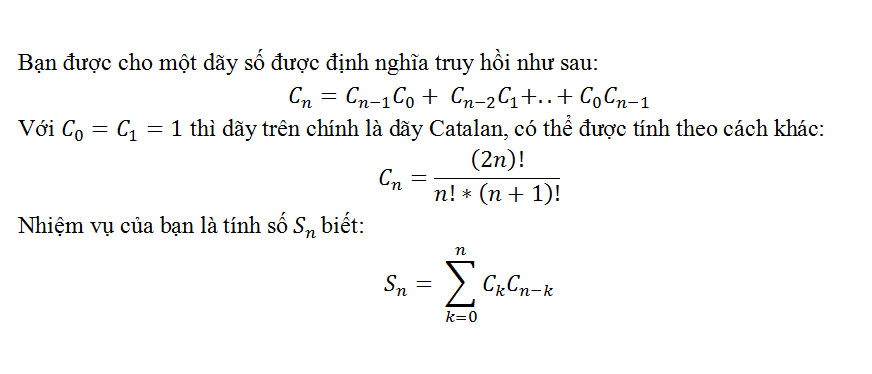


**Đầu vào:**
Dòng duy nhất chứa số n (0 <= n <= 5000).

**Đầu ra:**
Dòng duy nhất chứa kết quả tìm được.

**Ví dụ:**
**input:**
```
3
```

**output:**
```
14
```

### CPP0723 TÍCH GIAI THỪA CÁC CHỮ SỐ
Axe chơi một trò chơi với Lina.
Họ định nghĩa hàm F(x) với số x nguyên dương là tích giai thừa các chữ số của x.
Ví dụ F(135)  = 1! * 3! * 5! = 720.
Đầu tiên, họ chọn một số a có n chữ số và có ít nhất một chữ số lớn hơn 1, có thể có chữ số không ở đầu. Sau đó họ tìm một số nguyên dương x lớn nhất thỏa mãn:
- X không chứa chữ số 0 hoặc 1
- F(x) = F(a)
Hãy giúp Axe và Lina tìm ra được số đó.

**Đầu vào:**
Dòng đầu tiên chứa số bộ test T (T < 100).
Mỗi test gồm một dòng chứa số n và số a (1 <= n <= 15).

**Đầu ra:**
In ra kết quả mỗi test trên một dòng là số lớn nhất tìm được.

**Ví dụ:**
**input:**
```
1
4 1234
```

**output:**
```
33222
```

### CPP0724 HÌNH CHỮ NHẬT CON CÓ TỔNG LỚN NHẤT
Cho ma trận A[N][M]. Nhiệm vụ của bạn là tìm hình chữ nhật con của A[][] có tổng các phần tử lớn nhất. Ví dụ với ma trận dưới đây ta sẽ tìm ra được ma trận con có tổng các tử lớn nhất là 29.

**Đầu vào:**
- Dòng đầu tiên đưa vào số lượng bộ test T.
- Những dòng kế tiếp đưa vào T bộ test. Mỗi bộ test gồm hai dòng: dòng đầu tiên đưa vào N, M; dòng tiếp theo đưa vào N×M số A[i][j] ; các số được viết cách nhau một vài khoảng trống.
- T, M, N, A[i][j] thỏa mãn ràng buộc: 1≤ T ≤100; 1≤ M, N ≤200; -10<sup>5</sup>≤ A[i][j] ≤10<sup>5</sup>.

**Đầu ra:**
- Đưa ra kết quả mỗi test theo từng dòng.

**input:**
```
1
4 5
1 2 -1 -4 -20 -8 -3 4 2 1 3 8 10 1 3 -4 -1 1 7 -6
```

**output:**
```
29
```

### CPP0725 TÍNH SỐ TỔ HỢP
Cho hai số n và r, hãy tìm C(n, r)% P. Trong đó, P = 10<sup>9</sup>+7.

**Đầu vào:**
- Dòng đầu tiên đưa vào số lượng test T.
- Những dòng kế tiếp đưa vào các bộ test. Mỗi test là bộ đôi n, r. Các số được viết cách nhau một vài khoảng trống.
- T, n, r thỏa mãn ràng buộc : 1≤T≤100; 0≤n≤10<sup>3</sup>; 1≤ r ≤800.

**Đầu ra:**
- Đưa ra kết quả mỗi test theo từng dòng.

**input:**
```
2
3  2
4  2
```

**output:**
```
3
6
```

### CPP0726 PHÉP CHIA DƯ CỦA TÍCH HAI SỐ
Cho ba số a, b, c có thể lớn cỡ 10<sup>16</sup>. Nhiệm vụ của bạn là tính (a*b)%c.

**Đầu vào:**
- Dòng đầu tiên đưa vào số lượng test T.
- Những dòng kế tiếp đưa vào các bộ test. Mỗi test trên một dòng đưa vào ba số a, b, c.
- T, a, b, c  thỏa mãn ràng buộc : 1≤T≤100; 0≤a, b, c≤10<sup>16</sup>.

**Đầu ra:**
- Đưa ra số kết quả mỗi test theo từng dòng.

**input:**
```
1
8 4 5
```

**output:**
```
2
```

### CPP0727 TỔNG LỚN NHẤT CỦA DÃY CON KHÔNG KỀ NHAU
Cho mảng A[] gồm n số nguyên dương. Hãy tìm tổng lớn nhất của dãy con thỏa mãn ràng buộc không có hai phần tử kề nhau thuộc một dãy con. Ví dụ với mảng A[] = {3, 2, 7, 10} ta nhận được kết quả là 13 = 10 + 3. Với mảng A[] = {3, 2, 5, 10, 7} ta có kết quả là 15 = 3 + 5 +7.

**Đầu vào:**
- Dòng đầu tiên đưa vào số lượng bộ test T.
- Những dòng kế tiếp đưa vào T bộ test. Mỗi bộ test gồm hai dòng: dòng đầu tiên đưa vào n là số phần tử của mảng A[]; dòng kế tiếp đưa vào n số A[i] của mảng; các số được viết cách nhau một vài khoảng trống.
- T, n, A[i] thỏa mãn ràng buộc: 1≤ T ≤100; 1≤ n ≤10<sup>5</sup>; 1≤ A[i] ≤10<sup>5</sup>;

**Đầu ra:**
- Đưa ra kết quả mỗi test theo từng dòng.

**input:**
```
2
6
5  5  10  100  10  5
3
1  20  3
```

**output:**
```
110
20
```

### CPP0729 BỘI SỐ CHUNG NHỎ NHẤT CỦA TẬP CON
Cho một tập hợp gồm n số nguyên dương. Bạn cần tính tổng của bội chung nhỏ nhất của tất cả các tập hợp con của tập hợp ban đầu (trừ tập hợp rỗng).
Vì đáp số có thể rất lớn nên hãy in ra kết quả theo modulo 10007.

**Đầu vào:**
Dòng đầu tiên gồm số lượng bộ test T (T <= 100).
Mỗi bộ test bao gồm số nguyên dương n (1 <= n <= 100), là số lượng phần tử của dãy số.
Dòng tiếp theo gồm n số a_i (1 <= a_i <= 500).

**Đầu ra:**
Với mỗi test, in ra số thứ tự của test (Case ...) và đáp số của bài toán.

**Ví dụ:**
**input:**
```
2
3
3 4 5
2
2 7
```

**output:**
```
Case 1: 119
Case 2: 23
```

### CPP0730 TỔNG LỚN NHẤT CỦA DÃY CON LIÊN TỤC
Cho mảng A[] gồm n phần tử. Nhiệm vụ của bạn là tìm tổng lớn nhất các dãy con liên tục của mảng A[]. Ví dụ với A[] = { -2, -3, 4, -1, -2, 1, 5, -3} ta có câu trả lời là 7 tương ứng với tổng lớn nhất của dãy con liên tục {4, -1, -2, 1, 5}.

**Đầu vào:**
- Dòng đầu tiên đưa vào số lượng bộ test T.
- Những dòng kế tiếp đưa vào T bộ test. Mỗi bộ test gồm hai dòng: dòng đầu tiên là số phần tử của mảng n; dòng tiếp theo là n số A[i] của mảng A[]; các số được viết cách nhau một vài khoảng trống.
- T, n, A[i] thỏa mãn ràng buộc: 1≤ T ≤100; 1≤ n  ≤10<sup>6</sup>; 10<sup>-6</sup>≤ A[i]  ≤10<sup>6</sup>.

**Đầu ra:**
- Đưa ra kết quả mỗi test theo từng dòng.

**input:**
```
2
5
1 2 3 -2 5
4
-1 -2 -3 -4
```

**output:**
```
9
-1
```

### CPP0731 SỐ BƯỚC DỊCH CHUYỂN ÍT NHẤT
Cho mảng A[] gồm n số nguyên. Giá trị mỗi phần tử biểu diễn số lượng lớn nhất các bước ta có thể dịch chuyển từ phần tử này. Phần tử có giá trị bằng 0 được hiểu ta không được phép dịch chuyển. Xuất phát từ phần tử đầu tiên, hãy đếm số lượng ít nhất các bước dịch chuyển đến phần tử cuối cùng trong mảng. Ví dụ với A[] = { 1, 3, 5, 8, 9, 2, 6, 7, 6, 8, 9} ta có câu trả lời là 3 tương ứng với các phép dịch chuyển: 1 -> 3->8->9  (A[1] =1 nên ta dịch chuyển nhiều nhất 1 bước đến A[2]; A[2] = 3 nên ta được phép dịch chuyển nhiều nhất 3 bước tương ứng với A[3]=5, A[4]=8, A[5] = 9; do A[4] = 8 nên ta chỉ cần dịch chuyển 1 bước nữa là đến đích.

**Đầu vào:**
- Dòng đầu tiên đưa vào số lượng bộ test T.
- Những dòng kế tiếp đưa vào T bộ test. Mỗi bộ test gồm hai dòng: dòng đầu tiên là số phần tử của mảng n; dòng tiếp theo là n số A[i] của mảng A[]; các số được viết cách nhau một vài khoảng trống.
- T, n, A[i] thỏa mãn ràng buộc: 1≤ T ≤100; 1≤ n  ≤10<sup>3</sup>; 1≤ A[i]  ≤10<sup>7</sup>.

**Đầu ra:**
- Đưa ra số bước dịch chuyển ít nhất của mỗi test, đưa ra -1 nếu ta không có phép dịch chuyển đến đích.

**input:**
```
2
11
1 3 5 8 9 2 6 7 6 8 9
6
1 4 3 2 6 7
```

**output:**
```
3
2
```

### CPP0732 TỔNG LỚN NHẤT CỦA DÃY CON TĂNG DẦN
Cho mảng A[] gồm n số nguyên dương. Hãy tìm tổng lớn nhất của dãy con tăng dần của dãy số A[]. Ví dụ với A[] = { 1, 101, 2, 3, 100, 4, 5} ta có câu trả lời là 106=1+2+3+100. Với dãy A[] = {10, 5, 4, 3} ta có câu trả lời là 10.

**Đầu vào:**
- Dòng đầu tiên đưa vào số lượng bộ test T.
- Những dòng kế tiếp đưa vào T bộ test. Mỗi bộ test gồm hai dòng: dòng đầu tiên là số phần tử của mảng n; dòng tiếp theo là n số A[i] của mảng A[]; các số được viết cách nhau một vài khoảng trống.
- T, n, A[i] thỏa mãn ràng buộc: 1≤ T ≤100; 1≤ n  ≤10<sup>3</sup>; 1≤ A[i]  ≤10<sup>7</sup>.

**Đầu ra:**
- Đưa ra kết quả mỗi test theo từng dòng.

**input:**
```
2
7
1 101 2 3 100 4 5
4
10 5 4 3
```

**output:**
```
106
10
```

### CPP0736 DÃY CON LIÊN TỤC NHỎ NHẤT
Cho mảng A[] gồm n số nguyên và số X. Hãy tìm độ dài dãy con liên tục nhỏ nhất có tổng lớn hơn X. Ví dụ với A[] = { 1, 4, 45, 6, 0, 19} và X = 51 ta có câu trả lời là 3 tương ứng với dãy con {4, 45, 6}. Với dãy A[] = {1, 10, 5, 2, 7} và X =9 ta có câu trả lời là 1 tương ứng với dãy con {10}. Với dãy A[] = {1, 2, 4}và X=8 ta có câu trả lời là -1.

**Đầu vào:**
- Dòng đầu tiên đưa vào số lượng bộ test T.
- Những dòng kế tiếp đưa vào T bộ test. Mỗi bộ test gồm hai dòng: dòng đầu tiên là số phần tử của mảng n và số X; dòng tiếp theo là n số A[i] của mảng A[]; các số được viết cách nhau một vài khoảng trống.
- T, n, X, A[i] thỏa mãn ràng buộc: 1≤ T ≤100; 1≤ n  ≤10<sup>7</sup>; 1≤ A[i]  ≤10<sup>7</sup>.

**Đầu ra:**
- Đưa ra kết quả mỗi test theo từng dòng.

**input:**
```
2
6 51
1 4 45 6 0 19
3 8
1 2 4
```

**output:**
```
3
-1
```

### CPP0737 DÃY CON TRUNG BÌNH LỚN NHẤT
Cho mảng A[] gồm n số và số nguyên dương k. Hãy tìm dãy con liên tục độ dài k có giá trị trung bình các phần tử lớn nhất. Ví dụ với A[] = { 1, 12, -5, -6, 50, 3} và k = 4 ta có câu trả lời là {12, -5, -6, 50} có trung bình các phần tử lớn nhất là (12-5-6+30)/4=7.75.

**Đầu vào:**
- Dòng đầu tiên đưa vào số lượng bộ test T.
- Những dòng kế tiếp đưa vào T bộ test. Mỗi bộ test gồm hai dòng: dòng đầu tiên là số phần tử của mảng n và số k; dòng tiếp theo là n số A[i] của mảng A[]; các số được viết cách nhau một vài khoảng trống.
- T, n, k, A[i] thỏa mãn ràng buộc: 1≤ T ≤100; 1≤ k≤n ≤10<sup>3</sup>; -10<sup>3</sup>≤ A[i]  ≤10<sup>3</sup>.

**Đầu ra:**
- Đưa ra kết quả mỗi test theo từng dòng.

**input:**
```
2
5 2
10 4 5 15 20
4 2
-12 34 56 7
```

**output:**
```
15 20
34 56
```

### CPP0738 CỘNG 1 VÀ NHÂN ĐÔI
Cho mảng A[] gồm n số nguyên dương. Mảng A[] được gọi là mảng mục tiêu. Hãy tạo một mảng bắt đầu S[] gồm n phần tử có các phần tử ban đầu được thiết lập là 0. Chỉ được phép thực hiện hai thao tác dưới đây:
- Thao tác 1 (Increament Operation): tăng giá trị của 1 phần tử bất kỳ lên 1 đơn vị.
- Thao tác 2 (Double Operation ): nhân toàn bộ phần tử trong mảng với 2.
Hãy tìm số các ít nhất để dịch chuyển mảng bắt đầu S[] thành mảng mục tiêu A[]. Ví dụ với A[] = { 16, 16, 16} ta cần thực hiện ít nhất 7 thao tác như sau:
- Sử dụng 3 thao tác Increament để biến : S[0] =1, S[1]=1, S[2]=1.
- Sử dụng 4 thao tác Double để biến : S[0] =16, S[1]=16, S[2]=16.

**Đầu vào:**
- Dòng đầu tiên đưa vào số lượng bộ test T.
- Những dòng kế tiếp đưa vào T bộ test. Mỗi bộ test gồm hai dòng: dòng đầu tiên là số phần tử của mảng n; dòng tiếp theo là n số A[i] của mảng A[]; các số được viết cách nhau một vài khoảng trống.
- T, n, A[i] thỏa mãn ràng buộc: 1≤ T ≤100; 1≤ n ≤10<sup>3</sup>; 1≤ A[i]  ≤10<sup>3</sup>.

**Đầu ra:**
- Đưa ra kết quả mỗi test theo từng dòng.

**input:**
```
2
3
16 16 16
2 
2 3
```

**output:**
```
7
4
```

### CPP0740 TÍCH LỚN NHẤT CỦA DÃY CON LIÊN TỤC
Cho mảng A[] gồm n phần tử gồm các số âm và dương. Hãy tìm giá trị lớn nhất tích các phần tử của tất cả các dãy con liên tục trong mảng A[]. Ví dụ với mảng A[] = {6, -3, - 10, 0, 2 } ta có kết quả là 180 tương ứng với tích các phần tử của dài dãy con {6, -3, -10}.

**Đầu vào:**
- Dòng đầu tiên đưa vào số lượng bộ test T.
- Những dòng kế tiếp đưa vào T bộ test. Mỗi bộ test gồm hai phần: phần thứ nhất đưa vào số lượng phần tử của mảng N; phần thứ hai đưa vào n số A[i]; các số được viết cách nhau một vài khoảng trống.
- T, n, A[i] thỏa mãn ràng buộc: 1≤ T ≤100; 1≤ n ≤100; 1≤ A[i] ≤200.

**Đầu ra:**
- Đưa ra kết quả mỗi test theo từng dòng.

**input:**
```
3
5
6 -3 -10 0 2
6
2 3 4 5 -1 0 
10
8 -2 -2 0 8 0 -6 -8 -6 -1
```

**output:**
```
180
120
288
```

### CPP0742 ĐỔI CHỖ ÍT NHẤT
Cho mảng A[] gồm n phần tử. Hãy tìm số phép đổi chỗ ít nhất giữa các phần tử của mảng để mảng A[] được sắp xếp. Ví dụ với A[] = {4, 3, 2, 1} ta cần thực hiện ít nhất 2 phép đổi chỗ: Swap(A[0], A[3]),  Swap(A[1], A[2]).

**Đầu vào:**
- Dòng đầu tiên đưa vào số lượng bộ test T.
- Những dòng kế tiếp đưa vào T bộ test. Mỗi bộ test gồm hai dòng: dòng đầu tiên là số phần tử của mảng n và X; dòng tiếp theo là n số A [i] của mảng A [];các số được viết cách nhau một vài khoảng trống.
- T, n thỏa mãn ràng buộc: 1≤ T ≤100; 1≤ n ≤10<sup>3</sup>.

**Đầu ra:**
- Đưa ra kết quả mỗi test theo từng dòng.

**input:**
```
2
4
4 3 2 1
5
1 5 4 3 2
```

**output:**
```
2
2
```

### CPP0744 BẢNG MÀU R - G - B
Ta cần tạo một xâu ký tự S có độ dài n. Trong đó, mỗi ký tự trong S chỉ là các ký tự R, B, hoặc G. Xâu ký tự nhận được có ít nhất r ký tự R, b ký tự B, g ký tự G (r + b + g ≤n). Hãy đếm số các xâu ký tự thỏa mãn yêu cầu kể trên. Ví dụ với n=4, r=1, b=1, g = 1 ta có thể có 36 xâu ký tự khác nhau.

**Đầu vào:**
- Dòng đầu tiên đưa vào số lượng bộ test T.
- Những dòng kế tiếp đưa vào T bộ test. Mỗi bộ test là bộ bốn số phân biệt n, r, b, g được viết trên một dòng.
- T, S, n, r, b, g thỏa mãn ràng buộc: 1≤ T ≤100; 1≤ n ≤20;1≤ r, b, g≤N.

**Đầu ra:**
- Đưa ra kết quả mỗi test theo từng dòng.

**input:**
```
2
4 1 1 1
4 2 0 1
```

**output:**
```
36
22
```

### CPP0747 LOẠI BỎ 100
Cho xâu ký tự S chỉ bao gồm các ký tự ‘0’ và ‘1’. Nhiệm vụ của bạn là loại bỏ các xâu con “100” trong S và đưa ra độ dài lớn nhất xâu con bị loại bỏ. Ví dụ S =” 1011110000” ta nhận được kết quả là 6 vì ta cần loại bỏ xâu “110000” có độ dài 6.

**Đầu vào:**
- Dòng đầu tiên đưa vào số lượng bộ test T.
- Những dòng kế tiếp đưa vào T bộ test. Mỗi bộ test là một xâu ký tự nhị phân S được viết trên một dòng.
- T, S thỏa mãn ràng buộc: 1≤ T ≤100; 1≤ Length(S)≤10<sup>5</sup>.

**Đầu ra:**
- Đưa ra kết quả mỗi test theo từng dòng.

**input:**
```
2
010010
1011110000
```

**output:**
```
3
6
```

### CPP0751 SO SÁNH LŨY THỪA
Cho mảng X[] gồm n phần tử và mảng Y[] gồm m phần tử. Hãy đếm số các cặp x<sup>y</sup>>y<sup>x</sup>, trong đó x€X[] và y€Y[]. Ví dụ X[] = {2, 1, 6 }, Y[] = {1, 5} ta có kết quả là 3 cặp (2, 1), (2, 5), (6, 1).

**Đầu vào:**
- Dòng đầu tiên đưa vào số lượng bộ test T.
- Những dòng kế tiếp đưa vào T bộ test. Mỗi bộ test gồm ba dòng: dòng đầu tiên đưa vào n, m tương ứng với số phần tử của mảng X[] và Y[]; dòng tiếp theo là n số X[i] của mảng X[]; dòng cuối cùng là m số của mảng Y[]; các số được viết cách nhau một vài khoảng trống.
- T, n, m, X[i], Y[j] thỏa mãn ràng buộc: 1≤ T ≤100; 1≤ n, m ≤10<sup>5</sup>; 1≤ X[i], Y[j] ≤10<sup>3</sup>.

**Đầu ra:**
- Đưa ra kết quả mỗi test theo từng dòng.

**input:**
```
1
3 2
2 1 6
1 5
```

**output:**
```
3
```

### CPP0761 ƯỚC SỐ CHUNG LỚN NHẤT CỦA SỐ NGUYÊN LỚN
Cho hai số a và b trong đó a≤10<sup>12</sup>, b≤10<sup>250</sup>. Nhiệm vụ của bạn là tìm ước số chung lớn nhất của hai số a, b.

**Đầu vào:**
- Dòng đầu tiên đưa vào T là số lượng bộ test.
- T dòng tiếp đưa các bộ test. Mỗi bộ test gồm hai dòng: dòng đầu tiên đưa vào số a; dòng tiếp theo đưa vào số b.
- Các số T, a, b thỏa mãn ràng buộc: 1≤T≤100; 1≤a≤10<sup>12</sup>; 1≤b≤10<sup>250</sup>;

**Đầu ra:**
- Đưa ra kết quả mỗi test theo từng dòng.

**input:**
```
1
1221
1234567891011121314151617181920212223242526272829
```

**output:**
```
3
```

### OLP184 PTIT 2024D - ĐƯỜNG TRÒN
Cho đường tròn có tâm tại vị trí (X, Y) và bán kính R. Hãy đếm số lượng các điểm có tọa độ nguyên nằm bên trong hoặc trên đường tròn?

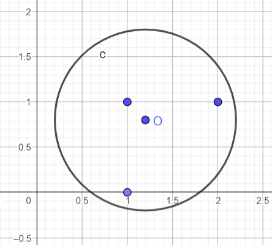


**Đầu vào:**
Gồm 3 số thực X, Y, R có tối đa 4 chữ số sau dấu phảy (|X|, |Y| ≤ 10<sup>5</sup>, 0 ≤ R ≤ 10<sup>5</sup>).

**Đầu ra:**
In ra số lượng điểm có tọa độ nguyên nằm bên trong hoặc bên trên đường tròn đã cho.

**Ví dụ:**
**input:**
```
1.2 0.8 1
```

**output:**
```
3
```

**input:**
```
0 0 1
```

**output:**
```
5
```

**input:**
```
-39066.9606 -83906 45886.5164
```

**output:**
```
6614851027
```

### OLP204 PHÂN TÍCH SỐ 123
Cho số N, bạn cần phân tích N thành K số A[1], A[2], …, A[K] thỏa mãn:
- A[1] + A[2] + ... + A[K] = N
- A[i] chỉ chứa các chữ số 1, 2, 3.
Có thể có nhiều cách phân tích. Nhiệm vụ của bạn là hãy tìm giá trị K nhỏ nhất thỏa mãn yêu cầu.

**Đầu vào:**
Dòng đầu tiên là số lượng bộ test T (T ≤ 1000).
Mỗi test gồm một số nguyên N.

**Đầu ra:**
Với mỗi test, in ra giá trị K tìm được trên một dòng.

**Giới hạn:**
Subtask 1 (40%): N ≤ 10<sup>5</sup>;
Subtask 2 (60%): N ≤ 10<sup>18</sup>.

**Ví dụ:**
Giải thích:
123 = 123
456 = 133 + 323
90 = 22 + 22 + 23 + 23
1 = 1
1000 = 132 + 232 + 313 + 323

**input:**
```
5
123
456
90
1
1000
```

**output:**
```
1
2
4
1
4
```

### OLP209 PHÂN TÍCH SỐ 123 - Bản dễ
Cho số N, bạn cần phân tích N thành K số A[1], A[2], …, A[K] thỏa mãn:
- A[1] + A[2] + ... + A[K] = N
- A[i] chỉ chứa các chữ số 1, 2, 3.
Có thể có nhiều cách phân tích. Nhiệm vụ của bạn là hãy tìm giá trị K nhỏ nhất thỏa mãn yêu cầu.

**Đầu vào:**
Dòng đầu tiên là số lượng bộ test T (T ≤ 1000).
Mỗi test gồm một số nguyên N.

**Đầu ra:**
Với mỗi test, in ra giá trị K tìm được trên một dòng.

**Giới hạn:**
N ≤ 100000;

**Ví dụ:**
Giải thích:
123 = 123
456 = 133 + 323
90 = 22 + 22 + 23 + 23
1 = 1
1000 = 132 + 232 + 313 + 323

**input:**
```
5
123
456
90
1
1000
```

**output:**
```
1
2
4
1
4
```

## Ứng dụng thư viện STL

### CPP0733 TÌM ĐƯỜNG TRONG MA TRẬN NHỊ PHÂN
Cho ma trận A[N][M] chỉ bao gồm các số 0 và 1. Hãy tìm đường đi ngắn nhất từ một phần tử bắt đầu đến phần tử đích. Biết mỗi bước đi ta chỉ được phép dịch chuyển từ phần tử có giá trị 1 đến phần tử có giá trị 1. Ví dụ với ma trận dưới đây sẽ cho ta kết quả là 11.
A[9][10]  =
{{**1**,0, **1**, **1**, **1**, 1, 0, 1, 1, 1 },
{**1**, 0, **1**, 0, **1**, 1, 1, 0, 1, 1 },
{**1**, **1**, **1**, 0, **1**, 1, 0, 1, 0, 1 },
{0, 0, 0, 0, **1**, 0, 0, 0, 0, 1 },
{1, 1, 1, 0, 1, 1, 1, 0, 1, 0 },
{1, 0, 1, 1, 1, 1, 0, 1, 0, 0 },
{1, 0, 0, 0, 0, 0, 0, 0, 0, 1 },
{1, 0, 1, 1, 1, 1, 0, 1, 1, 1 },
{1, 1, 0, 0, 0, 0, 1, 0, 0, 1 }};
Begin = A[0][0];
End =A[3][4];

**Đầu vào:**
- Dòng đầu tiên đưa vào số lượng bộ test T.
- Những dòng kế tiếp đưa vào T bộ test. Mỗi bộ test gồm hai dòng: Dòng đầu tiên đưa vào 6 số N, M, phần tử bắt đầu (x, y),  phần tử kết thúc (z, t) ; dòng tiếp là N×M các phần tử của ma trận A[][]; các phần tử được viết cách nhau một vài khoảng trống.
- T, N, M, x, y, z, t thỏa mãn ràng buộc: 1≤T≤100; 1≤ N, M ≤10<sup>3</sup>; 1≤ x, y, z, t ≤10<sup>3</sup>.

**Đầu ra:**
- Đưa ra kết quả mỗi test theo từng dòng. Nếu không tìm được đáp án, in ra -1.

**input:**
```
1
9 10 0 0 3 4
1 0 1 1 1 1 0 1 1 1
1 0 1 0 1 1 1 0 1 1 
1 1 1 0 1 1 0 1 0 1 
0 0 0 0 1 0 0 0 0 1 
1 1 1 0 1 1 1 0 1 0 
1 0 1 1 1 1 0 1 0 0 
1 0 0 0 0 0 0 0 0 1 
1 0 1 1 1 1 0 1 1 1 
1 1 0 0 0 0 1 0 0 1
```

**output:**
```
11
```

### CPP0734 HÌNH CHỮ NHẬT LỚN NHẤT - 2
Cho ma trận A[N][M] chỉ bao gồm các số 0 và 1. Hãy tìm hình chữ nhật lớn nhất có các phần tử đều bằng 1. Ví dụ với ma trận dưới đây ta sẽ có hình chữ nhật lớn nhất có các phần tử là 1 bằng 8.
0          1          1          0
1          1          1          1                      1          1          1          1
1          1          1          1                      1          1          1          1
1          1          0          0

**Đầu vào:**
- Dòng đầu tiên đưa vào số lượng bộ test T.
- Những dòng kế tiếp đưa vào T bộ test. Mỗi bộ test gồm hai dòng: Dòng đầu tiên đưa vào hai số N, M ; dòng tiếp là N×M các phần tử của ma trận A[][]; các phần tử được viết cách nhau một vài khoảng trống.
- T, N, M thỏa mãn ràng buộc: 1≤T≤100; 1≤ N, M ≤500.

**Đầu ra:**
Đưa ra kết quả mỗi test theo từng dòng.

**input:**
```
1
4 4 
0 1 1 0 
1 1 1 1 
1 1 1 1 
1 1 0 0
```

**output:**
```
8
```

### CPP0735 MA TRẬN CON LỚN NHẤT
Cho ma trận A[N][M] chỉ bao gồm các số 0 và 1. Hãy tìm cấp ma trận vuông con lớn nhất có các phần tử đều bằng 1. Ví dụ với ma trận dưới đây ta sẽ có cấp ma trận vuông con lớn nhất có các phần tử là 1 bằng 3.

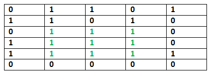


**Đầu vào:**
- Dòng đầu tiên đưa vào số lượng bộ test T.
- Những dòng kế tiếp đưa vào T bộ test. Mỗi bộ test gồm hai dòng: Dòng đầu tiên đưa vào hai số N, M ; dòng tiếp là N×M các phần tử của ma trận A[][]; các phần tử được viết cách nhau một vài khoảng trống.
- T, N, M thỏa mãn ràng buộc: 1≤T≤100; 1≤ N, M ≤500.

**Đầu ra:**
- Đưa ra kết quả mỗi test theo từng dòng.

**input:**
```
2
5 6
0 1 0 1 0 1 
1 0 1 0 1 0 
0 1 1 1 1 0 
0 0 1 1 1 0 
1 1 1 1 1 1
2 2
1 1 
1 1
```

**output:**
```
3
2
```

### CPP0739 GIẢI MÃ TĂNG GIẢM
Cho mảng A[] chỉ bao gồm các ký tự I hoặc D. Ký tự I được hiểu là tăng (Increasing) ký tự D được hiểu là giảm (Degreeasin). Sử dụng các số từ 1 đến 9, hãy đưa ra số nhỏ nhất được đoán nhận từ mảng A[]. Chú ý, các số không được phép lặp lại. Dưới đây là một số ví dụ mẫu:
- A[] = “I”               : số tăng nhỏ nhất là 12.
- A[] = “D”              : số giảm nhỏ nhất là 21
- A[] =”DD”            : số giảm nhỏ nhất là 321
- A[] = “DDIDDIID”: số thỏa mãn 321654798

**Đầu vào:**
- Dòng đầu tiên đưa vào số lượng bộ test T.
- Những dòng kế tiếp đưa vào T bộ test. Mỗi bộ test là một xâu ID
- T, Length(A) thỏa mãn ràng buộc: 1≤ T ≤100; 1≤ Length(A) ≤9; .

**Đầu ra:**
- Đưa ra kết quả mỗi test theo từng dòng.

**input:**
```
4
I
D
DD
DDIDDIID
```

**output:**
```
12
21
321
321654798
```

### CPP0743 ĐẢO TỪ
Cho xâu ký tự S. Nhiệm vụ của bạn là đảo ngược các từ trong S. Ví dụ S =  “I like this program very much”, ta nhận được kết quả là “much very program this like I”.

**Đầu vào:**
- Dòng đầu tiên đưa vào số lượng bộ test T.
- Những dòng kế tiếp đưa vào T bộ test. Mỗi bộ test là một xâu ký tự S.
- T, S thỏa mãn ràng buộc: 1≤ T ≤100; 1≤ Length(S)≤10<sup>3</sup>.

**Đầu ra:**
- Đưa ra kết quả mỗi test theo từng dòng.

**input:**
```
2
I like this program very much
much very program this like I
```

**output:**
```
much very program this like I
I like this program very much
```
